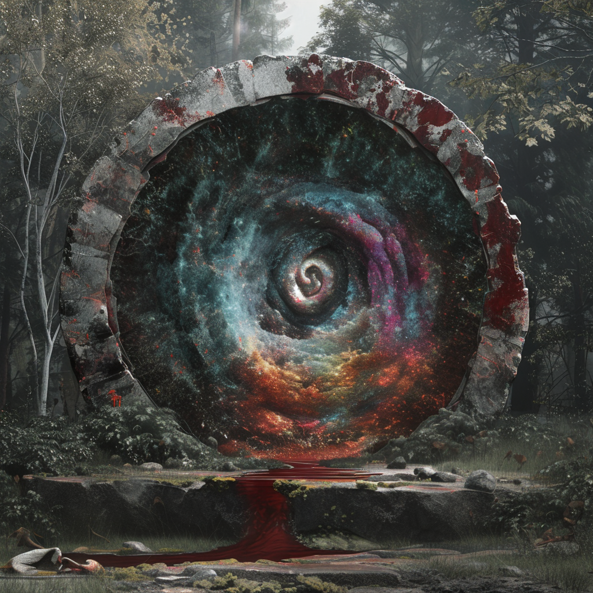

# Sgrisignier-Portale

Auf nahezu jedem Planeten des Serpinit-Systems befinden sich rundliche Steintore die von uralter Runenmagie durchdrungen sind.
Diese Steinbögen sind Portale, wobei in der Theorie immer genau zwei Portale miteinander verbunden sind.
Sie wurden von den Sgrisigniern gebaut um zwischen den Planeten reisen zu können, sind jedoch für die modernen Völker lange Zeit aufgrund von Chaos-Interferenzen nicht nutzbar.

## Portalmembran
Zwischen dem Steinbogen ist eine magische Oberfläche aufgespannt.
Diese **Portalmembran** sieht aus wie ein bunter Wirbel aus tausend Farben und muss durchdrungen werden um das Portal zu durchschreiten.
Dabei hat die Oberfläche einige spezielle Eigenschaften:
* Die Stärke des Wiederstandes den die Membran auf ein Material ausübt ist antiproportional zur Menge an magischer Potenz die dieses Material abgibt.
    * Die Sgrisignier als starke magische Wesen konnten die Portale somit ohne Mühe durchschreiten.
    * Da jedes Lebewesen ein wenig magische Potenz abstrahlt, ist beim Durchschreiten für die meisten ein mittlerer Wiederstand zu spüren.
    * Nicht-lebendige Materialien die zusätzlich eine niedrige Potenzleitfähigkeit besitzen (z.B. Metall) müssen mitunter mit einiger Kraft durch das Portal befördert werden. Nicht selten hat dies Nebenwirkungen wie eine starke Erwärmung des Stoffes. Versucht man Wasser welches nahe seinem Potenzpunkt ist durch das Portal zu befördern, so verdampft dieses.  
* Die Erwärmung von z.B. Metall ist deutlich extremer bei aktiven Chaos-Interferenzen
* Die Membran regeneriert sich in Echtzeit, sie umgibt also alle durchdringenden Gegenstände zu jeder Zeit eng.

## Chaos-Interferenzen

Chaos-Interferenzen werden von Portalen ausgestrahlt welche kein festes Ziel mehr besitzen.
Dies passiert meist, weil das ursprüngliche Gegenstück eines Portals zerstört wurde.
Die Teleporationsmagie eines solchen Protals "zappt" förmlich durch das System auf der Suche nach seinem Gegenstück.
Dabei stellt des Chaos-Portal zwar immer wieder eine durchaus stabile, aber auch sehr kurze Verbindung zu einem beliebigen anderen Portal her.
Die Verbindung dauert nur einen Bruchteil einer Pulsene (0.0235 ± 0.19).

Aus diesem Grund werden Lebewesen die ein Chaos-Portal durchqueren meist schlichtweg zerrissen.
Darüber hinaus macht die Existenz der Chaos-Portale auch das Reisen mit vollkommen intakten Portalen äußerst gefährlich.
Ein Chaos-Portal bildet beim Verbindungsaufbau mit einem anderen Portal für kurze Zeit ein gerichtetes Teleportations-Dreieck mit dem Ziel-Portal und seinem eigentlichen Gegenstück.
Sollte also ein Lebewesen gerade auf dem regulären Weg zum Ziel-Portal sein, so kann es ebenfalls vom Chaos-Portal zerrissen werden.
Die Conius-Lateralen fanden schließlich einen Weg dieses Phänomen zu unterbinden und starteten darauf basierend schließlich die [Ikusation](/content/Ereignis_/Ikusation.md).
Die frühen Expeditionen der Ikusation zeigten jedoch auch, dass selbst gesicherte Portale nur einen Teil des Risikos beseitigen.
Ein Zielort konnte weiterhin durch Klima, Gifte, Fauna oder politische Umstände unbenutzbar bleiben, wie sich etwa an den ersten Routen über [Aridess](/content/Himmelskoerper_/Aridess/index.md) und [Venoxi](/content/Himmelskoerper_/Venoxi/index.md) deutlich zeigte.

## Aufbau

Die Anordnung der Runensteine in einem Sgrisignier-Portal ist von großer Bedeutung.
<!-- callout: todo -->
> **Todo:** Ringsystem mit Grad-Angaben beschreiben.

