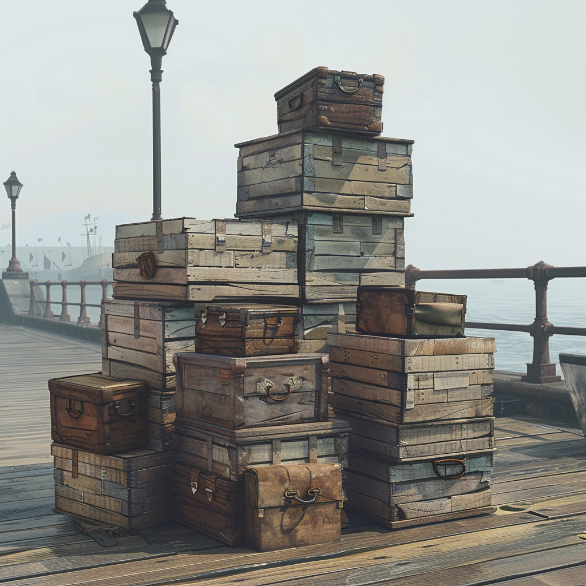
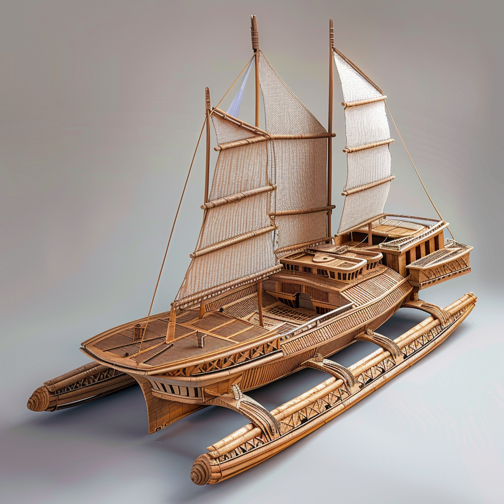

# 20. März 2024

# Meta / Kontext

Die Spieler werden am nächsten Tag zu ihrem ersten Portal aufbrechen.
Sie haben sich gegen das naheliegendere entschieden, um mit einem Schiff über den Gravitationsozean zu fahren.
Sie werden begleitet von 3 Conius-Forschern (unter anderem Kwint Gurdun) und 2 Sodili im Auftrage des Köngis.

Ákos tritt der Gruppe bei und übernimmt einen der Charaktere der Expedition (außer Kwint).

Den verbleibenden Tag in Carpebur nutzen die Spieler unterschiedlich.
Taeron hat einen Unsichtbarkeits-Umhang in einem geheimen Conius-Laden in der grauen Zone gekauft, Alaric hat den "braunen Ring" in den Schwarztunneln gesucht und steht nun vor dessen Türen, und Kle hat eine Bibel von der Bibliothek abgeholt.

Malte wird nicht zur Session anwesend sein.
Kles Bibel wird daher als allgemeiner Aufhänger für die anderen Spieler genutzt um sie an die Religion der Sgrisignier und die theologische Bedeutung der "Roiatinen" heranzuführen.

Jaghati sitzt mit einigen Matrosenkollegen in einer Taverne, als die Kapitänin der Crew Erisa Sturint hereintritt und von dem neuen Auftrag erzählt.

Als Hauptaufgabe müssen die Spieler nach wie vor das erste Portal erschließen.

## Der Inhalt von Kles Bibel

Die [Bibel](/content/Volk_/Lateralen_/Sodili/Theologie/die-Bibel-der-Unzaehlbaren.md) die Kle von der Bibliothek abgeholt hat, behandelt lediglich die Religion der Sodili.
Als solche ist sie zwar inspiriert von der wahren [Schöpfungsgeschichte](/content/Allgemein/Schoepfungsgeschichte.md) aber in einer stark verzerrten Form.

## Alarics Begegnung mit dem braunen Ring
* Alaric steht in der Dunkelheit vor einer abgewetzten Holztür mit einem eingeritztem gezackten Kreis. 
* Auf den Tunnelwänden vor der Tür sind viele Kritzeleien, ein geübtes Auge erkennt sie als Diebesschrift.
* Über der Tür steht: "Spüret die schmerzenden Dornen des bedeutsamen Ringes" / "Drücke auf die relevanten Spitzen des Ring-Symbols"
* Auf den Tunnelwänden sind insgesamt 3 Hinweise:
    * "Frische Dornen haben grüne Spitzen" / "Zuerst, die Zacke die auf das Moos zeigt"
    * "Reifende Dornen spicken den Weg in die Tiefe" / "Als zweites die Zacke die nach unten zeigt"
    * "Starke Dornen begehren den Stahl" / "Als letztes, die Zacke die zur Klinke zeigt"
* Wenn Alaric die Zacken korrekt berührt, wird ihm die Tür geöffnet.
* Ihm gegenüber steht ein schlaksiger Sodili in heruntergekommenen Klamotten und mit einer Kakerlake auf der Schulter
* Er mustert Alaric durchgehend, dann springt die Kakerlake von seiner Schulter und verschwindet im Tunnel hinter ihm.
* Der Sodili hält Alaric eine Weile hin und erfragt seine Absichten.
* Sollte Alaric ihn nicht verärgern, wird er wenig später durchgelassen und betritt ein kleines Gewölbe.
* Es stehen modrige, alte, nicht zusammenpassende Holztische und -stühle herum und der Raum ist gefüllt mit ca. 13 zwielichtigen Gestalten.
* An einem Tisch in der Ecke erwartet ihn der Schmutzfinger Jolint.
* Jolint erklärt Alaric die Hierarchie des Ringes und macht ihn außerdem mit seiner neuen Rolle als Rekrut vertraut.
    * Sämtliche Diebesgüter muss Alaric direkt bei Jolint abgeben
    * In seiner Zeit als Rekrut bekommt er keine Entlohnung
    * In der Stadt gibt es verschiedene versteckte schwarze Bretter über die sich die Mitglieder des braunen Ringes austauschen ohne Aufsehen zu erregen.
    * Wenn Alaric genug Aufträge erfüllt, kann er im braunen Ring aufsteigen
* Danach verscheucht er ihn, da er als Rekrut ohne jegliches Ansehen nicht im Geheimquartier herumzulungern hat.

## Charaktere

### Sodili
* [Eolyn Sera (Waldläufer) & Fezir (Zwergadler)](/content/Volk_/Lateralen_/Sodili/Charakter_/Eolyn-Aksae-Sera_Fezir/index.md)
* [Caelum Storringer (Paladin) & Tempest (Krokodil)](/content/Volk_/Lateralen_/Sodili/Charakter_/Caelum-Froso-Storringer_Tempest/index.md)

### Conius
* [Draven Norint (Alchemist)](/content/Volk_/Lateralen_/Conius/Charakter_/Draven-Norrint/index.md)
* [Lysandra Swirm (Druide)](/content/Volk_/Lateralen_/Conius/Charakter_/Lysandra-Swirm/index.md)
Außerdem begleitet Ingvor Mandijit die Expedition.

# Erschließung der Portale

## Expeditionsstart am Wolkenhafen

Bei der Ankunft am Wolkenhafen werden die Spieler von [Kwint Gurdun](/content/Volk_/Lateralen_/Conius/Charakter_/Kwint-Gurdun/index.md) erwartet.
Hinter Kwint sind einige Kisten aufgestapelt, welche die anderen Mitglieder der Expedition (die oben eingeführten, nicht-bespielten Charaktere) und die Crew bereits auf das Schiff laden.

Als Kwint die Spieler sieht, winkt er sie rasch zu sich herüber und sagt nur:
> "Da seit ihr ja endlich. Kommt schnell und helft beim Verladen, wir sollten zügig aufbrechen"

Nachdem die Spieler (hoffentlich) beim Verladen geholfen haben, legt die Mannschaft schnellstmöglich ab.
Kwint winkt bei allen näheren Nachfragen ab, da er die geheimen Details erst auf hoher See besprechen möchte.
Sollten die Spieler in die Kisten gucken finden sie die Dinge ihrer Bestellung:

* Proviant für 1 Tag
* Kochtopf und Feuer
* Zelte und Betten
* Kleine Axt
* 4 Seile (dünn bis dick)
* Kleine Lebendfalle
* Säcke und Barrikaden
* Ritterrüstung
* Kleine Eisenplatte
* Gewichte
* Armbrust und Dolch

aber auch noch einiges mehr, vom König für die Expedition gestellt:

* Notproviant für 2 Wochen (Getrocknetes Fleisch)
* 5 Wasserfässer (100L) 
* Werkzeug (Hammer, Nägel, Sägen, Beile, Schaufeln)
* Navigationsinstrumente: Karten, Kompass, Sextant
* Medizinische Versorgung: Heilkräuter, Verbände, etc.

Außerdem haben die Conius noch zwei Kisten mit magischer Ausrüstung, auf welche die Spieler aber keinen Zugriff haben.
Die Crew des Schiffes besteht ausschließlich aus Sodili:

* [Erisa Sturint (Kaptänin) & Gale (Seeadler)](/content/Volk_/Lateralen_/Sodili/Charakter_/Erisa-Ikal-Sturint_Gale/index.md)
* [Thaos Swiff (Schiffsnavigator / Steuermann) & Maris (Delphin)](/content/Volk_/Lateralen_/Sodili/Charakter_/Thaos-Deakel-Swiff_Maris/index.md)
* [Maggus Sallet (Koch) & Ink (Tintenfisch)](/content/Volk_/Lateralen_/Sodili/Charakter_/Maggus-Firn-Sallet_Ink/index.md)
* [Renn Ionfor (Schiffsmechaniker) & Wench (Anglerfisch)](/content/Volk_/Lateralen_/Sodili/Charakter_/Renn-Kienu-Ionfor_Wench/index.md)
* [Jaghati Kayn & Odin (Rabe)]() (Von Ákos bespielt)
* 6x Matrosen (fürs Rudern und allgemeine Aufgaben an Bord, wie Reinigung, Wachen halten usw.):
<!-- callout: todo -->
> **Todo:** Die 6 Matrosen ausformulieren (Name, Beschreibung, Stärken, Schwächen, Micu)

## Auf dem Gravitationsozean

Sobald die Crew abgelegt hat, versammelt Kwint die Expeditionsteilnehmer in der Kajüte um ihnen die nächsten Schritte zu vermitteln.

Das angestrebte Vorgehen ist die Etablierung einer Versorgungskette durch mehrere Portale.
Es wurde sich explizit gegen eine großflächige Erschließung mehrerer einzelner Portale entschieden, da die Gefahren zu wenig bekannt und zu unberechenbar sind.
Sollten z. B. mehrere Portale in der Umgebung der Stadt erschlossen werden woraufhin sich dann ungeahnte Gefahren ergeben, könnte das die gesamte Sodili-Hauptstadt gefährden.
Stattdessen soll mit der Zeit ein einziger gefestigter Stützpunkt um das erste erschlossene Portal errichtet werden.
Vom Ziel-Ort des Portals werden dann weitere Portale gesucht und erschlossen, sodass im schlimmsten Fall nur ein Portal verteidigt werden muss.
Kwint macht der gesamten Expedition aber auch ausdrücklich klar, dass der Frieden immer im Vordergrund steht.
Die Erschließung der Portale soll neue Handelsrouten und interplanetare Verbindungen herstellen, keine neuen Gefahren und Krieg bringen.

Allgemein können die Spieler während der Fahrt die Aussicht genießen, angeln, oder die Crew kennenlernen.

Die ersten ~2 Stunden der Schiffahrt passiert das Schiff lediglich die großen Klippen von Carpebur.
In den steilen Steinwänden sind viele kleine Löcher in denen Vögel nisten und von den überhängenden Kanten der Klippen hängen dicke Lianen zwischen denen Hörnchen-Affen schwingen.
Die Klippen nehmen mit der Zeit an Höhe ab, bis die Küste knapp auf Höhe der Meeresoberfläche ist.

Dann muss der Katamaran einen Umweg nach außen nehmen, da Gurontis an dieser Stelle ein weitreichendes Plateau unter der Wasseroberfläche aufweist.
Für Schiffe sind diese Gewässer zu seicht und außerdem wird das Plateau am Ende von einer dichten Inselkette gesäumt.
In den seichten Gewässern hat sich ein Korallenriff gebildet, mit einer vielfältigen Flora und Fauna.

## Ankunft am Zielort

Die Expedition legt in einer Bucht nahe der passierten Inselkette an.
Das Portal ist von dieser Stelle einen ~20 minütigen Marsch entfernt, in einem kleinen Waldstück.
Es ist ca. 10 Meter hoch und versehen mit altem, getrocknetem Blut.

Die Conius-Lateralen haben bisher nur ein theoretisches Vorgehen zur Erschließung der Portale entworfen und konnten dieses noch nicht in der Praxis erproben.
Folgende Erkenntnisse hat Kwint Gurdun mit seinen bisherigen Forschungen gewonnen:

* Jeder Stein eines Portals trägt zur Portal-Magie bei.
* Im Inneren der Steine befinden sich Tjomanten (Tjosand-Quarz-Steine mit Sgrisignier Runen). Dies wurde bei der Analyse der Überreste eines zerstörten Portals herausgefunden.
* Durch eine systematische Zerlegung der Tjomanten wurden bereits einige Querschnitte der hochkomplexen dreidimensionalen Runen katalogisiert, auch wenn die genaue Funktionsweise noch nicht geklärt ist.
* Die Conius konnten so herausfinden welcher der Steine für die Verbindung zum Zielort zuständig ist.
* Durch eine energetische Analyse kann eingeschätzt werden, ob ein Portal ein funktionierendes Gegenstück hat, oder ob es sich um ein Chaos-Portal handelt.
* Die Analyse nutzt einen Stoff in den Fasern aus Tjosand-Quarz eingearbeitet sind. So kann die Intesität der Abstrahlung von magischer Potenz gemessen werden, wobei die Muster auf dem Stoff einen Hinweis auf den Aufbau und die Funktionsweise der jeweiligen Rune liefern.
* Sind die Muster auf dem Stoff besonders unbeständig, handelt es sich nicht nur um ein Portal das von Chaos-Interferenzen beeinflusst wird, sondern um ein Chaos-Portal selbst, also ein solches ohne funktionierendes Gegenstück.
* Handelt es sich *nicht* um ein Chaos-Portal, kann die Ziel-Rune durch die Anbringung einer zusätzlichen zweidimensionalen Rune vor den Einflüssen von anderen Portalen geschützt werden.
* Da die Conius noch nicht herausgefunden haben wie die Portale sich selbst mit Energie versorgen, muss die zusätzliche Rune immer von einem Conius aktiv aufrecht erhalten werden. Daraus ergiebt sich der Beruf des Portalwächters.
* Laut Kwint kann das Portal mit den anwesenden Conius vorerst ca. 2 Stunden stabil gehalten werden (Kwint 40 min, Lysandra 40 min, Draven 10 min, Taeron 30 min) ohne die Entkräftung eines Mitglieds in Kauf zu nehmen.

Die Expedition beginnt direkt um das Portal herum einen Stützpunkt zu errichten.
Zuerst werden die Zelte aufgebaut und grundlegende Dinge wie eine Feuerstelle etc. eingerichtet.
Dann wird Holz für Barrikaden gesammelt.
Die erste Barrikade formt einen inneren Ring um das Portal um eine "Invasion" verteidigen zu können.
Eine zweiter Ring umgibt das Lager nach aussen um vor Außenstehenden zu schützen und die Geheimhaltung weitesgehend zu wahren.

