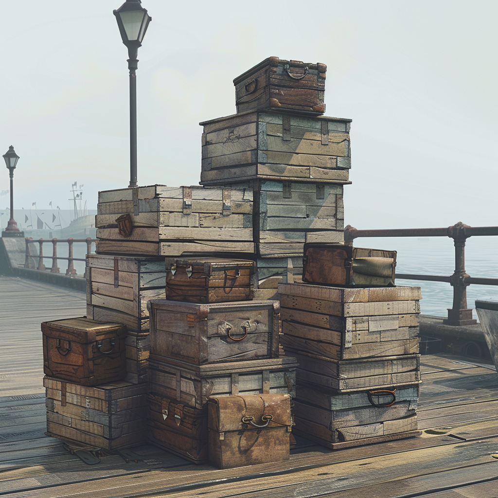
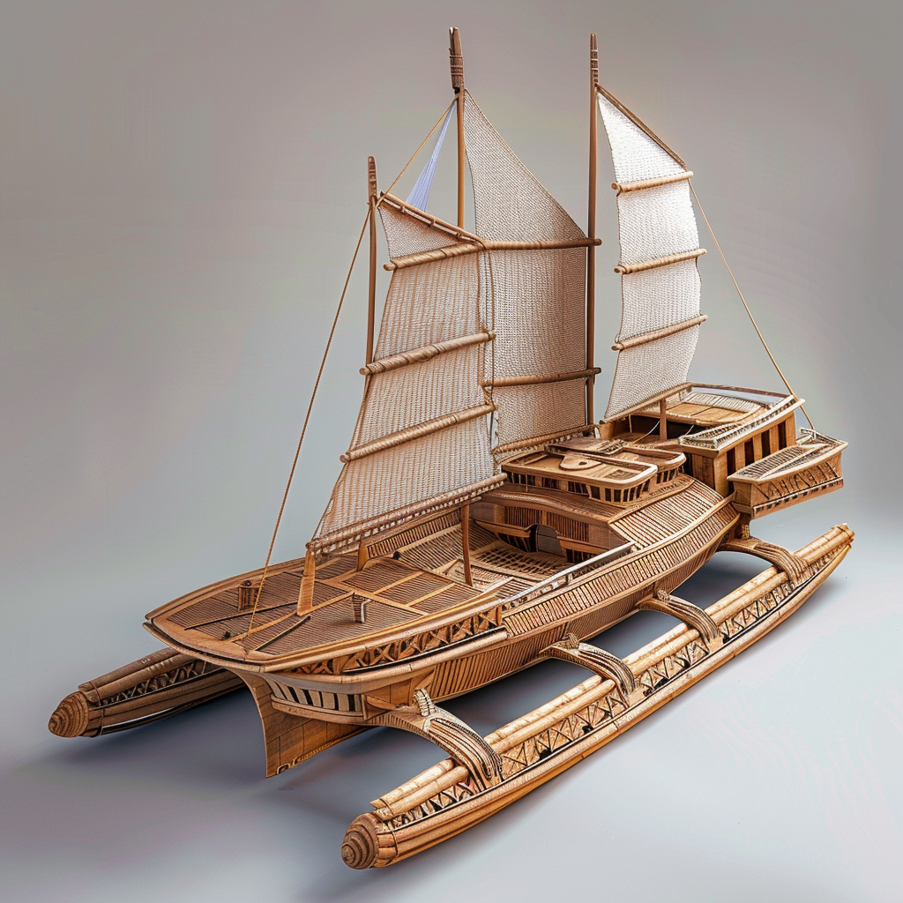
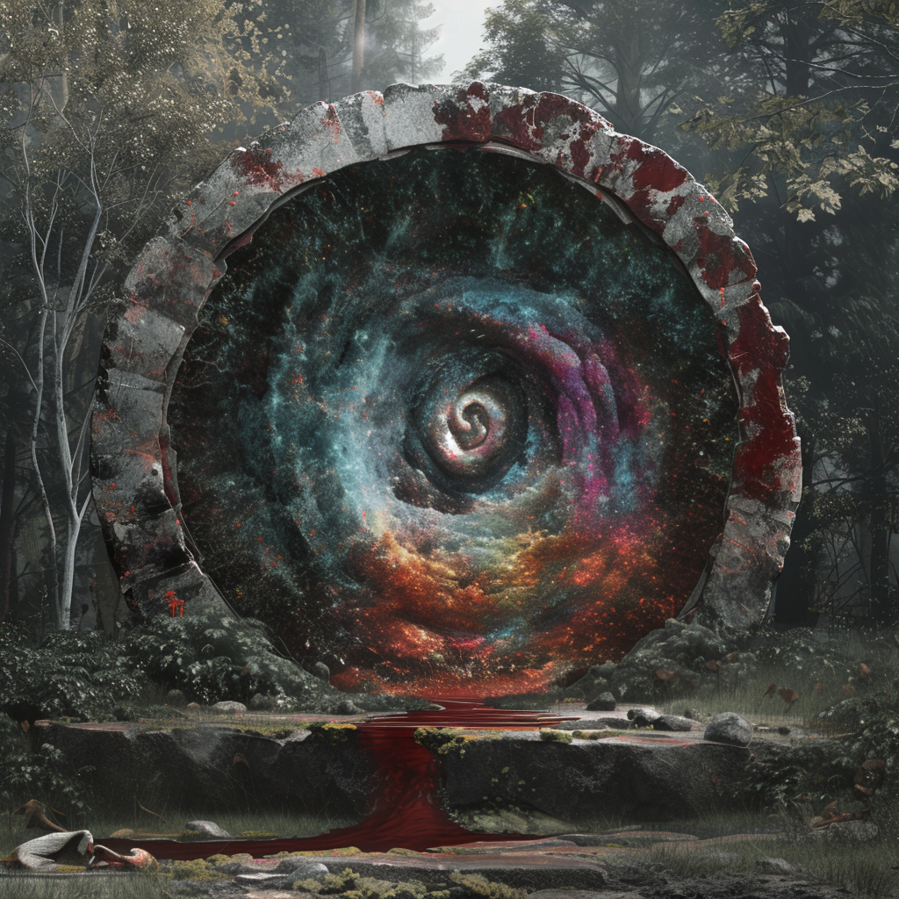

# 07.03.2024

# Meta / Kontext

Die Spieler werden am nächsten Tag zu ihrem ersten Portal aufbrechen. Sie haben sich gegen das naheliegendere entschieden, um mit einem Schiff über den Gravitationsozean zu fahren. Sie werden begleitet von 3 Conius-Forschern (unter anderem Kwint Gurdun) und 2 Sodili im Auftrage des Köngis.

Ákos tritt der Gruppe bei und übernimmt einen der Charaktere der Expedition (außer Kwint).

Den verbleibenden Tag in Carpebur nutzen die Spieler unterschiedlich. Taeron hat einen Unsichtbarkeits-Umhang in einem geheimen Conius-Laden in der grauen Zone gekauft, Alaric hat den "braunen Ring" in den Schwarztunneln gesucht und steht nun vor dessen Türen, und Kle hat eine Bibel von der Bibliothek abgeholt.

Malte wird nicht zur Session anwesend sein. Kles Bibel wird daher als allgemeiner Aufhänger für die anderen Spieler genutzt um sie an die Religion der Sgrisignier und die theologische Bedeutung der "Roiatinen" heranzuführen.

Die Spieler müssen nach wie vor das erste Portal erschließen: 
* Ihre Aufgabe besteht aus zwei Teilen:
    * Sie müssen herausfinden, ob die andere Seite des Portals Überleben zulässt oder nicht.
    * Wenn sie es als möglich einstufen müssen sie das Portal durchschreiten.
* Die nicht-spielenden begleitenden Conius und Sodili sind keine große Hilfe.

## Der Inhalt von Kles Bibel

Die [Bibel](/content/Voelker/Lateralen/Sodili/Theologie/die-Bibel-der-Unzaehlbaren.md) die Kle von der Bibliothek abgeholt hat, behandelt lediglich die Religion der Sodili. Als solche ist sie zwar inspiriert von der wahren [Schöpfungsgeschichte](/content/Allgemein/Schoepfungsgeschichte.md) aber in einer stark verzerrten Form.

## Alarics Begegnung mit dem braunen Ring
* Alaric steht in der Dunkelheit vor einer abgewetzten Holztür mit einem eingeritztem gezackten Kreis. 
* Auf den Tunnelwänden vor der Tür sind viele Kritzeleien, ein geübtes Auge erkennt sie als Diebesschrift.
* Über der Tür steht: "Spüret die schmerzenden Dornen des bedeutsamen Ringes" / "Drücke auf die relevanten Spitzen des Ring-Symbols"
* Auf den Tunnelwänden sind insgesamt 3 Hinweise:
    * "Frische Dornen haben grüne Spitzen" / "Zuerst, die Zacke die auf das Moos zeigt"
    * "Reifende Dornen spicken den Weg in die Tiefe" / "Als zweites die Zacke die nach unten zeigt"
    * "Starke Dornen begehren den Stahl" / "Als letztes, die Zacke die zur Klinke zeigt"
* Wenn Alaric die Zacken korrekt berührt, wird ihm die Tür geöffnet.
* Ihm gegenüber steht ein schlaksiger Sodili in heruntergekommenen Klamotten und mit einer Kakerlake auf der Schulter
* Er mustert Alaric durchgehend, dann springt die Kakerlake von seiner Schulter und verschwindet im Tunnel hinter ihm.
* Der Sodili hält Alaric eine Weile hin und erfragt seine Absichten.
* Sollte Alaric ihn nicht verärgern, wird er wenig später durchgelassen und betritt ein kleines Gewölbe.
* Es stehen modrige, alte, nicht zusammenpassende Holztische und -stühle herum und der Raum ist gefüllt mit ca. 13 zwielichtigen Gestalten.
* An einem Tisch in der Ecke erwartet ihn der Schmutzfinger Jolint.
* Jolint erklärt Alaric die Hierarchie des Ringes und macht ihn außerdem mit seiner neuen Rolle als Rekrut vertraut.
    * Sämtliche Diebesgüter muss Alaric direkt bei Jolint abgeben
    * In seiner Zeit als Rekrut bekommt er keine Entlohnung
    * In der Stadt gibt es verschiedene versteckte schwarze Bretter über die sich die Mitglieder des braunen Ringes austauschen ohne Aufsehen zu erregen.
    * Wenn Alaric genug Aufträge erfüllt, kann er im braunen Ring aufsteigen

## Charaktere

### Sodili
* [Eolyn Sera (Waldläufer) & Fezir (Adler)](/content/Voelker/Lateralen/Sodili/Charaktere/Eolyn-Aksae-Sera_Fezir/index.md)
* [Caelum Storringer (Paladin) & Tempest (Krokodil)](/content/Voelker/Lateralen/Sodili/Charaktere/Caelum-Froso-Storringer_Tempest/index.md)

### Conius

* [Draven Norint (Alchemist)](/content/Voelker/Lateralen/Conius/Charaktere/Draven-Norrint/index.md)
* [Lysandra Swirm (Druide)](/content/Voelker/Lateralen/Conius/Charaktere/Lysandra-Swirm/index.md)

# Erschließung der Portale

## Expeditionsstart am Wolkenhafen

Bei der Ankunft am Wolkenhafen werden die Spieler von [Kwint Gurdun](/content/Voelker/Lateralen/Conius/Charaktere/Kwint-Gurdun/index.md) erwartet.
Hinter Kwint sind einige Kisten aufgestapelt, welche die anderen Mitglieder der Expedition (die oben eingeführten, nicht-bespielten Charaktere) und die Crew bereits auf das Schiff laden.

Als Kwint die Spieler sieht, winkt er sie rasch zu sich herüber und sagt nur: 
> "Da seit ihr ja endlich. Kommt schnell und helft beim Verladen, wir sollten zügig aufbrechen"

Nachdem die Spieler (hoffentlich) beim Verladen geholfen haben, legt die Mannschaft schnellstmöglich ab. Kwint winkt bei allen näheren Nachfragen ab, da er die geheimen Details erst auf hoher See besprechen möchte. Sollten die Spieler in die Kisten gucken finden sie die Dinge ihrer Bestellung:

* Proviant für 1 Tag
* Kochtopf und Feuer
* Zelte und Betten
* Kleine Axt
* 4 Seile (dünn bis dick)
* Kleine Lebendfalle
* Säcke und Barrikaden
* Ritterrüstung
* Kleine Eisenplatte
* Gewichte
* Armbrust und Dolch

aber auch noch einiges mehr, vom König für die Expedition gestellt:

* Notproviant für 2 Wochen (Getrocknetes Fleisch)
* 5 Wasserfässer (100L) 
* Werkzeug (Hammer, Nägel, Sägen, Beile, Schaufeln)
* Navigationsinstrumente: Karten, Kompass, Sextant
* Medizinische Versorgung: Heilkräuter, Verbände, etc.

Die Crew besteht aus angeheuerten Sodili:

* [Erisa Sturint (Kaptänin) & Gale (Seeadler)](/content/Voelker/Lateralen/Sodili/Charaktere/Erisa-Ikal-Sturint_Gale/index.md)
* [Thaos Swiff (Schiffsnavigator / Steuermann) & Maris (Delphin)](/content/Voelker/Lateralen/Sodili/Charaktere/Thaos-Deakel-Swiff_Maris/index.md)
* [Maggus Sallet (Koch) & Ink (Tintenfisch)](/content/Voelker/Lateralen/Sodili/Charaktere/Maggus-Firn-Sallet_Ink/index.md)
* [Renn Ionfor (Schiffsmechaniker) & Wench (Anglerfisch)](/content/Voelker/Lateralen/Sodili/Charaktere/Renn-Kienu-Ionfor_Wench/index.md)
* 6x Matrosen (fürs Rudern und allgemeine Aufgaben an Bord, wie Reinigung, Wachen halten usw.):
<!-- TODO -->

## Auf dem Gravitationsozean

Sobald die Crew abgelegt hat, versammelt Kwint die Expeditionsteilnehmer in der Kajüte um ihnen die nächsten Schritte zu vermitteln.

Das angestrebte Vorgehen ist die Etablierung einer Versorgungskette durch mehrere Portale. Es wurde sich explizit gegen eine großflächige Erschließung mehrerer einzelner Portale entschieden, da die Gefahren zu wenig bekannt und zu unberechenbar sind. Sollten z. B. mehrere Portale in der Umgebung der Stadt erschlossen werden woraufhin sich dann ungeahnte Gefahren ergeben, könnte das die gesamte Sodili-Hauptstadt gefährden. Stattdessen soll mit der Zeit ein einziger gefestigter Stützpunkt um das erste erschlossene Portal errichtet werden. Vom Ziel-Ort des Portals werden dann weitere Portale gesucht und erschlossen, sodass im schlimmsten Fall nur ein Portal verteidigt werden muss. Kwint macht der gesamten Expedition aber auch ausdrücklich klar, dass der Frieden immer im Vordergrund steht. Die Erschließung der Portale soll neue Handelsrouten und interplanetare Verbindungen herstellen, keine neuen Gefahren und Krieg bringen.

Allgemein können die Spieler während der Fahrt die Aussicht genießen, angeln, oder die Crew kennenlernen.

Die ersten ~2 Stunden der Schiffahrt passiert das Schiff lediglich die großen Klippen von Carpebur. In den steilen Steinwänden sind viele kleine Löcher in denen Vögel nisten und von den überhängenden Kanten der Klippen hängen dicke Lianen zwischen denen Hörnchen-Affen schwingen.
Die Klippen nehmen mit der Zeit an Höhe ab, bis die Küste knapp auf Höhe der Meeresoberfläche ist. 

Dann muss der Katamaran einen Umweg nach außen nehmen, da Gurontis an dieser Stelle ein weitreichendes Plateau unter der Wasseroberfläche aufweist. Für Schiffe sind diese Gewässer zu seicht und außerdem wird das Plateau am Ende von einer dichten Inselkette gesäumt. In den seichten Gewässern hat sich ein Korallenriff gebildet, mit einer vielfältigen Flora und Fauna.

## Ankunft am Zielort

Die Expedition legt in einer Bucht nahe der passierten Inselkette an. Das Portal ist von dieser Stelle einen ~20 minütigen Marsch entfernt, in einem kleinen Waldstück.

<!-- TODO: Genaues Vorgehen zur Portal-Sicherung definieren (Anbringen der Rune, etc.) -->

<!-- TODO: Portalkette definieren -->

## Mögliche Ziele

### Aridess
* Große Wüsten, kleine Oasen.
* Schwieriege Navigation
* Begegnung mit Zwergen-Karavane
    * Gespannte Situation durch Unbekanntheit
    * Sprachbarriere
    * Auf dem Weg zum Handelsposten 
* Mögliche Informationen über die Umgebung:
    * Oase circa 3 Stunden entfernt, Handelposten der Vapornans
    * Verlassene Edelsteinmine der Vapornans die von den giftigen Stachelschwein-Kakteen infiziert ist.
    * Offene Wüste mit "Wellen" (Gefährliche Riesenflunder)
    * Trockene Bergkette aus dem die Karawane kam (enge Bergpfade und steile Steinwände mit Sukkulenten)

### Linunar
* Tote Urzeit-Welt
* Viele riesiege Insekten, Farn-Bäume und Reptilien
* Strahlenbelastet

### Luqua
* Nur Riff-Dörfer sind zugänglich
* Die Portale sind möglicherweise sehr weit unter Wasser (Gefahr durch Druck)

### Mognar
* Zu heiß, nicht (lang) betretbar
* Erweckung der Drachenkinder

### Navura
* Tiefe Dschungel
* Begegnung mit Orcs

### Venoxi
* Zu giftig, nicht betretbar

# Carpebur

## Der obere Wolkenhafen

Ihr betretet den oberen Wolkenhafen von Carpebur, einen geschäftigen Knotenpunkt des Handels und der Flugaktivitäten, der am Rand der Klippen thront. Die Straßen sind belebt von Händlern und Reisenden, die ihre Waren und Dienstleistungen anpreisen, handeln, verladen und transportieren.

## Die mittleren Tunnelebenen

Ihr betretet die mittleren Tunnelebenen von Carpebur, eine versteckte Welt unter der Oberfläche der Stadt, die von einem Labyrinth von Tunneln und Gängen durchzogen ist. Die Tunnel sind eng und verwinkelt und ihr könnt das Gefühl haben, dass ihr euch in einem Irrgarten verlaufen habt, während ihr durch die dunklen Gänge navigiert.

Die Architektur der mittleren Tunnelebenen ist einfach und funktional, mit vielen kleinen Wohnungen und Geschäften, die entlang der Tunnelwände angelegt sind. Die Straßen sind schmal und schlecht beleuchtet und ihr könnt das Gefühl der Enge und Beklemmung spüren, das die Tunnel durchdringt.

In den mittleren Tunnelebenen gibt es nur wenige Geschäfte und Unterhaltungsmöglichkeiten und die Atmosphäre ist düster und bedrückend. Ihr könnt das Gefühl haben, dass ihr euch in einer ganz anderen Welt befindet, weit entfernt von der Hektik und dem Trubel der Oberfläche der Stadt.

## Der untere Wolkenhafen

Der untere Wolkenhafen liegt unterhalb der Klippen am Rand von Gurontis, wo die Wassermassen des Hudori-Flusses in den Gravitationsozean fließen. Der

## Die graue Zone

Ihr betretet die graue Zone von Carpebur, eine düstere und gefährliche Gegend am Rande der Stadt, die von Verbrechen und Gewalt geprägt ist. Die Straßen sind schmutzig und verfallen und die Gebäude sind heruntergekommen und verlassen.

Die Architektur der grauen Zone ist düster und bedrohlich, mit vielen verlassenen Gebäuden und heruntergekommenen Straßen. Die Atmosphäre ist düster und beklemmend und ihr könnt das Gefühl haben, dass ihr euch in einem Albtraum befindet, während ihr durch die verlassenen Straßen wandert.

In der grauen Zone gibt es nur wenige Geschäfte und Unterhaltungsmöglichkeiten und die Atmosphäre ist düster und bedrückend. Ihr könnt das Gefühl haben, dass ihr euch in einer ganz anderen Welt befindet, weit entfernt von der Hektik und dem Trubel der Oberfläche der Stadt.

## Die Schwarztunnel

Ihr betretet die Schwarztunnel von Carpebur, ein gefährliches und unerforschtes Labyrinth von Tunneln und Gängen, das tief unter der Oberfläche der Stadt liegt. Die Tunnel sind dunkel und bedrohlich und ihr könnt das Gefühl haben, dass ihr euch in einem Albtraum befindet, während ihr durch die düsteren Gänge wandert.

Die Architektur der Schwarztunnel ist düster und bedrohlich, mit vielen dunklen und verlassenen Gängen und Höhlen. Die Atmosphäre ist düster und beklemmend und ihr könnt das Gefühl haben, dass ihr euch in einer ganz anderen Welt befindet, weit entfernt von der Hektik und dem Trubel der Oberfläche der Stadt.

In den Schwarztunneln gibt es keine Geschäfte oder Unterhaltungsmöglichkeiten und die Atmosphäre ist düster und bedrohlich. Ihr könnt das Gefühl haben, dass ihr euch in einem Albtraum befindet, während ihr durch die düster
