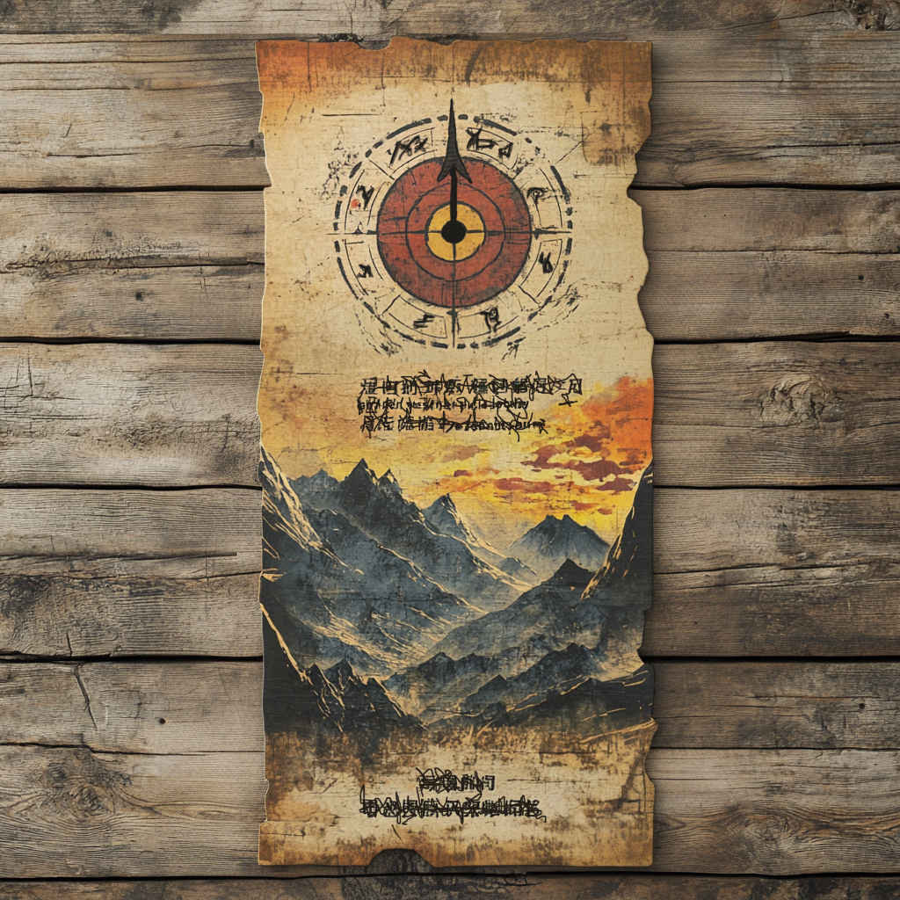

# Zirkel-Wettstreit

Der Zirkel-Wettstreit ist eine Veranstaltung der [Vapornan](/content/Volk_/Vapornane/index.md)-Familie [Krolpin](/content/Volk_/Vapornane/Politik/Familie_/Krolpin_Zirkelgruender/index.md), welche im [Zirkel-Gebirge](/content/Himmelskoerper_/Aridess/Kontinent_/Unon/Gebirge_Zirkelgebirge/index.md) am nördlichen Pol des Planeten [Aridess](/content/Himmelskoerper_/Aridess/index.md) stattfindet.
Der Wettstreit ist ein wichtiger Meilenstein in der Geschichte der Vapornanes.
Ziel ist die Entwicklung von mechanischen Erfindungen, die von so fundamentaler Nützlichkeit sind, dass sie Einfluss auf den gesamten Planeten nehmen können und so einerseits zur [Globalisierung von Aridess](../Globalisierung-Aridess.md) beitragen sollen und andererseits die Entstehung der [12 Vapornan-Zirkel](/content/Volk_/Vapornane/Politik/Zirkel_/index.md) bedingen.
Um den Wettstreit zu bewerben müssen die Krolpins ihre Position als Hauptversorger für Metalle voll ausnutzen.
Für die Verkündung werden insgesamt Tausende Handzettel erstellt, welche allen Handelspartnern der Krolpins für die Weiterverbreitung mitgegeben werden.
:::figure{style="width: 400px;"}

::figcaption[Flyer für die Werbung des Zirkel-Wettstreits]
:::
Dabei sind die bestehenden Handelsrouten auf Aridess zu großen Teilen stark vernestelt und dadurch nicht selten recht ineffizient.
Die von den Krolpins gewählte Vorlaufzeit von 10 Zyklen soll daher sicherstellen, dass die Kunde sich möglichst weit verbreitet und mögliche Teilnehmer genug Zeit für die Anreise haben.
Schließlich finden sich 158 teilnehmende Gruppen (insgesamt über 650 Vapornanes) für den Wettstreit im Tal des Zirkelgebirges ein.
Der Zirkel-Wettstreit führt letztendlich dazu, dass sich die Lebensqualität nahezu aller erreichter Orte auf Aridess stark verbessert und löst langfristig zudem eine Verstädterung auf Aridess aus.

# Regeln
Zu Beginn richten die Krolpins eine Eröffnungszeremonie aus, bei welcher [Hiante Krolpin](/content/Volk_/Vapornane/Politik/Familie_/Krolpin_Zirkelgruender/Charakter_/Hiante-Krolpin/index.md) neben einer feierlichen Begrüßung auch das Ziel des Wettstreits sowie dessen Rahmenbedingungen verkündet.
Der Wettstreit wird über einen Zeitraum von zwei Zyklen durchgeführt und die Qualifikation der Erfindungen erfolgt über mehrere Runden hinweg durch demokratische Abstimmungen aller Teilnehmer.
Dabei wird die Anzahl an Gruppen mit abnehmender Schrittweite dezimiert.
Zur anfänglichen Überraschung vieler Teilnehmer sind die Gruppen nicht für den gesamten Verlauf festgelegt.
Ausgeschiedenen Gruppen steht es frei, sich sogleich der Weiterentwicklung einer der qualifizierten Erfindungen anzuschließen.
Zudem legen die Wettstreitbedingungen fest, dass sich alle Teilnehmer dazu verpflichten die Verbreitung der Gewinner-Erfindungen auf dem gesamten Planeten zu unterstützen.
Mit Abschluss des Wettstreits wird für jede der 12 gewinnenden Erfindungen ein Zirkel gegründet, welcher fortan eine koordinierende Rolle bei der geplanten Globalisierung einnimmt.

# Ablauf
Ab der Eröffnungsfeier haben die Gruppen stetig Zeit kollaborativ an ihrer jeweiligen Erfindung zu arbeiten und sie gemeinsam zu verbessern.
Hierfür werden unter anderem viele spezielle Veranstaltungen geplant, bei denen die Teilnehmer die Möglichkeit haben bestimmte Techniken, Erkenntnisse oder wissenschaftliche Theorien zu lehren und zu lernen.

## Einführung
Die erste Lehrveranstaltung übernimmt [Grisham Krolpin](Stolzer Sohn).

Auf diesem Wege werden unter Anderem das Wissen über die Nutzung von Wasserdampf sowie die Effekte von aufgeladenen Edelsteinen verbreitet, was wiederum zur Verbesserung der meisten der entwickelten Gegenstände führt und so das Gesamtniveau des Wettstreits anhebt.