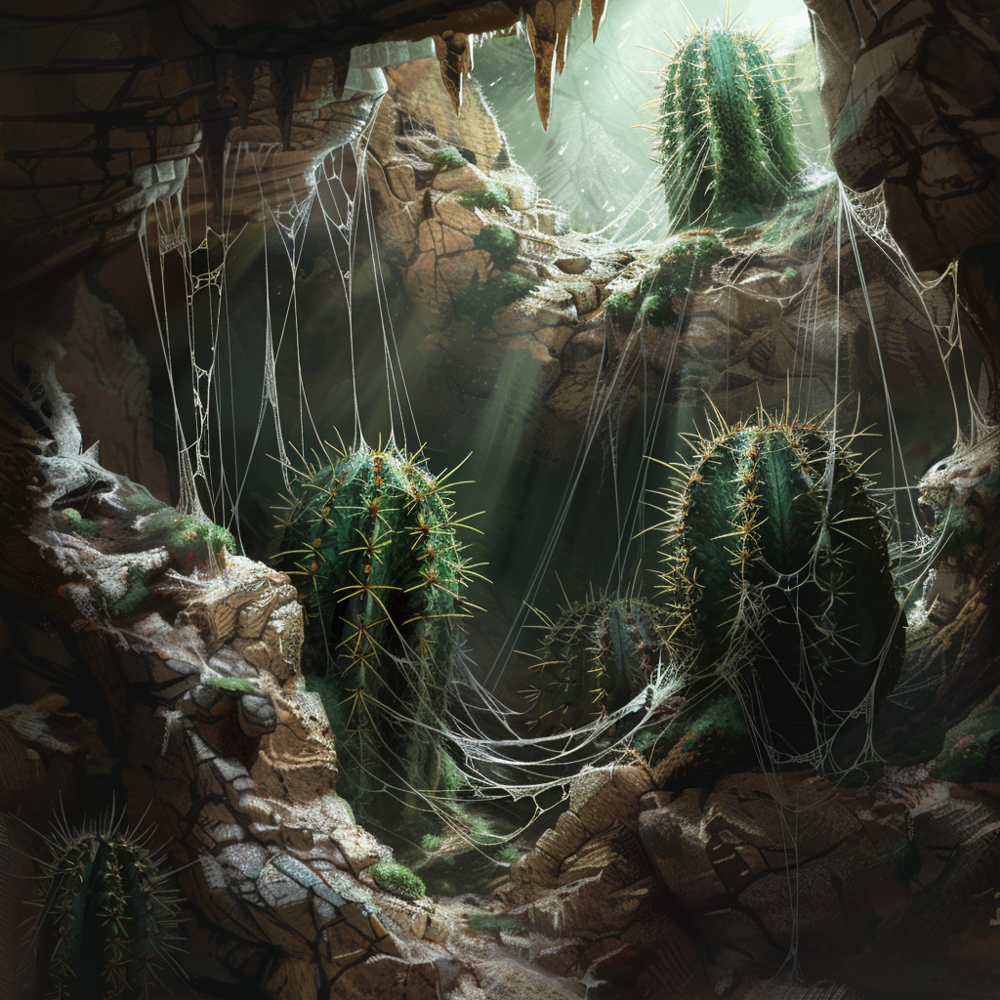

# Shwin-Kaktus

:::figure

::figcaption[Eine Höhle voller Shwin-Kakteen und ihren Fäden]
:::

## Beschreibung
Der Shwin-Kaktus, auch bekannt als Spinnenstachel-Kaktus, ist eine hochentwickelte und gefährliche Variation herkömmlicher Kaktusarten. Er ist dafür bekannt, dünnflüssige Fäden ähnlich einer Spinne zu produzieren, die aus seinen Stacheln austreten. Diese Fäden haften stark an allem, was sie berühren.

## Funktion und Jagdverhalten
Die Stacheln von einem Shwin-Kaktus sind mit einer äußerst giftigen Flüssigkeit gefüllt. Wenn ein Lebewesen versehentlich in die Fäden des Kaktus gerät, bleiben sie daran kleben. Bei Bewegung des Opfers löst dies eine schnelle Reaktion aus, bei der die Stacheln des Kaktus als Ganzes aus dem Stamm geschleudert werden. Diese Angriffe sind blitzschnell und können tief in die Haut oder das Fell eindringen, wobei die giftigen Substanzen schnell in den Blutkreislauf gelangen und eine ernsthafte Vergiftung verursachen.

## Verbreitung und Lebensraum
Die meisten Shwin-Kakteen sind in den trockenen und felsigen Regionen von [Aridess](/content/Himmelskoerper/Aridess/index.md) anzutreffen.
Diese Pfalnze bevorzugt windgeschützte Lebensräume inmitten von Felsspalten und anderen Nischen, wo optimale Bedingungen für die Produktion der Fäden herrschen. Diese einzigartige Schutzstrategie hat sich über Jahrmillionen der Evolution entwickelt, um zu verhindern, dass er von Tieren wie dem Lurper, die ihn aufgrund seines hohen Wassergehalts verzehren könnten, gefressen wird.

## Nutzung und Gefahren
Aufgrund seiner hochgiftigen Natur und der gefährlichen Verteidigungsmechanismen wird der Shwin-Kaktus von den Bewohnern der Region mit äußerster Vorsicht behandelt. Niedrig dosiert soll das Gift gegen Arthritis helfen, doch lohnt sich der Aufwand für die meisten Vapornane nicht
