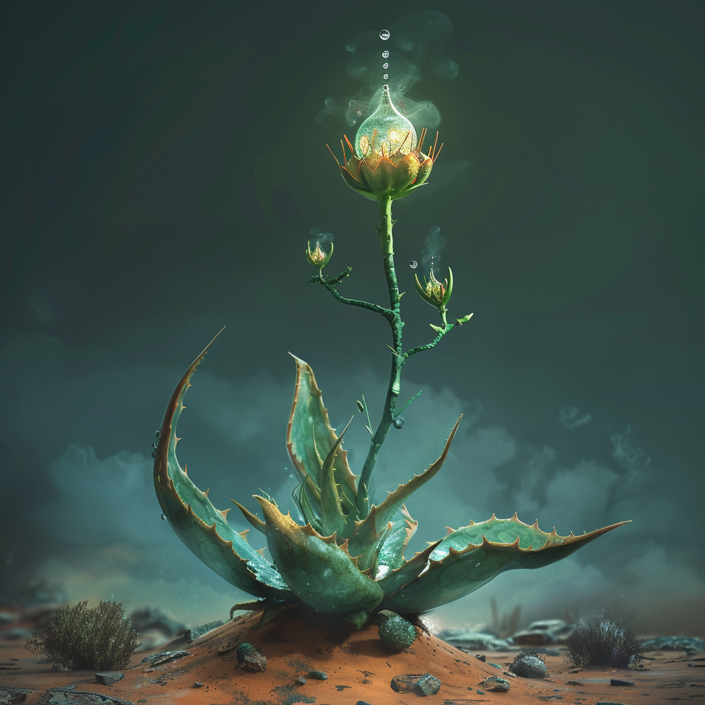

# Vorolae

:::figure

::figcaption[Eine Vorolae im Lockmodus]
:::

## Beschreibung
Die Vorolae ist eine faszinierende fleischfressende Pflanze, die auf Aridess gedeiht. Sie hat Ähnlichkeit mit einer großen Aloe Vera, mit ihren dicken, fleischigen, leicht stacheligen Blättern, die eine grau-grüne Farbe haben und von einer wachsartigen Schutzschicht überzogen sind.
Die Pflanze erreicht eine Höhe von bis zu zwei Meter und eine Breite von etwa einem halben Meter. 
Ihre Blätter sind in einer Rosette angeordnet und weisen spitze, leicht gezahnte Ränder auf. 
In der Mitte dieser Rosette befindet sich ein besonders bemerkenswertes Merkmal: ein ausfahrbarer Stamm, der eine klebrige Blüte trägt. Diese Blüte sieht aus wie ein riesieger Wassertropfen, welcher Tiere in der trockenen Umgebung unausweichlich anlockt.

## Funktion und Jagdverhalten
Die Vorolae ist eine Fleischfresserin. Sobald ein ahnungsloses Beutetier von der klebrigen Blüte angelockt wird und sich in deren Nähe begibt, schnappt die Pflanze blitzschnell zu. Ihre Blätter schließen sich wie ein gewaltiger Kiefer um die Beute und zwingen diese, in der Mitte der Rosette gefangen zu bleiben. Die Pflanze sondert dann Verdauungsenzyme ab, die das gefangene Tier zersetzen und die Nährstoffe aufnehmen.

## Lebensraum
Die Vorolae bevorzugt trockene, schattige Umgebungen. Je trockener, desto effektiver ist ihre Jagdmethode, doch vermeidet sie es ihre Frucht in der prallen Sonne auszufahren, damit diese nicht austrocknet. Man findet Vorolaen häufig in den vielen trockenen Felsspalten und Savannen von .

## Nutzung
In den Kulturen der Varnops wird die Vorolae wegen ihrer Wasserfrucht geschätzt. Schneidet man den Stamm der Vorolae schnell genug durch, zieht sie sich schnell zurück und man kann die Wasserfrucht mit etwas Geschicklichkeit auffangen.

## Mythologie und Legenden
In der Folklore vieler Völker der Fantasy-Welt gilt die Vorolae als ein Symbol für die Wildheit und Unberechenbarkeit der Natur. Es gibt zahlreiche Geschichten über unvorsichtige Wanderer und Abenteurer, die in die Falle der Vorolae geraten sind. Einige Varnops sind der Meinung, dass die Pflanze besonders reine Seelen nicht frisst und freiwillig von ihrer Frucht nährt.