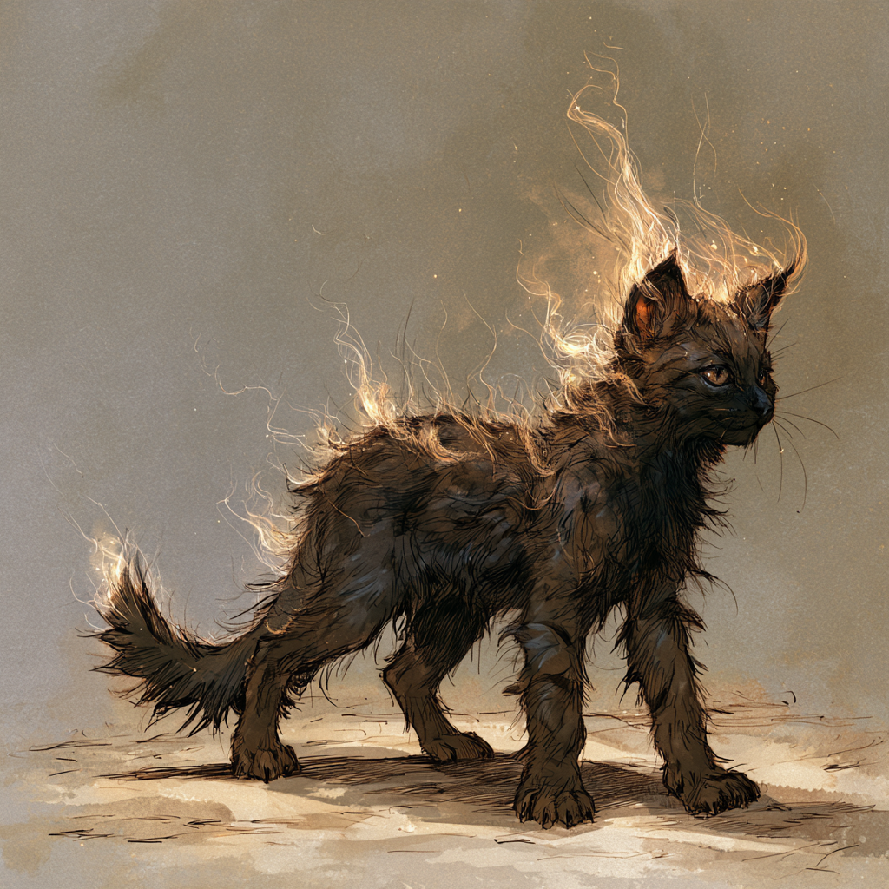
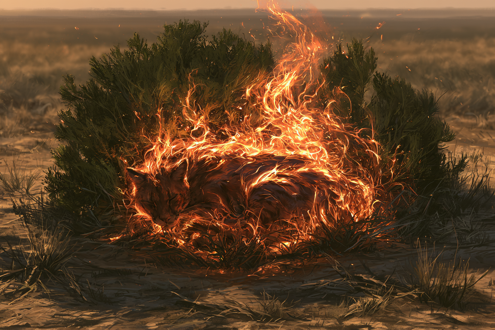

<!-- tags: Raubtier, inherit=1 -->
# Fuaga
Die Fluagas, auch genannt Feuer-Katze ist eine majestätische, mittelgroße Raubkatze, deren rotes Fell im Sonnenlicht schimmert und glüht, als wäre es in Flammen.
Diese Katzen jagen in geschickten Gruppen und sind bekannt für ihre schnellen und präzisen Angriffe auf Beute.
Wenn sie eine Beute jagt, kommuniziert die Gruppe durch leise, aber effektive Laute miteinander, um gemeinsam die Beute zu sichern.
Liegt eine Gruppe gemeinsam in der Sonne, hält man sie bei etwas Wind leicht für einen kleinen Buschbrand

## Fellfarbe und Tarnung

Jungtiere tragen ein dunkles, bräunliches Fell, besitzen aber bereits die feinen, fast leuchtenden Flaumhärchen, die im Wind wehen und wie kleine Flammen wirken.
Diese Tarnung erlaubt es ihnen, sich unbemerkt auf Bäumen aufzuhalten.

Erwachsene Fuagas halten sich seltener auf Bäumen auf.
Ihr dunkleres, rötliches Fell dient stattdessen als Tarnung bei Büschen und Sträuchern, wo es wie der Glutherd eines kleinen Buschbrandes wirkt.