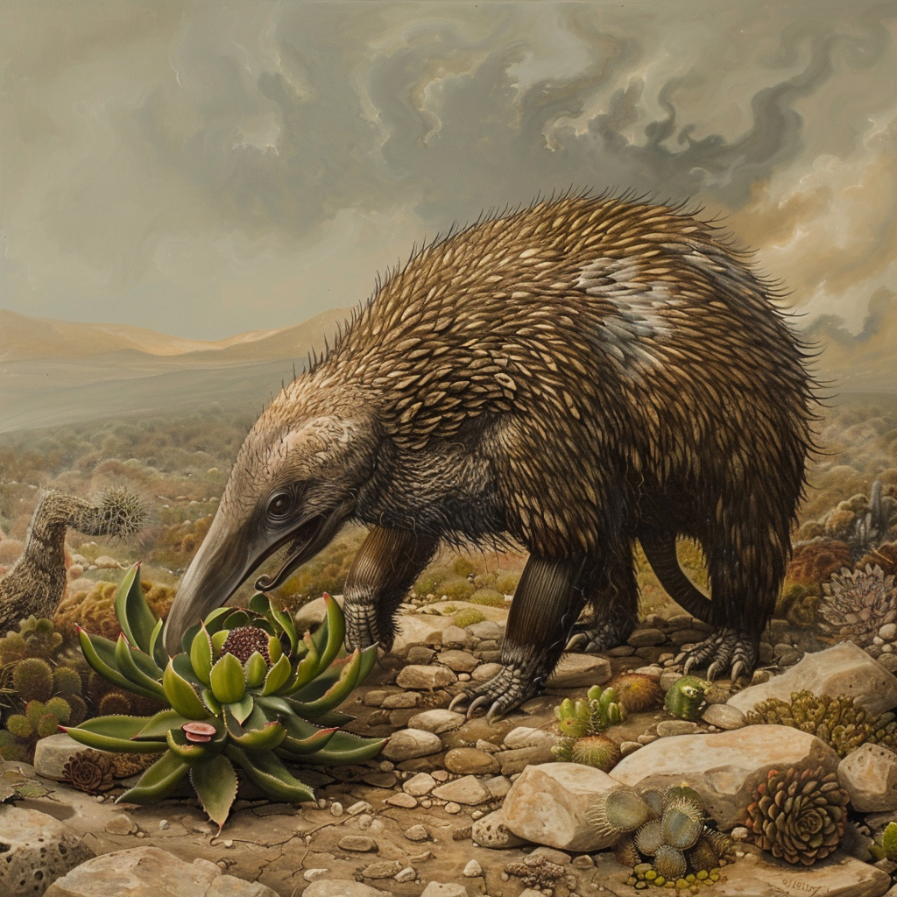

# Lurper

## Beschreibung

Der Lurper ist ein großes Wüstentier, das entfernt an einen Ameisenbären erinnert.
Sein länglicher Kopf und der kräftige Rüssel sind darauf spezialisiert, sukkulente Pflanzen und Kakteen anzustechen, um ihnen Feuchtigkeit zu entziehen.

## Verhalten

Trotz dieser spezialisierten Ernährungsweise sind Lurper keineswegs harmlos.
Sie verhalten sich stark territorial und greifen Eindringlinge an, wenn sie ihre Futterplätze, Nistbereiche oder Jungtiere bedroht sehen.
Besonders in felsigen Übergangszonen zwischen Savanne und Wüste klettern sie überraschend geschickt und nutzen ihre Masse, um Gegner mit plötzlichen Vorstößen zu vertreiben.
Auf Distanz schleudern sie mit ihrem Rüssel auch gezielt Steine gegen Eindringlinge, die sich ihrem Revier nicht sofort nähern.

## Lebensraum

Lurper halten sich bevorzugt in trockenen Felslandschaften, Kakteenfeldern und den Randgebieten wasserarmer Savannen auf.
Sie folgen dabei weniger offenen Dünenmeeren als jenen Zonen, in denen genügend widerstandsfähige Pflanzen wachsen, um ihren Wasserbedarf zu decken.

## Beziehung zum Shwin-Kaktus

Gerade weil Lurper auf wasserhaltige Pflanzen spezialisiert sind, gehören [Shwin-Kakteen](/content/Himmelskörper/Aridess/Flora/Shwin-Kaktus/index.md) zu ihren gefährlichsten natürlichen Gegenspielern.
Immer wieder werden verletzte oder tote Lurper in der Nähe dichter Kaktusfelder gefunden, deren Hinterläufe oder Flanken von Stachelgiften durchsetzt sind.
Solche Funde gelten unter Reisenden als deutlicher Hinweis darauf, dass ein Gebiet nicht nur trocken, sondern auch biologisch hochgradig wehrhaft ist.
