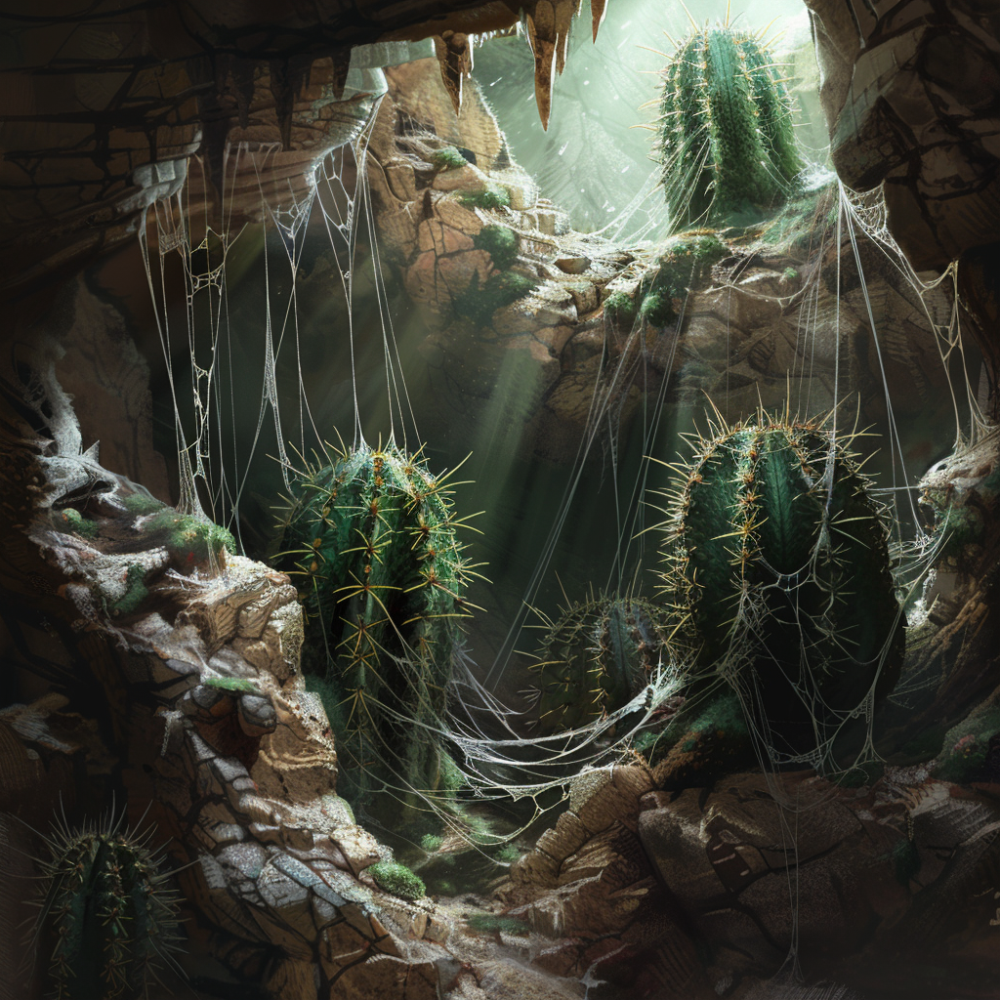

# Shwin-Kaktus

<!-- display: figure -->

## Beschreibung

Der Shwin-Kaktus, auch Spinnenstachel-Kaktus genannt, ist eine hochentwickelte und gefährliche Variation aridessischer Kaktusarten.
Er produziert dünnflüssige, klebrige Fäden, die aus seinen Stacheln austreten und sich über die nähere Umgebung spannen.

## Funktion und Jagdverhalten

Die Stacheln des Shwin-Kaktus sind mit einer äußerst giftigen Flüssigkeit gefüllt.
Wenn ein Lebewesen versehentlich in die Fäden gerät, bleiben diese daran haften.
Bei Bewegung des Opfers löst dies eine schnelle Reaktion aus, bei der die Stacheln als Ganzes aus dem Stamm geschleudert werden.
Die Angriffe sind blitzschnell und können tief in Haut oder Fell eindringen, woraufhin das Gift rasch in den Blutkreislauf gelangt.

## Verbreitung und Lebensraum

Die meisten Shwin-Kakteen sind in den trockenen und felsigen Regionen von [Aridess](/content/Himmelskörper/Aridess/index.md) anzutreffen.
Die Pflanze bevorzugt windgeschützte Lebensräume in Felsspalten, Höhleneingängen und ähnlichen Nischen, wo ihre Fäden nicht zu schnell zerreißen oder verwehen.

Diese Abwehrstrategie gilt als evolutionäre Antwort auf Fressfeinde wie den [Lurper](/content/Himmelskörper/Aridess/Fauna/Lurper/index.md), der den hohen Wassergehalt vieler Wüstenpflanzen ausnutzt.

## Nutzung und Gefahren

Aufgrund seiner hochgiftigen Natur und der gefährlichen Verteidigungsmechanismen wird der Shwin-Kaktus von den Bewohnern der Region mit äußerster Vorsicht behandelt.
Niedrig dosiert soll sein Gift gegen Arthritis helfen, doch lohnt sich der Aufwand für die meisten Varnops nicht.

## Historische Einordnung

In den frühen Berichten der [Ikusation](/content/Ereignis/Ikusation.md) wird der Shwin-Kaktus mehrfach als Grund genannt, warum verlassene Minen und schattige Felsspalten auf Aridess keineswegs automatisch sichere Zufluchtsorte darstellen.
Gerade erschöpfte Reisende unterschätzen häufig die Reichweite und Reaktionsgeschwindigkeit seiner Fäden.
