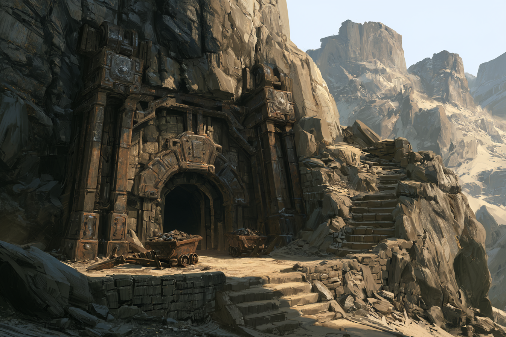
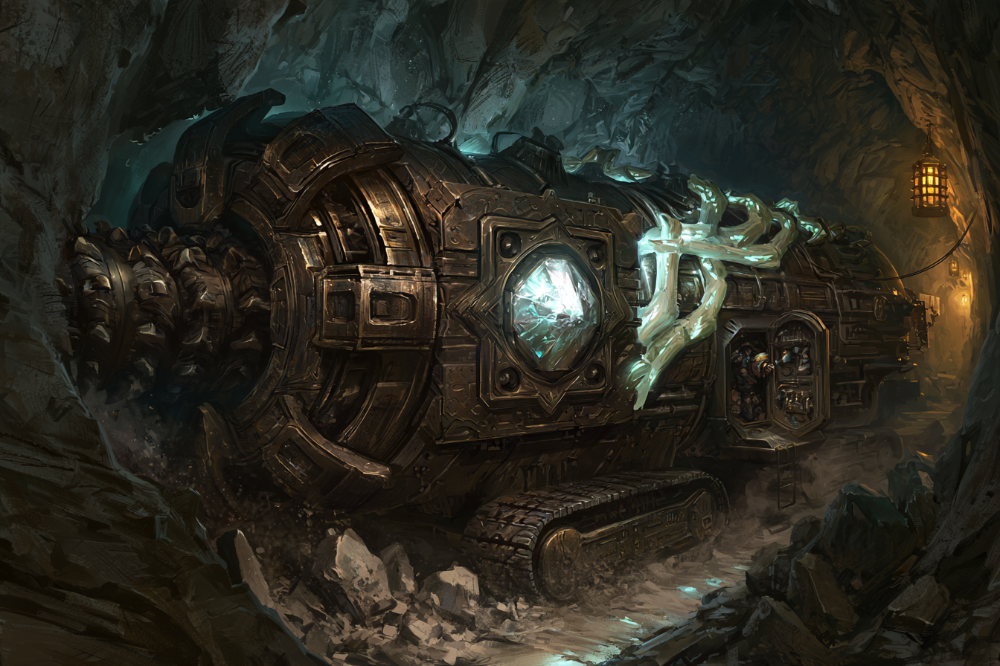

<!-- tags: Bergbau, Krolpin, Aridess -->
# Kharrak Minen

Die Kharrak-Minen befinden sich in einem der äußeren Berge der nördlichen Gebirge.
Über dem Eingang ist das Wappen der Krolpin-Familie in den Fels eingelassen.
In dieser Mine wird Eisenerz abgebaut und verarbeitet.

Bis heute ist die Mine aktiv und nutzt dafür die großen Tunnelbohrer des [Erz-Phoriats](/content/Volk/Varnops/Politik/Zirkel/Erz-Phoriat.md).
Zu echten, riesigen Tunnelbohrern wurden diese Geräte erst durch die Gemtech-Beschleunigung des Zirkel-Wettstreits — zuvor dienten nur kleine Handbohrer als Unterstützung.
Die Leitung dieser Mine obligt [Lerold](/content/Volk/Varnops/Politik/Familie/Krolpin/Charakter/Lerold-Krolpin/index.md).

## Historische Bedeutung

Die Kharrak-Mine ist nicht nur eine der zentralen Eisenquellen des frühen Zirkelgebirges, sondern auch ein wichtiger Knotenpunkt im Umfeld der [Krolpin-Familie](/content/Volk/Varnops/Familie/Krolpin/index.md).
Im Rahmen des [Erstkontakts mit den Varnops](/content/Ereignis/Erstkontakt-Varnops.md) passierte die laterale Expedition die Mine auf ihrem Weg ins Zirkel-Tal und erneut auf dem Rückweg nach dem diplomatischen Austausch mit Hiante Krolpin.
