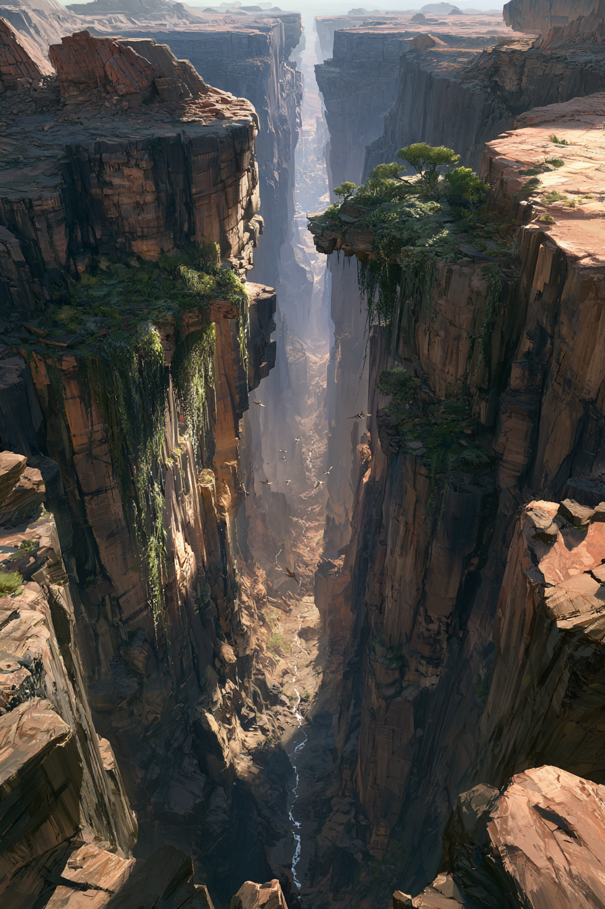

<!-- tags: inherit=1 -->
# Verdial, die Grünen Schluchten

# Allgemein
<!-- callout: note -->
> **Note:** Verdial ist technisch gesehen kein eigener Kontinent, sondern nur das Ergebnis der Divergenz von Unol und Zunir.

Das Verdial-Gebiet (auch "die Verdialen" genannt) ist ein Netzwerk von Schluchten am Äquator von Aridess.
Es zählt als die fruchtbarste Gegend auf Aridess, denn zum einen hat sich in diesen Canyons über Jahrmillionen ein Großteil des Wassers von Aridess gesammelt, und zum anderen schützen die steilen Klippen und Überhange vor der segenden Hitze der Sonne.
Das Leben in den Verdialen ist dabei nicht zu vergleichen mit dem Leben sonstwo auf Aridess.
Die Schluchten verlangen eine vertikale Lebensart, weshalb sich Lebewesen die gut klettern oder fliegen können hier besonders gut durchgesetzt haben.
Trotz der Hindernisse haben sich einige kleine, hoch spezialisierte Siedlungen in den Schluchten angesiedelt, die sich die Fruchtbarkeit der Region zunutze machen.
Für die meisten Bodenvölker ist eine Querung der Verdialen nur an wenigen bekannten Passagen möglich — abseits davon gelten die Schluchten als faktisch unüberwindbar und bleiben vor allem kletternden oder fliegenden Wesen vorbehalten.