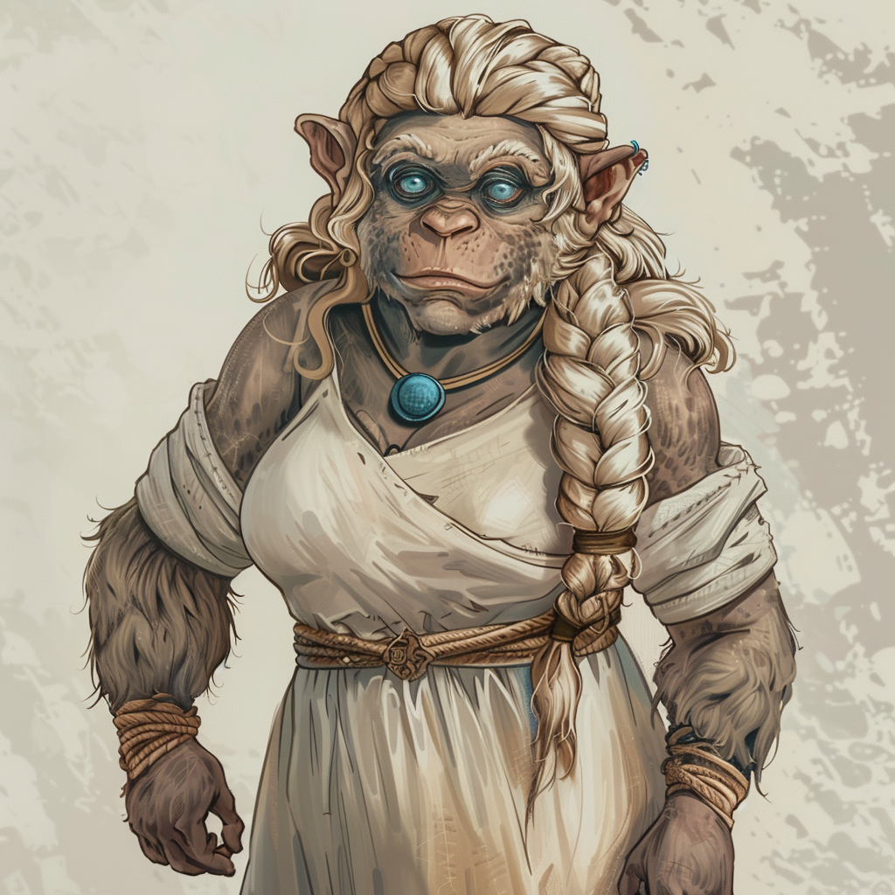

# Lysandra Swirm (Wasser-Magierin)

**Name:** Lysandra Swirm  
**Titel/Klasse:** Wasser-Magierin  
**Alter:** Junge Erwachsene  
**Geschlecht:** Weiblich  
**Spezies/Rasse:** [Conius-Laterale](/content/Voelker/Lateralen/index.md)  
**Heimat:** Carpebur  
**Beruf:** Besitzerin einer Unterkunft am Kapis-Schloss

## Allgemein

### Aussehen
Lysandra ist eine korpulente Frau mit grau-blauen Augen und langem, welligen blonden Haar, welches sie oft in einem lockeren Zopf trägt.
An ihrem Hals hängt stets ein blaues Amulett in Tropfenfrom, spiegelnd wie das Wasser, das sie so liebt. 
Sie trägt meist einfache Kleider in hellen Farbtönen und verzichtet auf Stoffe wie Leder oder Fell wenn möglich.

### Persönlichkeit

#### Charakterzüge
Lysandra ist ruhig und besonnen und strahlt eine natürliche Gelassenheit aus, die auch auf andere beruhigend wirkt.
Sie ist sehr charismatisch und hat ein großes Herz für Tiere, besonders für Micus.
Außerdem ist Lysandra immer neugierig auf den neusten Klatsch und Tratsch des Adels aus Carpebur. 

#### Vorlieben
Lysandra liebt es, Zeit mit ihren Gästen (vor allem den Micus) zu verbringen.
Sie genießt das Wasser der vielen Kanäle und Seen in Carpebur, sei es zum Schwimmen oder einfach nur zum Entspannen am Ufer.
In ihrer Freizeit hört sie gerne den Geschichten und dem Klatsch und Tratsch zu, den die Besucher ihrer Gaststätte zu erzählen haben.

#### Abneigungen
Lysandra hat wenig Geduld für diejenigen, die Tiere schlecht behandeln.
Sie empfindet außerdem eine Abneigung gegenüber Sodili, die ihren Micu als selbstverständlich ansehen.

## Hintergrundgeschichte

### Frühes Leben
Lysandra wurde auf einem Hof in der Nähe von Resrubor geboren, sodass ihr die Liebe zu Tieren quasi in die Wiege gelegt wurde. 
Ihre Eltern schickten sie schließlich auf die Resrubor-Akademie, da sie die Hoffnung hatten, dass die Runen-Magie ihnen schließlich ein besseres Leben ermöglichen würde.
Nach ihrer Ausbildung in der Akademie kehrte sie auf den Hof zurück, wo sie sich um ihre Eltern un deren Micus kümmerte, besonders nachdem diese krank wurden.

### Wichtige Ereignisse
Nach dem Tod ihrer Eltern verkaufte Lysandra schließlich den Hof und zog nach Carpebur.
Sie wollte näher bei den Sodili und ihren Micus sein, da sie sich so weniger alleine fühlte.
Nachdem sie auf der Straße einige Zeit Micu-Pflege angeboten hatte und so genug Geld sparen konnte, eröffnete Lysandra eine Unterkunft speziell für Sodili mit wasserliebenden Micus nahe dem Kapis-Schloss.
Ihre Unterkunft wurde schnell beliebt, besonders bei wohlhabenden Sodili die das Schloss besuchten.

### Aktuelle Situation
Varion Sierfehl suchte Lysandra auf und bat sie, an der geheimen [Ikusations-Expedition](/content/Allgemein/Ikusation.md) teilzunehmen, da sie als eine der wenigen Conius gilt, die das Vertrauen der Sodili gewonnen hat.
Sie versucht dabei eine wertneutrale Berichterstattung zu gewährleisten, um keinen Konflikt zwischen Resrubor und Carpebur entstehen zu lassen.

## Fähigkeiten und Kräfte

### Physische Fähigkeiten
Lysandra ist zwar etwas korpulenter, aber insgesamt körperlich fit, mit einer besonderen Affinität zum Schwimmen.

### Magische Fähigkeiten
Lysandra hat eine ausgeprägte Fähigkeit in der Runen-Magie, besonders in der Manipulation des Elements Wasser.
Sie beherrscht verschiedene Runen, die es ihr ermöglichen, Wasser zu kontrollieren, sei es zur Verteidigung, im Kampf oder im Alltag.

### Talente
Ihre ruhige Art und ihre Güte machen Lysandra zu einer ausgezeichneten Tier- und Micupflegerin.
Lysandras Charisma und ihre besonnene Art schafft zudem oft und schnell Vertrauen bei Fremden.

## Ausrüstung

### Waffen
Lysandra trägt keine traditionellen Waffen, verlässt sich jedoch auf ihre Fähigkeit, Wasser-Runen zu nutzen, um sich zu verteidigen oder anzugreifen.

### Rüstung
Sie trägt normalerweise keine Rüstung, besitzt jedoch eine Kettengarnitur für alle Fälle.

### Sonstiges
Lysandra trägt immer ein Amulett in Tropfen-Form bei sich.
Sie nutzt diesen Stein als Handschmeichler, welcher ihr hilft, sich bei der Synthese von Runen zu konzentrieren.
Sie hat außerdem meist eine kleine Tasche dabei, gefüllt mit kleinen Leckereien für Micus und Tiere.

## Beziehungen

### Familie
- **Elara Swirm:** Lysandras Mutter, die sie in ihrer Tierliebe und ihrer magischen Ausbildung immer unterstützt hat.
- **Thoren Swirm:** Lysandras Vater, ein klassicher Farmer, der ihr viel über die Natur beigebracht hat.

### Freunde
- **Mirae Tolin:** Eine enge Freundin und königliche Botin in Carpebur, die mit Lysandra schon viele abendliche Gespräche mit nicht wenig Lierbrand verbracht hat.
- **Rian Thalos:** Ein adliger Sodili und regelmäßiger Gast in ihrer Unterkunft, der schon länger ein Auge auf Lysandra geworfen hat.

### Feinde
Lysandra hat keine direkten Feinde, aber sie hatte schon des öfteren einige Spannungen mit Sodili, die misstrauisch ihrem übermäßigen Interesse gegenüber Micus sind.

### Romantische Beziehungen
Lysandra flirtet ab und zu mit Thoren, ist jedoch nicht wirklich an einer Beziehung interessiert.

## Zitate
  
> "Die Wahrheiten des Lebens findet man nur im stillen Wasser und in den Herzen der Tiere."  

> "Micus sind nicht nur die Begleiter der Sodili, sie sind ihre Seelenverwandten. Die meisten Conius verstehen das nicht."  

## Trivia

- Lysandra hat einmal den Tauben-Micu von Mirae gerettet, als dieser in einen der Untergrundkanäle in Carpebur gesogen wurde, was ihr viel Anerkennung in der Sodili-Gemeinschaft einbrachte.
- Sie hat ein besonderes Talent dafür, wilde Tiere zu beruhigen und zu zähmen.
- Lysandra kann stundenlang im Wasser verbringen, ohne sich zu langweilen, da sie die Stille des Wassers liebt.

<!-- ## Anmerkungen -->
