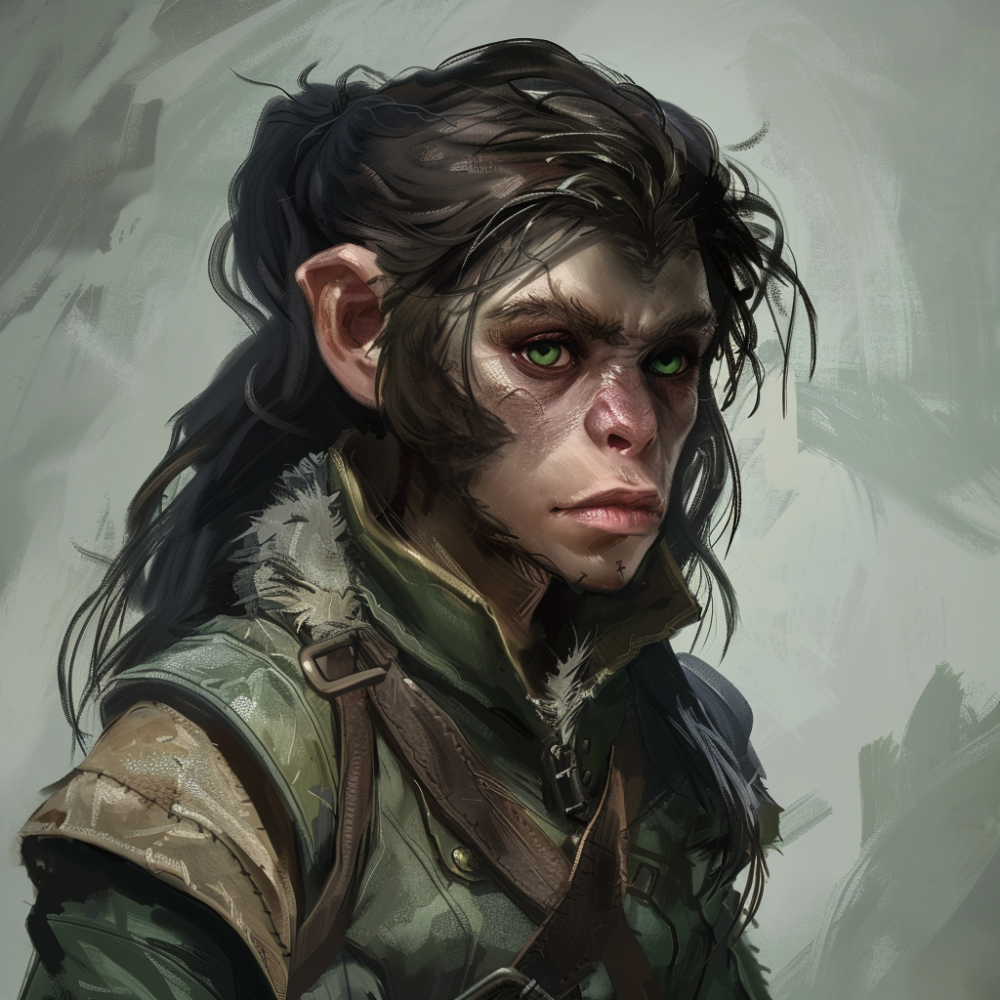

# Eolyn Sera (Waldläuferin) & Fezir (Adler)

**Name:** Eolyn Aksae Sera  
**Titel/Klasse:** Waldläuferin  
**Alter:** Junge Erwachsene  
**Geschlecht:** Weiblich  
**Spezies/Rasse:** [Sodili-Laterale](/content/Voelker/Lateralen/index.md)  
**Heimat:** [Carpebur](/content/Himmelskoerper/Agranum/Kontinente/Gurontis/Sodili-Hauptstadt_Carpebur/index.md)  
**Beruf:** Handelsvertreterin der Familie Sera

## Allgemein

### Aussehen
Eolyn ist eine junge Frau mit einer schlanken Statur und einer energetischen Ausstrahlung. 
Sie hat dunkle, lange Haare, die sie oft zu einem praktischen Zopf gebunden trägt. 
Ihre Augen sind von einem intensiven Grün, und sie hat eine leicht schiefe Nase über vollen Lippen. 
Sie trägt meist eine leichte Lederrüstung, die ihre Beweglichkeit nicht einschränkt.

### Persönlichkeit
Eolyn ist von Natur aus neugierig und strebt ständig danach, ihren Horizont zu erweitern.
Ihr pragmatischer Ansatz und ihre Entschlossenheit machen sie zu einer wertvollen Verbündeten, doch aufgrund ihrer jugendlichen Energie und ihrem Ehrgeiz kann Eolyn manchmal übermütig werden und sich selbst überschätzen.

#### Charakterzüge
Eolyn zeichnet sich durch ihre Neugierde, Entschlossenheit und Ehrgeiz aus.
Sie begegnet neuen Menschen immer aufgeschlossen und freundlich, nicht zuletzt um sich die bestmöglichen Konditionen für etwaige Handelsabkommen offen zu halten.
Die junge Sodili ist jedoch keinesfalls naiv und lässt sich von Lügnern und Betrügern nicht einschüchtern.

#### Vorlieben
Eolyn genießt das Reisen, die Erkundung neuer Orte und die Herausforderungen, die damit einhergehen. 
Sie schätzt die Freiheit und die Möglichkeit, sich in der Natur zu bewegen.
Nicht selten schlägt sie bei einer altbekannten Route einen unbekannten Weg ein, um neue Erfahrungen zu machen.
Außerdem schreibt Eolyn liebnd gerne Tagebuch über ihr tägliches Leben.

#### Abneigungen
Eolyn hat wenig Geduld für Bürokratie und Enge.
Sie ist ungeduldig in Situationen, die ihre Freiheit einschränken, und hat wenig Verständnis für Menschen, die sich auf unehrliche Weise bereichern.

## Hintergrundgeschichte

### Frühes Leben
Aufgewachsen in einer Familie, die sich dem Handel verschrieben hat, entwickelte Eolyn schon früh eine Affinität für Reisen und Erkundungen.
Ihre Eltern, die als angesehene Händler in Carpebur leben, haben sie schon als Kind auf Handelsmissionen mitgenommen, um wichtige Verträge und Abkommen abzuschließen und sie so in die Familienpflichten einzuführen.
Mit fortschreitendem Alter verließen ihre Eltern selbst immer seltener die Stadt, unter anderem um in der Lage zu sein, ihre geschäftlichen Vorgänge zu überwachen, und so ist Eolyn immer häufiger als ihre Vertreterin unterwegs gewesen.

### Wichtige Ereignisse
Als Eolyn von ihren Eltern zur offiziellen Handelsvertreterin der Familie Sera ernannt wurde, war dies ein wichtiger Meilenstein in ihrem Leben.

### Aktuelle Situation
Eolyns Teilnahme an der königlichen Ikusations-Expedition ist sowohl eine Ehre als auch eine Herausforderung.
Sie sieht es als ihre Aufgabe, nicht nur die Interessen ihrer Familie zu vertreten, sondern auch ihren eigenen Wissensdurst zu stillen und ihre Fähigkeiten weiter zu verfeinern.

## Fähigkeiten und Kräfte

### Physische Fähigkeiten
Eolyn ist eine herausragende Bogenschützin.
Zu ihren Fähigkeiten zählt außerdem die Naturkunde, ihr Geschick im Umgang mit Fallen und ihre Navigationskünste durch unwegsames Gelände.

### Magische Fähigkeiten
Eolyn verfügt über keine aktiven magischen Fähigkeiten.

#### Micu
Eolyns treuer Begleiter ist der Zwerg-Adler Fezir.
Mit seinem scharfen Blick und seiner Fähigkeit, hohe Geschwindigkeiten zu erreichen, ist Fezir ein ausgezeichneter Späher und Wächter.
Fezir unterstützt Eolyn bei Erkundungsmissionen und in gefährlichen Situationen, indem er potenzielle Bedrohungen frühzeitig erkennt und meldet.

### Talente
Eolyn ist besonders talentiert im Umgang mit dem Bogen, eine Leidenschaft die über die Futterbeschaffung auf Reisen weit hinaus geht.
Sie hat außerdem ein gutes Gespür für Verhandlungen und Abkommen, etwas was sie vor Allem von ihren Eltern gelernt hat.

## Ausrüstung

### Waffen
Eolyn verwendet einen präzisen Langbogen und eine Vielzahl von Pfeilen.

### Rüstung
Sie trägt eine leichte, aber robuste Lederrüstung, die ihre Beweglichkeit nicht einschränkt.

### Sonstiges
Eolyn trägt stets ein Tagebuch bei sich, in dem sie ihre Entdeckungen und Beobachtungen festhält.

## Beziehungen

### Familie
Die Familie Sera ist bekannt als angesehener Handelspartner der königlichen Familie.
Eolyn hat eine enge Beziehung zu ihren Eltern und ihren zwei Geschwistern, obwohl sie oft getrennt sind aufgrund ihrer geschäftlichen Verpflichtungen.

### Freunde
Eolyns Abenteuerlust und ihr Ehrgeiz haben ihr bereits zahlreiche Kontakte und Freunde in verschiedenen Städten eingebracht.

### Feinde
Keine bekannten Feinde.

### Romantische Beziehungen
Keine bekannten romantischen Beziehungen.

## Zitate

> "Die Welt ist voller Wunder, die nur darauf warten, entdeckt zu werden."
> "Jeder lässt mit sich verhandeln. Fraglich ist nur die Höhe des Preises."

## Trivia

- Eolyn hat eine besondere Vorliebe für exotische Teesorten und sammelt gerne Kräuter während ihrer Reisen.

<!-- ## Anmerkungen -->

