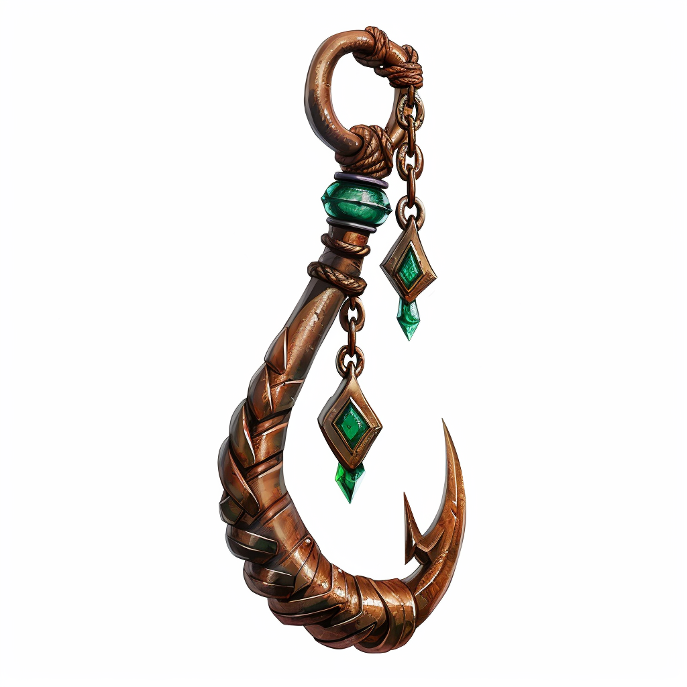

# Baldryn Smedau

<!-- layout: overview -->

| | |
| --- | --- |
| **Name:** | Baldryn Smedau |
| **Rolle:** | Meister der Artefakte |
| **Alter:** | Verstorben im hohen Alter |
| **Geschlecht:** | Männlich |
| **Spezies / Rasse:** | [Conius-Lateraler](/content/Volk/Lateralen/index.md) |
| **Heimat:** | Conius-Gemeinschaft (Herkunft) |
| **Beruf:** | Unabhängiger Erfinder und Artefaktschöpfer |

Baldryn Smedau war ein herausragender Conius-Lateraler, der für seine einzigartigen Beiträge zur Magie und die Entwicklung faszinierender Artefakte bekannt war.
Sein Leben war geprägt von Entdeckungen, Herausforderungen und einem Erbe, das bis heute Rätsel aufgibt.

## Frühes Leben und Ausbildung

Geboren in einer Conius-Gemeinschaft, zeigte Baldryn von Jugend an eine besondere Affinität zur Magie.
Diese Fähigkeiten brachten ihn an die renommierte Resrubor Akademie, wo er von den besten Magiern seiner Zeit ausgebildet wurde.
Seine Leidenschaft für die Erforschung von Magie führte jedoch zu einem schicksalhaften Vorfall, bei dem einer seiner Prototypen explodierte und tragischerweise zwei Mitschüler tötete.
Dies führte zu Baldryns Rauswurf aus der Akademie.

## Unabhängiger Erfinder

Ungeachtet seines Rauswurfs setzte Baldryn seine Forschungen und Experimente fort.
Er wurde bekannt für seine Arbeit mit Tjosand, einem besonderen magischen Sediment.
Baldryns Fähigkeiten und Kreativität manifestierten sich in der Erschaffung einzigartiger magischer Artefakte.

## Beiträge zur Magie

Eine seiner herausragenden Schöpfungen waren die Kristallfliegen, magische Artefakte aus klarem Bergkristall und mit Sgrisignier-Runen graviertem Metall, die als effizientes Kommunikationsmittel dienten.
Seine berühmteste Kreation war jedoch die legendäre Angelrute.
Diese Rute, ausgestattet mit einem energetisch geladenen Smaragd-Kristall und Sgrisignier-Runen, lockte Fische magisch an.

## Späteres Leben und Vermächtnis

Baldryn verbrachte sein Leben damit, Wissen zu sammeln und Artefakte zu erschaffen.
Sein Tod erfolgte auf natürliche Weise im hohen Alter, aber sein Vermächtnis lebt weiter.
Der Verbleib seiner Aufzeichnungen, Skizzen und Prototypen bleibt jedoch ein Geheimnis.
Es ist nicht bekannt, ob er diese bewusst zerstörte, versteckte oder ob sie anderweitig verloren gingen.

## Erbe für die Welt

Baldryn Smedaus Einfluss auf die Magie und die Welt selbst ist unbestreitbar.
Seine verlorenen Werke könnten noch immer in den Schatten darauf warten, entdeckt zu werden.
Die mysteriösen Umstände seines Lebens und die Suche nach seinen verschollenen Schätzen könnten die Grundlage für eine fesselnde Geschichte bilden, die die Leser in die Tiefen der Magie entführt.
