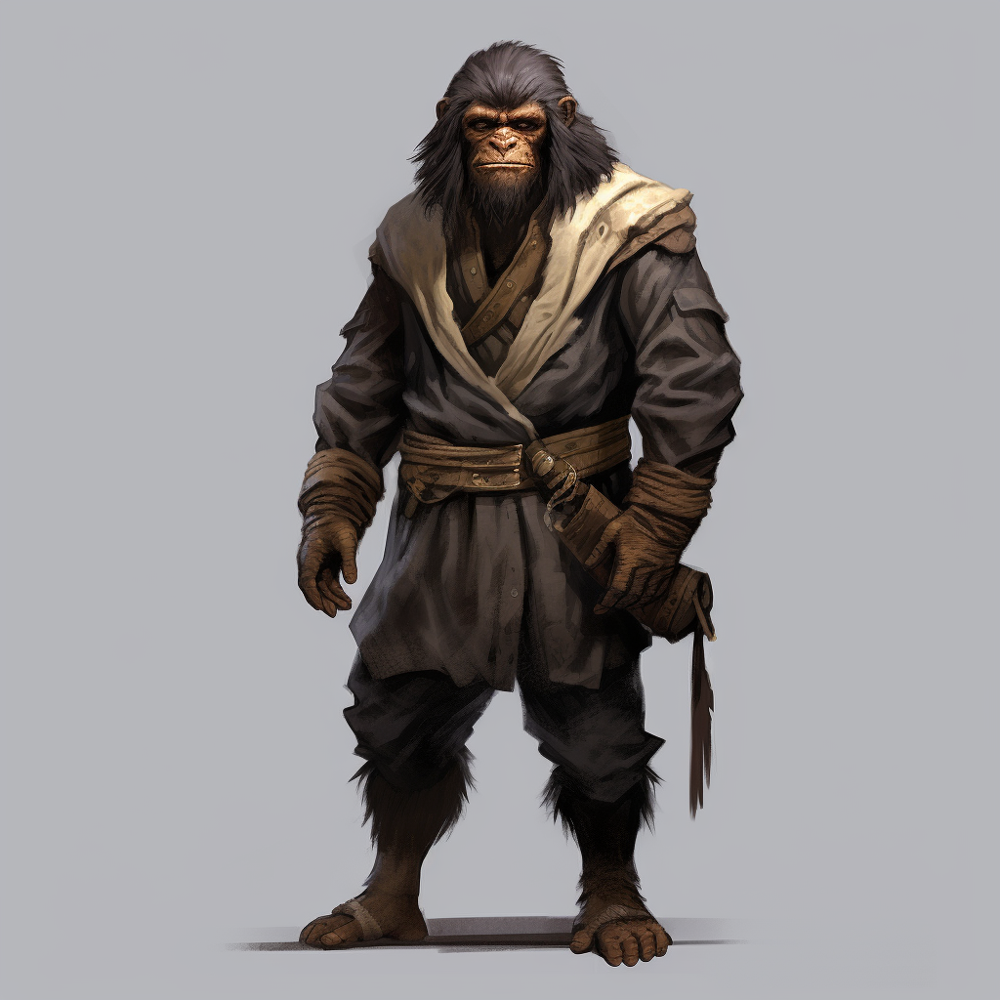

# Alaric Hoss

<!-- layout: overview -->

| | |
| --- | --- |
| **Name:** | Alaric Rodeto Hoss |
| **Rolle:** | Rekrut der Diebesgilde Brauner-Ring |
| **Geschlecht:** | Männlich |
| **Spezies / Rasse:** | [Sodili-Lateraler](/content/Volk/Lateralen/index.md) |
| **Beruf:** | Rekrut der Diebesgilde Brauner-Ring |

Alaric Rodeto Hoss ist ein erfahrener [Sodili-Lateraler](/content/Volk/Lateralen/index.md), dessen Ruf bereits in der Gemeinschaft bekannt war, noch bevor die Ereignisse um den [Kulios-Zwischenfall](/content/Ereignis/Kulios-Zwischenfall.md) begannen.
Seine Ratte-Micu Sable sitzt für gewöhnlich auf seiner Schulter und schnüffelt neugierig in die Luft.

## Rolle im Kulios-Zwischenfall

Alaric war aus persönlichem Interesse auf dem Weg nach [Carpebur](/content/Himmelskörper/Agranum/Kontinent/Gurontis/Carpebur/index.md), als er auf [Taeron Kalidorvus](/content/Volk/Lateralen/Conius/Charakter/Taeron-Kalidorvus/index.md) und [Valeria Wulfryn Liek](/content/Volk/Lateralen/Sodili/Charakter/Valeria-Wulfryn-Liek_Nalius/index.md) traf.
Gemeinsam erreichten sie das vom Kulios-Zwischenfall bedrohte [Akuelon](/content/Himmelskörper/Agranum/Kontinent/Gurontis/Akuelon/index.md) und lösten das Ungleichgewicht am See auf.

## Aufnahme in den Brauner-Ring

Nach dem Zwischenfall trat Alaric der [Diebesgilde Brauner-Ring](/content/Volk/Lateralen/Sodili/Politik/Clan/Brauner-Ring/index.md) bei.
Er löste das Rätsel an ihrer verborgenen Eingangstür und wurde vom Schmutzfinger Jolint als Rekrut aufgenommen.
Als Rekrut erhält er keine Entlohnung und muss sämtliche Diebesgüter direkt abliefern, hat jedoch die Aussicht, sich durch erfüllte Aufträge einen höheren Rang zu erarbeiten.
