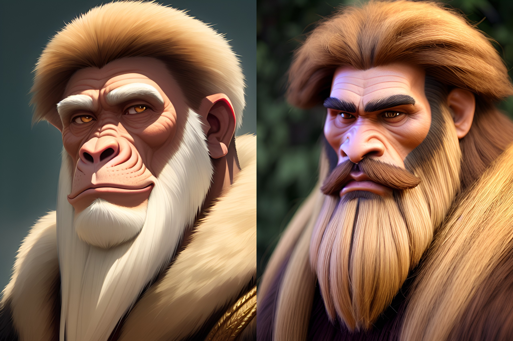

<!-- folder-tag -->
# Die Lateralen

Die Lateralen sind das intelligente Volk des Planeten [Agranum](/content/Himmelskörper/Agranum/index.md).
Der außergewöhnlichen Geschichte dieses Planeten entsprechend, verzeichnet das Volk der Lateralen im Vergleich zu den anderen Völkern des Serpinit-Systems eine einzigartige Entwicklung.

Im Allgemeinen wird bei Lateralen zwischen [Sodili](./Sodili/index.md) und [Conius](./Conius/index.md) unterschieden.

# Entwicklung

## Entstehung des *homo primian fractus*

Schon früh experimentieren die [Sgrisignier](/content/Volk/Sgrisignier/index.md) zu ihrer persönlichen Belustigung auf magische Weise mit den *homo primian* auf Agranum.
Sie erschaffen dafür kleine Runensteine, welche bei Berührung den Betroffenen temporär in ein vordefiniertes Tier verwandeln.
Zuerst sind die Affenartigen mit dem Kontakt zur Magie überfordert, doch nach einiger Zeit fangen sie an den Effekt der Runensteine zu verstehen und sie schließlich für die Jagd zu nutzen.
Als die Sgrisignier schließlich von [Aerion](/content/Allgemein/Aerion.md) im Zuge der [Impuls-Eruption](/content/Ereignis/Impuls-Eruption.md) vernichtet werden, richtet sich dieser Angriff kollateral auch gegen die unschuldigen *homo primian* von Agranum, denn die Magie der Sgrisignier hat direkte Spuren in ihrer Genetik hinterlassen.
Zwar werden sie durch die Magie Aerions nicht vernichtet, doch der magische Impuls hat zur Folge, dass alle gegenwärtigen und künftig gezeugten *homo primian* eine Spaltung ihres Geistes durchmachen müssen, weshalb sie seit diesem Ereignis auch als *homo primian fractus* bezeichnet werden.
Das ihnen fortan angeborene psychische Trauma führt im Allgemeinen noch vor der Geburt zur Bildung einer zweiten inneren Persönlichkeit.
Der Grund dafür liegt nicht allein in einer psychischen Beschädigung.
Vielmehr wurde durch Aerions Impuls bei den Nachfahren der betroffenen *homo primian* eine kleine, aber folgenreiche Fehlstelle im Gehirn hinterlassen, an welcher durchgehend magische Potenz aus dem Wymen in die natürlichen Denkvorgänge einwirkt.
Diese stetige Fehlkopplung verstärkt die angeborene Zweiteilung des Geistes immer weiter.
Der zusammenhängende Bruch wird im Artikel [Psychische Verstümmelung der Lateralen](/content/Ereignis/Psychische-Verstümmelung-der-Lateralen.md) gebündelt.
Hinzu kommt, dass der Bruch des Planeten Agranum nicht nur ein Massenaussterben nach sich zieht, welches die meisten Lebewesen auf Agranum umbringt, sondern für die übrigen Lebewesen einen komplett neuen Lebensraum schafft, an den diese sich anpassen müssen.

## Evolution der Sodili-Lateralen

Die Lateralen entstehen schließlich nach dem Fall der Sgrisignier über Jahrmillionen hinweg aus den überlebenden *homo primian fractus* durch [arcanogene Evolution](/content/Allgemein/Magie/index.md#arcanogene-evolution).
Diese magisch beeinflusste Evolution hat dabei auf die geistig Verstümmelten einen besonderen Einfluss.
Durch ihren magischen Ursprung werden die Effekte der psychischen Zweiteilung während der arcanogenen Evolution noch verstärkt.
Die abgespaltene Persönlichkeit ist leichter zu differenzieren und entwickelt eigene Gedanken, Wünsche und Emotionen.
Dabei wird sie von den Betroffenen immer häufiger als ein ganz bestimmtes Tier empfunden.
Die Evolution führt schließlich dazu, dass die zweite Persönlichkeit sich nicht nur auf einer geistigen Ebene bildet, sondern sich im Jugendalter sogar in einer magischen Entladung vom Körper des Betroffenen abspaltet und so einen eigenen Körper manifestiert.
Diese Entladung ist jedoch keine willkürliche Laune der Magie.
Sie ist der Moment, in dem der stetige magische Zufluss im Geist des Betroffenen schließlich eine stabile äußere Form findet.
Die Lateralen werden ab diesem Evolutionsschritt als **Sodili-Laterale** bezeichnet, während die Verkörperung der zweiten Persönlichkeit **Micu** genannt wird.
Der Körper aller Micu ist dabei ausschließlich von entsprechender, tierischer Natur.
Die Geister der beiden Lebewesen sind auch nach der Abspaltung weiterhin untrennbar miteinander verbunden, da sie nach wie vor zwei Persönlichkeiten desselben Wesens darstellen.
Außerdem ist jedem Sodili eine [Hybridisierung](/content/Volk/Lateralen/Hybridisierung.md) mit seiner manifestierten, zweiten Persönlichkeit möglich.
Diese Form der Hybridisierung führt zu einer ungeahnten Vielfalt, wodurch die Sodili-Lateralen schließlich auch nach der Impuls-Eruption wieder ganz Agranum besiedeln können.

## Abspaltung der Conius

Irgendwann distanziert sich schließlich eine Gruppierung der Lateralen von ihren Artgenossen.
Diese Individuen sind der Überzeugung, dass das Auftreten der zweiten Persönlichkeit unnatürlich sei und einer geistigen Krankheit entspringt, die das gesamte Volk der Lateralen in sich trägt.
Nachdem sie durch entsprechende Selbstversuche erstmalig eine permanente Verschmelzung der zwei Persönlichkeiten erreichen, erkennen sie, dass der geteilte Geist eines Sodili in gewisser Weise sogar die Entwicklung jeglicher magischer Intelligenz beeinträchtigt.
Diese Gruppierung beginnt daraufhin junge Laterale zu therapieren, mit dem Ziel, dass sich die geteilten Persönlichkeiten schon vereinen noch bevor es überhaupt zur körperlichen Abspaltung kommt.
Mit der Zeit verstehen diese frühen Conius, dass nicht bloß die zweite Persönlichkeit selbst das Problem darstellt, sondern vor allem die magische Fehlkopplung im Gehirn, welche sie dauerhaft nährt.
"Geheilte" Lateralen werden fortan **Conius-Laterale** genannt.
Wird die Identitätsstörung in dieser Form erfolgreich therapiert, so kann die magische Intelligenz des Betroffenen in der Tat mit entsprechender Bildung weiterentwickelt werden.
Die Therapie der Conius zielt dabei letztendlich darauf ab, die betroffene Fehlstelle frühzeitig zu schließen oder zumindest so weit zu kompensieren, dass die zweite Persönlichkeit nicht mehr zu einer eigenständig manifestierbaren Gestalt heranwächst.
So erreichen die Conius-Lateralen eine Ausprägung der magitiven Wahrnehmung, welche es ihnen ermöglicht nicht nur die magische Potenz ihrer Umgebung, sondern auch Sgrisignier-Runen und andere magische Phänomene zu erfühlen.
Damit verstehen sie die Magie des Serpinit-Systems besser als jedes andere moderne Volk und können fortan auf äußerst wissenschaftliche Art und Weise weitere Erkenntnisse gewinnen.
Besonders bedeutend ist dabei die Erkenntnis über die Dreidimensionalität der Sgrisignier-Runen.
Das Wissen der Conius findet insbesondere nach der [Ikusation](/content/Ereignis/Ikusation.md) Einzug in die magischen Theorien der meisten intelligenten Völker, da eine wissenschaftliche Korrektheit im Grunde nicht anzuzweifeln ist.

# Lebensraum

Die Lebensräume der Lateralen sind so vielfältig wie ihre innere Spaltung.
Sodilische Gemeinschaften prägen weite Teile Agranums und haben sich dank [Hybridisierung](/content/Volk/Lateralen/Hybridisierung.md) an sehr unterschiedliche Regionen angepasst.
Die [Resrubor-Akademie](/content/Himmelskörper/Agranum/Kontinent/Resrubor/Resrubor-Akademie/index.md) bildet zugleich das gesellschaftliche und wissenschaftliche Zentrum der Conius-Lateralen.

# Aussehen

Typischer, moderner, männlicher Lateraler (rechts) und sein evolutionärer Vorgänger *homo primian fractus* (links)

Laterale zeigen ihre Gefühle generell weniger offen als andere Völker.
Die Mimik eines Sodili gibt selten Aufschluss über sein Inneres.
Das Aussehen des Micu eines Sodili dahingegen, und dementsprechend auch die Erscheinung ihres Hybridkörpers, sagt um einiges mehr über die Persönlichkeit eines Sodili aus.
Allein die Tierart welcher der Micu angehört zeigt welche Charaktereigenschaften ein Sodili aufweist.
Zudem sind die Micu fast immer eher extrovertiert und teilen ihre Gefühle offen mit, und da beide Geister eng verbunden sind gibt dies auch einiges über die Gedanken des Sodili preis.

Das Aussehen der Micu und Hybridwesen ist so vielfältig wie die Tierwelt selbst.
Es gibt auch innerhalb derselben Micu-Rasse starke äußerliche Unterschiede, die sich in Fellfarbe, Körperbau oder ähnlichem äußern können.

# Theologie

Die Sodili glauben an ein Pantheon aus Tiergöttern, geschaffen von einer verzerrten Variante von Creapatos.
Die Details sind in der [Sodili-Theologie](./Sodili/Theologie/index.md) beschrieben.

Die Conius glauben an die Sgrisignier, auch wenn ihnen deren wahre Gestalt nach wie vor ein Rätsel ist und ihnen nur die magische Runenschrift als Anhaltspunkt bleibt.

# Magie

Die Lateralen sind seit der Impuls-Eruption geistige Doppelwesen und haben daher von Geburt an immer zwei Persönlichkeiten.
Lange Zeit glaubten die Lateralen, dass ihre zweite Persönlichkeit unabdingbar für den Gebrauch von Magie war.
Da die Abspaltung eines Micu und die mögliche Hybridisierung mit diesem die einzige Form von Magie war, welche die Lateralen vor der Abspaltung der Conius ausüben konnten, wurde diese Annahme im Allgemeinen nicht angezweifelt.
Die Conius-Lateralen behaupteten dagegen eines Tages, dass es sich bei der zweiten Persönlichkeit um den Effekt einer genetischen Krankheit handelt von der das gesamte Volk betroffen ist.
Tatsächlich geht die Magie der Lateralen jedoch auf eine krankhafte Fehlkopplung zurück, welche fortwährend geringe Mengen magischer Potenz aus dem Wymen in das Gehirn eines betroffenen Sodili lenkt.
Die zweite Persönlichkeit wird dadurch nicht nur psychisch, sondern auch magisch genährt.
Sie vereinen fortan ihre zweite Persönlichkeit bereits im Kindesalter mit der eigenen und "heilen" so das Doppelwesen-Dasein.
Nach dieser Heilung waren sie sogar in der Lage größere magische Fähigkeiten zu entwickeln als die Sodili, indem sie ihre magitive Wahrnehmung schulen.
Trotzdem entscheiden sich viele Lateralen auch nach diesen Erkenntnissen für das Leben eines Sodili, da die Existenz eines eigenen Micu auch viele Vorteile mit sich bringt.

Die Akademie der Conius-Lateralen ist aus der Zusammenarbeit äußerst intelligenter Vertreter dieses Volkes entstanden, welche schließlich sogar das Phänomen der dreidimensionalen Runenschatten entdeckt haben.
Die so entdeckten Symbole waren die Sgrisignier-Runen.
Während die Conius-Lateralen schließlich in der Lage waren die dreidimensionalen Runen zu erspüren, war es lange Zeit keinem Volk möglich dreidimensionale Runen selbst zu bilden.
Stattdessen haben die Conius-Lateralen die möglichen zweidimensionalen Runenschatten vieler Zauber untersucht und analysiert.
So fanden sie heraus wovon die Stabilität einer einfachen Rune abhängt und konnten diese einfachen Runen schließlich für den allgemeinen Gebrauch bereitstellen.
Es entstand ein riesiges magisches Vokabular in der Resrubor-Akademie welches nicht nur dem Volk der Lateralen zu großem Fortschritt verholfen hat.

## Do-Uspil

Die [Do-Uspil](/content/Volk/Lateralen/Do-Uspil.md) ist das zentrale Übergangsritual der Sodili.
In ihr wird die zweite Persönlichkeit eines jungen Lateralen unter geordneten Bedingungen in die äußere Gestalt eines Micu überführt.
Sie ist zugleich religiöser, politischer und magischer Kern sodilischer Selbstdeutung.

## Hybridisierung

Die [Hybridisierung](/content/Volk/Lateralen/Hybridisierung.md) beschreibt die zeitweilige gemeinsame Gestalt von Sodili und Micu.
Sie ist einer der wichtigsten Gründe dafür, dass sich sodilische Lebensformen auf Agranum in einer so großen ökologischen und kulturellen Bandbreite ausprägen konnten.
