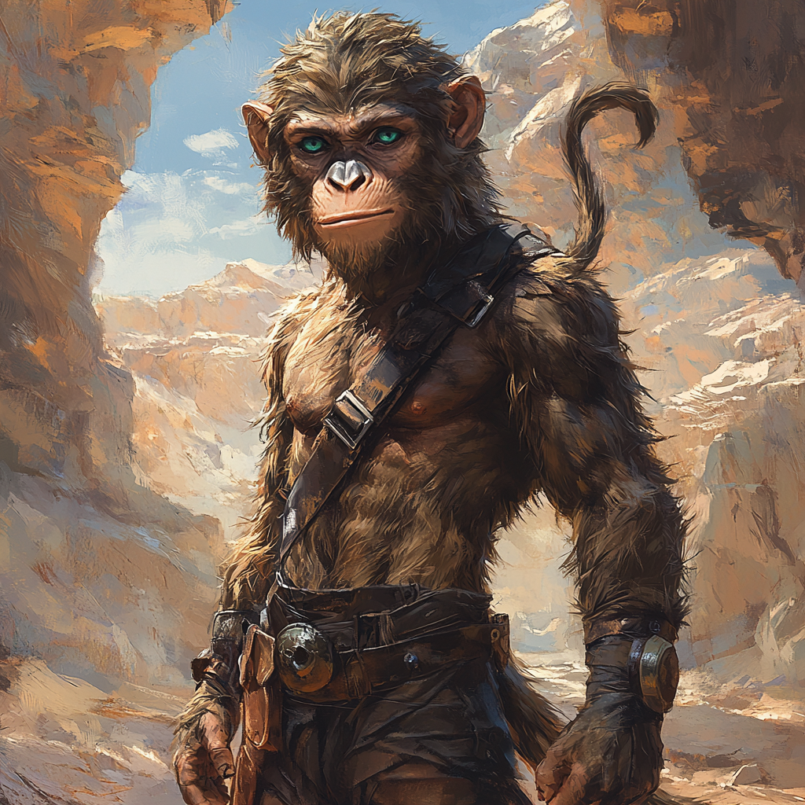

# Jopun Krolpin

<!-- layout: overview -->

| | |
| --- | --- |
| **Name:** | Jopun Krolpin |
| **Rolle:** | Organisator und Bote |
| **Geschlecht:** | Männlich |
| **Spezies / Rasse:** | [Varnops](/content/Volk_/Varnops/index.md) |
| **Beruf:** | Organisator und diplomatischer Vertreter der Krolpins |

Jopun Krolpin ist ein jüngerer Sohn von [Hiante Krolpin](/content/Volk_/Varnops/Familie_/Krolpin_Zirkelgruender/Charakter_/Hiante-Krolpin/index.md) und gehört zur Generation der Krolpins, die bereits im Umfeld des [Zirkel-Wettstreits](/content/Ereignis_/Zirkel-Wettstreit/index.md) aufwächst, ohne selbst noch die isolierte Frühzeit des Zirkelgebirges erlebt zu haben.

## Rolle im Zirkel-Tal

Während des Wettstreits übernimmt Jopun keine eigene Teilnehmergruppe.
Stattdessen unterstützt er seine Mutter und Geschwister bei organisatorischen Aufgaben, dokumentiert Fortschritte einzelner Gruppen und dient häufig als beweglicher Bote zwischen Lagern, Werkstätten und den neutralen Stellen des Wettstreits.

## Persönlichkeit

Jopun gilt als wissbegierig, aufmerksam und deutlich weniger schwerfällig als viele ältere Angehörige seiner Familie.
Er interessiert sich weniger für reine Machtdemonstrationen als für neue Zusammenhänge, fremde Lebensweisen und die Frage, wie unterschiedliche Ideen einander verstärken können.
Gerade deshalb reagierte er auf die Begegnung mit den Lateralen weit offener als viele andere Varnops seines Umfelds.

## Erstkontakt mit den Lateralen

Beim [Erstkontakt mit den Varnops](/content/Ereignis_/Erstkontakt-Varnops.md) wurde Jopun von Hiante ausgewählt, die Expedition durch das Lager des Wettstreits zu führen und sie bei den letzten Vorbereitungen ihrer Rückreise zu begleiten.
Damit wurde er zu einem der ersten Varnops, die über einen bloßen Höflichkeitskontakt hinaus direkten Austausch mit einem fremden interplanetaren Volk pflegten.

Die Entscheidung, Jopun als varnopischen Vertreter zur späteren Rückreise der Expedition abzustellen, war nicht nur ein Zeichen seines persönlichen Interesses, sondern auch Ausdruck des Vertrauens, das Hiante in seine Beobachtungsgabe und seine diplomatische Eignung setzte.
