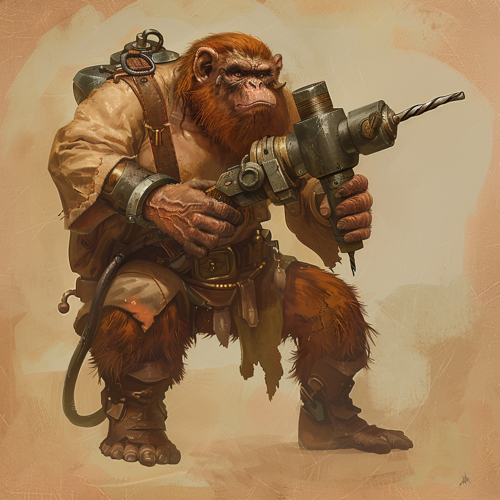

# Die Varnops

<!-- display: figure -->

Die Varnops sind das vorherrschende Volk auf [Aridess](/content/Himmelskörper/Aridess/index.md), bekannt für ihre robuste Natur und technische Raffinesse.
Diese kleinen, kräftigen Wesen haben sich perfekt an die extremen Umweltbedingungen ihrer Heimat angepasst, die von gnadenloser Hitze und endlosen Wüstenlandschaften dominiert werden.
Ihre Kultur ist geprägt von Anpassungsfähigkeit und pragmatischer Ingenieurskunst, die es ihnen ermöglicht, selbst unter den widrigsten Bedingungen zu florieren.
Da Aridess nicht [ovelärer](/content/Allgemein/Schoepfungsgeschichte.md#die-ovelären-planeten--die-elementdrachen) ist, haben die Varnops niemals magische Fähigkeiten durch eine [arcanogene Evolution](/content/Allgemein/Magie/index.md#arcanogene-evolution) entwickelt.
Sie fanden jedoch mit der Zeit trotzdem Möglichkeiten, die magische Energie des Serpinit-Systems technisch zu binden.
Diese Tradition wird im Allgemeinen als [Gemtech](/content/Volk/Varnops/Gemtech.md) bezeichnet.

# Lebensraum
Die meisten Varnops leben lange Zeit hauptsächlich in Ansammlungen von Höhlen und unterirdischen Tunnelsystemen, die Schutz vor den Elementen bieten, oder aber in Siedlungen in Oasen, wo fruchtbarer Boden und frisches Wasser zu finden sind.
Aufgrund der harschen Bedingungen auf Aridess sind die Varnops letztlich immer auf gegenseitigen Ressourcenaustausch angewiesen, um zu überleben.

# Entwicklung & Geschichte
Zu den Anfängen der intelligenten Völker bis zur Gründung der 12 Zirkel sind die Varnops ein einfaches Volk, welches Aridess vor allem aufgrund der Konkurrenzlosigkeit vollumfänglich besiedeln kann.
Sie leben lange Zeit ausschließlich in unzähligen kleinen, nahezu indigenen Gruppierungen, da größere Populationen aufgrund der Ressourcenknappheit keine Bestandsfähigkeit haben.
Dementsprechend divers ist auch die Kultur der Varnops, wobei ausgeprägte Handelsbeziehungen einen steten Austausch ebendieser Kulturen ermöglichen.
Ob es diesem Kulturaustausch oder einem ureigenen Instinkt der Varnops zu verdanken ist, dass insbesondere die Metallverarbeitung schon immer einen besonders hohen Stellenwert bei fast jeder Gruppierung dieses Volkes hat, ist nicht ganz klar.
Varnops nutzen Metall seit jeher für Werkzeuge, ihre Unterkünfte, Schmuck und ähnliches.
Selbst beim Handel wird nicht selten auf die Nutzung einer expliziten Währung verzichtet und stattdessen eine Bezahlung in Erzen oder verarbeitetem Metall gewählt.
Einen besonderen Stellenwert nehmen daher die Erzlieferanten auf Aridess ein.
Da die meisten Erzvorkommen in den nördlichsten Gebirgen des Planeten verortet sind, haben viele der komplexen Handelsstrukturen hier ihren Ursprung.

## Globalisierung
Ein wichtiger Meilenstein in der Geschichte der Varnops ist die Austragung des [Zirkel-Wettstreits](/content/Ereignis/Zirkel-Wettstreit/index.md) und der darauffolgende technologische Aufschwung.
Mit den innovativen Erfindungen und der neu gewonnenen gemeinschaftlichen Koordination schaffen es die Varnops unter der Führung der [Krolpin-Familie](./Familie/Krolpin/index.md), ausgehend vom [Zirkelgebirge](/content/Himmelskörper/Aridess/Kontinent/Unol/Zirkelgebirge/index.md), eine Globalisierung des Planeten Aridess zu starten.
Diese ermöglicht erstmalig eine effektive Vernetzung der Nordhalbkugel, von den Zirkelgebirgen am Nordpol bis zu den grünen Schluchten des Äquators.
Eine Ausdehnung auf die Südhalbkugel erfolgt verzögert, bedingt durch die weiten Handelswege und die natürlichen Schwierigkeiten der Überquerung der grünen Schluchten.
Der übergeordnete historische Zusammenhang dieses Umbruchs ist im Artikel [Globalisierung von Aridess](/content/Ereignis/Globalisierung-Aridess.md) beschrieben.

## Ikusation
Die Varnops profitieren insgesamt außerordentlich von den Folgen der Ikusation.
Zum einen liefert die Erschließung der Sgrisignier-Portale den Varnops eine Vielzahl an neuen Handelsmöglichkeiten.
Zum anderen können die Varnops mit [Tjosand](/content/Allgemein/Magie/Tjosand.md) ihre gesamte Technologie schließlich zusätzlich stark verbessern.

Der erste belastbare Kontakt zwischen Varnops und Lateralen wird im Rahmen der frühen [Ikusation](/content/Ereignis/Ikusation.md) hergestellt und ist als [Erstkontakt mit den Varnops](/content/Ereignis/Erstkontakt-Varnops.md) überliefert.

# Gesellschaft

Beim Volk der Varnops kommt Frauen und insbesondere Müttern schon immer eine besondere Bedeutung zu, weshalb die varnopische Gesellschaft als matriarchalisch beschrieben werden kann.
Darüber hinaus ist die Polygamie bei den Varnops schon immer gang und gäbe.
Weibliche Varnops können einen eigenen Familienamen wählen, wenn sie eine neue Familie gründen.
Diesen Namen geben sie bei der Zeugung von Kindern sowohl an ihren Partner als auch an ihre gemeinsamen Nachkommen weiter.
Bei Varnops, welche auch im Erwachsenenalter noch unter dem Namen ihrer Mutter leben, wird dem Familiennamen der Präfix "Hin-" angefügt.

Die Varnops leben seit dem Zirkel-Wettstreit und der Globalisierung in Zugehörigkeit zu einem jeweiligen [Zirkel](./Politik/Zirkel/index.md).
Die Zirkel entstehen zwar ursprünglich aus den gewinnenden Gruppen des Zirkel-Wettstreits, sind jedoch insbesondere durch Aridess' Globalisierung nicht mehr an diese Grenzen gebunden.
Stattdessen entstehen Zugehörigkeiten unterschiedlicher Orte zu einem Zirkel, wenn eine jeweilige Zirkel-Erfindung ausschlaggebende Auswirkungen auf die Ökonomie und Kultur ihrer Population hat.

# Theologie & Magie

Die Varnops haben keine frei formulierbaren magischen Fähigkeiten und begegnen der allgemeinen Theorie der Magie erst vergleichsweise spät in systematischer Form.
Ihre religiösen Traditionen sind deshalb stärker durch Umwelt, Materialkultur und Überleben geprägt als durch offen wirksame Zauberkunst.
Eine Sonderstellung nehmen die [Sgrisignier-Portale](/content/Allgemein/Magie/Sgrisignier-Portale.md) ein, die vielerorts als gefährliche, ehrfurchtgebietende Reste einer älteren Ordnung gedeutet wurden.
Eine genauere Einordnung ist in der [Theologie der Varnops](/content/Volk/Varnops/Theologie.md) beschrieben.

## Gemtech
Die varnopische Nutzung von Magie geschieht vor allem in technischer Form.
Geladene Edelsteine, Metallmechanik und tjosandhaltige Leiterstoffe werden zu Maschinen, Werkzeugen und Infrastrukturen verbunden, deren Wirkung weit über bloße Handwerkskunst hinausgeht.
Gerade diese Verbindung aus Materialverständnis, Speichertechnik und praktischer Ingenieurskultur machte die Varnops zu einer der technologisch prägendsten Zivilisationen des Systems.
Der Hauptartikel dazu ist [Gemtech der Varnops](/content/Volk/Varnops/Gemtech.md).

# Aussehen

* Bärtig (auch die Frauen), sonst kurzes Stoppelfell
* Haben einen Schwanz

Die Varnops sind klein und rundlich, mit Händen die an Maulwurfsschaufeln erinnern.
Ihre Arme, Beine, Hände und Füße sind stark behaart und sie haben eine Fettschicht aufgrund ihrer guten Nahrungsaufnahme.
Sie entwickeln schon als Kinder, meist im Alter von ca. 8 Zyklen, starken Bartwuchs, dessen Ergebnis nicht selten in kunstvollen Zöpfen zusammengeflochten wird.
Varnops haben fast ausschließlich braune und rote Haare, die mit dem Alter gräulich werden.
Seltener werden auch Varnops mit schwarzen Haaren geboren, während blonde Haare bei Varnops gar nicht vorkommen.

Bevor dieser Bartwuchs beginnt fällt es vielen Angehörigen anderer Völker schwer männliche und weibliche Varnopskinder zu unterscheiden, da auch die Frauen unter den Varnops kräftig gebaut sind und markante Gesichtszüge haben.
Auch die Länge der Haupthaare sagt bei einem Varnop nichts über das Geschlecht aus, denn sowohl lange als auch kurze Haare sind bei beiden Geschlechtern üblich.

Trifft man einen Varnop an, der neben einem glatten Kinn auch einen kahlen Kopf besitzt, so handelt es sich üblicherweise um einen Verbrecher, der für die Zeit seiner Strafe keine Rechte mehr besitzt.

## Mode

### Alltäglich

Alle Varnops besitzen von Kindesalter an breite Metallringe, in die das Symbol ihres jeweiligen Zirkels sowie ihr Hauswappen eingraviert sind.
Während die Männer diese Ringe über ihren Bartzöpfen tragen, hängen die der weiblichen Varnops meist an Ketten um ihren Hals.

Die Kleidung der Varnops kann je nach Lebensraum und Wohlhaben sehr unterschiedlich ausfallen, geht jedoch häufig in die rustikale Richtung mit vielen Fellen und Lederanteilen.

Aufgrund der Wirkungsweise der varnopischen Magietechnik ist Edelsteinschmuck zudem unverzichtbar.
Ob in Ringen, Halsketten, Haarschmuck oder Armreifen, viele Varnops tragen gleich mehrere reine Edelsteine am Körper, damit ihnen stets gespeicherte magische Energie auf Abruf zur Verfügung steht.

### Kampf

Varnopsrüstungen sind klassische Rüstungen aus breiten Metallplatten, unter denen ein Kettenhemd getragen wird.
Die Rüstungen sind darauf ausgelegt die Varnops, die aufgrund ihres gedrungenen Körperbaus ohnehin nicht allzu viel Bewegungsfreiheit besitzen, nicht noch mehr einzuschränken.
Dabei greifen die Platten bei jeder Drehbewegung ineinander und blockieren nicht.

In den Rüstungen ist immer das Symbol des jeweiligen Zirkels eingraviert.
Außerdem werden in höherwertigen Rüstungen Tjosand-Legierungen und Edelsteine eingelassen, die der Rüstung auf magische Art und Weise noch mehr Widerstandsfähigkeit im Kampf bieten.

Häufig sind Rüstungen für traditionelle Kämpfe und Feste zusätzlich mit dem bezeichnenden Metall des jeweiligen Zirkels und anderen Akzenten verziert.

### Festlich

Für besondere Anlässe tragen Varnops meist feine Leinenstücke mit passenden Umhängen.
Die Farben fallen im Allgemeinen kräftig aus, werden dabei aber immer passend zum Edelsteinschmuck des Varnops gewählt.

Des Weiteren wird für Festlichkeiten besonderes Augenmerk auf die Haare eines Varnops gelegt.
Häufig wird sehr viel Zeit investiert um sowohl das Haupthaar, als auch einen eventuellen Bart in aufwendigen Flecht- und Steckfrisuren herzurichten.

# Magische Fähigkeiten

Varnops haben genetisch gesehen die niedrigste magische Intelligenz aller modernen Völker.
Aus diesem Grund profitierten sie ursprünglich auch am wenigsten von den Erkenntnissen der Conius-Lateralen über die Sgrisignier-Runen.
Erst als die Sgrisignier-Portale größtenteils kartografiert waren entwickelten die Varnops Fähigkeiten, die mit denen der anderen Völker vergleichbar waren.
Diese beruhen jedoch nicht auf frei formulierbarer Zauberkunst, sondern auf dem Laden und technischen Nutzen reiner Edelsteine.

Diese Edelsteinmagie definiert sich dadurch, dass magische Kraft auf Edelsteine geladen wird, um diese dann ähnlich einer Batterie nutzen zu können.
Für diese Art der Magie ist immer [Tjosand-Quarz](/content/Allgemein/Magie/Tjosand.md) vonnöten, da nur mit der magischen Leitfähigkeit von Tjosand die Magie in die Edelsteine gelangen kann.
Die Varnops selbst besitzen keinerlei intuitive magische Kräfte, da sie von keinem der Elementdrachen geformt wurden.

Varnops sind zwar von Magie durchdrungen, haben aber trotzdem nicht im direkten Sinne magische Kräfte.
Stattdessen haben Varnops nur das ungewöhnlich starke Verlangen Edelsteine zu erlangen.
Berührt ein Varnop einen reinen Edelstein, kann er intuitiv eine Verbindung zu diesem Stein aufbauen und ist nun in der Lage seine magische Energie auf den Stein zu übertragen.
Aufgeladene Edelsteine können genutzt werden, um Magie in die Technologien der Varnops zu integrieren.
Besonders in Verbindung mit Metall und durch die leitenden Fähigkeiten des Tjosand-Quarzes konnten die Varnops Erfindungen entwickeln, die so bahnbrechend waren, dass sie auch ohne intuitive magische Fähigkeiten schnell zu einem der mächtigsten Völker im Serpinit-System werden konnten.

Die Edelsteinmagie der Varnops stellt dabei keine zweite, eigene Magietheorie dar.
Sie beruht vielmehr darauf, dass gebundene magische Potenz in einem geeigneten Trägerstoff gesammelt, gespeichert und schließlich technisch nutzbar gemacht wird.
