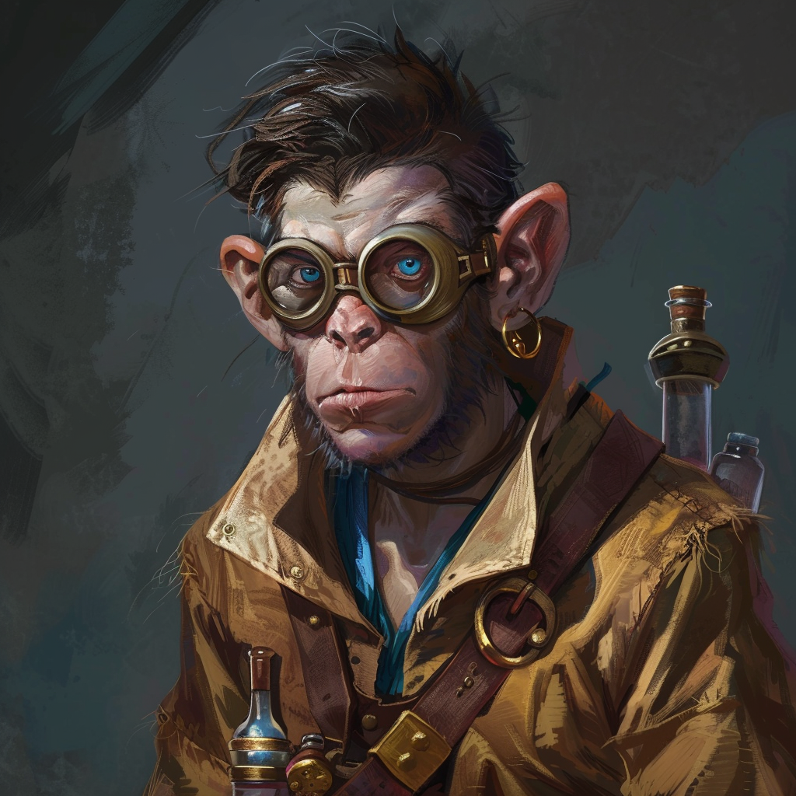

# Draven Norint

**Name:** Draven Norint  
**Titel/Klasse:** Alchemist  
**Alter:** Teenager  
**Geschlecht:** Männlich  
**Spezies/Rasse:** [Conius-Lateral](/content/Volk_/Lateralen/index.md)  
**Heimat:** Resrubor-Akademie  
**Beruf:** Schüler und Forscher an der Resrubor-Akademie

## Allgemein

### Aussehen
Draven hat kurze, dunkelbraune Haare und blaue Augen, die oft von Schutzbrillen verdeckt sind, um ihn vor den Dämpfen seiner Tränke zu schützen.
Er trägt meist eine einfache, aber robuste Alchemistenrobe, die von zahlreichen Taschen und Riemen durchzogen ist, in denen er seine Werkzeuge und Zutaten aufbewahrt.
Seine Hände sind oft fleckig von verschiedenen Substanzen, und er trägt stets einen Ledergürtel, an dem Phiolen und kleine Fläschchen hängen.

### Persönlichkeit

#### Charakterzüge
Draven ist geduldig und detailverliebt, was ihn zu einem hervorragenden Alchemisten macht.
Seine strategische Intelligenz und seine Fähigkeit, komplexe Probleme zu lösen, würden ihm gute Noten an der Akademie einbringen, wenn er nicht so oft vollends von seiner Braukunst eingenommen wäre.

#### Vorlieben
Draven liebt das Brauen von Tränken und das Experimentieren mit neuen Rezepturen.
Er hat eine Vorliebe für lange, herausfordernde Projekte, die seine Geduld und Kreativität auf die Probe stellen.
In seiner Freizeit liest er gern alte alchemistische Schriften und besucht Märkte auf der Suche nach seltenen Zutaten.

#### Abneigungen
Draven mag es nicht, wenn seine Arbeit unterbrochen wird, besonders durch soziale Verpflichtungen oder akademische Anforderungen, die nichts mit Alchemie zu tun haben.
Er hat eine Abneigung gegen die arrogante Haltung einiger seiner Professoren gegenüber der Alchemie und empfindet den Zwang, sich mit Runenmagie zu beschäftigen, als belastend.

## Hintergrundgeschichte

### Frühes Leben
Draven wurde in eine Familie von Gelehrten geboren, wobei sein Vater Hiron Norint ein angesehener Professor der Runenmagie an der Resrubor-Akademie ist.
Schon in jungen Jahren zeigte Draven eine bemerkenswerte Begabung für die Alchemie, was ihn oft in Konflikt mit den Erwartungen seines Vaters brachte, der ihn lieber als Runenmagier gesehen hätte.

### Wichtige Ereignisse
Draven begann sein Studium in Runenmagie, wandte sich aber schnell der Alchemie zu, sehr zum Missfallen seines Vaters.
Draven entwickelte einen besonders wirksamen Heiltrank, der ihm Anerkennung unter den wenigen alchemieaffinen Professoren einbrachte.
Auf Drängen seines Vaters wurde Draven in eine geheime Expedition (die [Ikusations-Expedition](/content/Ereignis_/Ikusation.md)) unter der Leitung von Vorian Sierfehl aufgenommen, in der Hoffnung, dass er die Bedeutung der Runenmagie erkennt.

### Aktuelle Situation
Draven soll sich während der Ikusation an Kwint Gurdun halten und möglichst viel über die Runenmagie lernen.
Obwohl ihm dies missfällt, möchte er seinen Vater nicht wieder enttäuschen.
Trotzdem versucht er die Expedition auch zu seinen Gunsten zu nutzen und sammelt heimlich Kräuter und andere Zutaten die er für Tränke gebrauchen könnte.

## Fähigkeiten und Kräfte

### Physische Fähigkeiten
Draven ist nicht besonders stark oder schnell, aber er hat eine ausgezeichnete Feinmotorik und Präzision, die ihm beim Mischen von Zutaten und beim Umgang mit empfindlichen alchemistischen Apparaturen zugutekommen.

### Magische Fähigkeiten
Draven beherrscht grundlegende Runenmagie, nutzt sie jedoch selten.
Seine wahre Leidenschaft und Expertise liegen in der Alchemie, wo er eine Vielzahl von Tränken und Elixieren braut, die verschiedene Effekte haben können.

### Talente
Draven ist ein Meister der Trankherstellung und kennt viele seltene und mächtige Rezepturen.
Außerdem ist er äußerst geduldig, was ihm bei langwierigen und komplizierten Experimenten hilft.
Er besitzt die Fähigkeit, komplexe Situationen schnell zu analysieren und strategische Entscheidungen zu treffen.

## Ausrüstung

### Waffen
Draven trägt keine traditionellen Waffen, sondern verlässt sich auf seine Wurftränke, die verschiedenste Wirkungen haben können, von explosiv bis betäubend.

### Rüstung
Er trägt keine schwere Rüstung, sondern eine robuste Alchemistenrobe, die gegen Hitze und chemische Angriffe schützt.

### Sonstiges
Draven hat immer einen Vorrat an verschiedenen Tränken und alchemistischen Werkzeugen bei sich, einschließlich einer tragbaren Destille und einem Notizbuch mit seinen Rezepturen und Forschungsergebnissen.

## Beziehungen

### Familie
- **Hiron Norint:** Dravens Vater, ein angesehener Professor der Runenmagie, der versucht, Draven zur Runenmagie zu bringen und seine Leidenschaft für Alchemie skeptisch betrachtet.

### Freunde
- **Elda Rinn:** Eine Mitstudentin und eine der wenigen, die Dravens Leidenschaft für Alchemie versteht und ihn oft bei seinen Experimenten unterstützt.

### Feinde
- **Vorian Sierfehl:** Der Leiter der Resrubor-Akademie, der Draven als unfokussierten Träumer sieht und ständig Druck auf ihn ausübt, sich auf die Runenmagie zu konzentrieren.

### Romantische Beziehungen
Keine bekannten romantischen Beziehungen.

## Zitate
  
> "Alchemie ist Kunst."  

> "Die Magie geht weit über die Runen hinaus. Ich wünschte Vater und Professor Sierfehl würden das endlich einsehen..."  

## Trivia

- Draven hat eine kleine Sammlung von seltenen alchemistischen Zutaten, die er immer versucht zu erweitern.
- Er hat eine Katze namens Flamme in der Akademie, die ihm oft Gesellschaft leistet, während er arbeitet.
- Draven träumt davon, eines Tages die Alchemie als eigenen Zweig der magischen Wissenschaften zu etablieren.

<!-- ## Anmerkungen -->
