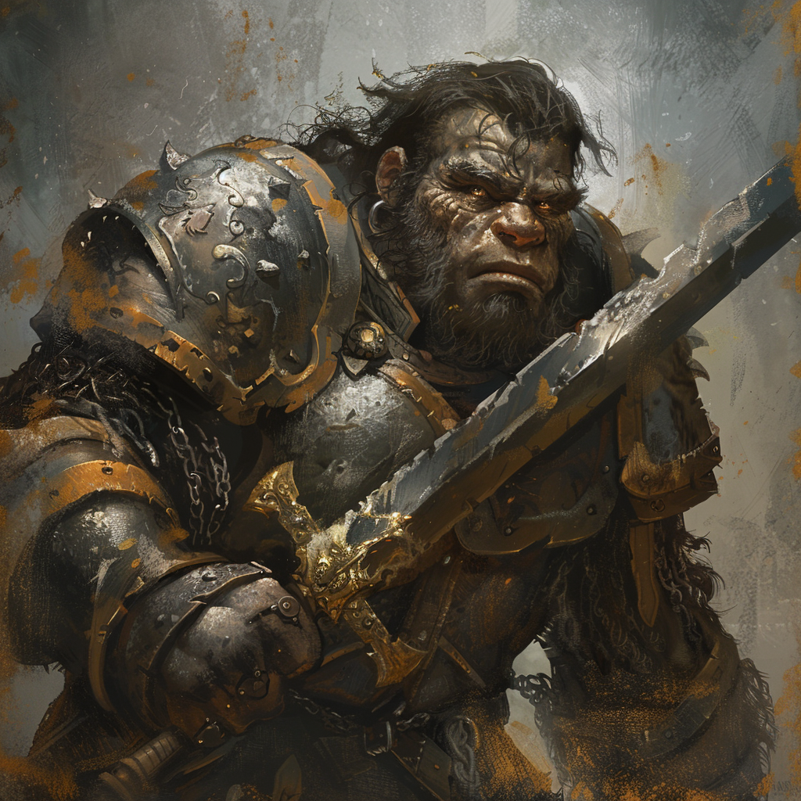

# Caelum Storringer (Paladin) & Tempest (Krokodil)

**Name:** Caelum Froso Storringer  
**Titel/Klasse:** Paladin  
**Alter:** Mittleren Alters  
**Geschlecht:** Männlich  
**Spezies/Rasse:** [Sodili-Lateral](/content/Volk_/Lateralen/index.md)  
**Heimat:** [Carpebur](/content/Himmelskoerper_/Agranum/Kontinent_/Gurontis/Sodili-Hauptstadt_Carpebur/index.md)  
**Beruf:** Mitglied der königlichen Garde  

## Allgemein

### Aussehen
Caelum ist ein imposanter Mann mit einer breiten Statur und einem ernsten Gesichtsausdruck.
Sein kurzes, dunkles Haar ist meist unter seinem Helm verborgen, und seine Augen strahlen Entschlossenheit aus.
Er trägt eine schwere Rüstung aus dem besten Stahl des Königreichs, und sein Schwert, das Symbol seiner Stellung als Paladin, ist stets an seiner Seite.

### Persönlichkeit
Caelum zeichnet sich durch seine unerschütterliche Treue und seinen starken Sinn für Gerechtigkeit aus.
Er ist ernsthaft und pflichtbewusst, was ihn zu einem verlässlichen und standhaften Beschützer macht.
Seine Starrköpfigkeit und der unbedingte Wille, immer das Richtige zu tun, können jedoch zu Konflikten führen, besonders wenn es um moralische Entscheidungen geht. Trotz seiner Tapferkeit hat Caelum eine tief verwurzelte Angst vor Magie, die er jedoch zu verbergen versucht.

#### Charakterzüge
Caelum ist treu, gerecht und pflichtbewusst.
Er ist jedoch auch starrköpfig und kann sich in moralischen Dilemmata verstricken.

#### Vorlieben
Caelum schätzt Ehre, Pflicht und den Schutz seiner Verbündeten.
Er genießt das bunte Treiben der Stadt und die Zeit, die er mit seinem Micu, Tempest, verbringen kann.

#### Abneigungen
Er hat eine tiefe Abneigung gegen Magie und alles, was er als Bedrohung für die Königsfamilie ansieht.

## Hintergrundgeschichte

### Frühes Leben
Aufgewachsen in einem Waisenhaus, hoffte Caelum schon früh auf ein besseres Leben.
Seine Ausbildung begann schließlich in seiner Jugend, als er von einem königlichen Truppführer in die Jugendgarde aufgenommen wurde.
Als Mitglied der königlichen Garde erlangte er schließlich durch seine Tapferkeit und sein großes Talent im Kampf immer mehr Anerkennung.

### Wichtige Ereignisse
Als Caelum dabei erwischt wurde, wie er einer der königlichen Patroullien nachstellte, hat der Truppführer XXX statt ihn zu bestrafen das Potenzial in dem Jungen gesehen.
Er nahm ihn in der Jugendgarde auf und wurde fortan zu seinem Mentor welcher ihm Recht und Ordnung beibrachte. 

### Aktuelle Situation
Seine Loyalität und sein Gerechtigkeitssinn brachten Caelum den Respekt des Königs ein, weshalb er auf Empfehlung persönlich vom König für die [Ikusations-Expedition](/content/Allgemein/Ikusation.md) ausgewählt wurde.
Die Teilnahme an der Expedition ist für Caelum eine Ehre und möglicherweise sein letzter Schritt, bevor er zum Truppführer befördert wird.
Neben der Aufgabe, die Gruppe zu schützen, soll er die Conius-Lateralen überwachen, eine Verantwortung, die er ernst nimmt, trotz oder gerade wegen seiner inneren Ängste gegenüber Magie.

## Fähigkeiten und Kräfte

### Physische Fähigkeiten
Caelum ist ein erfahrener Kämpfer, dessen Stärke und Geschicklichkeit ihn zu einem beeindruckenden Gegner im Kampf machen.
Er kann vor Allem durch physische Stärke glänzen, weshalb er besonders gut darin ist seine Mitstreiter zu beschützen und Gegner aufzuhalten.

### Magische Fähigkeiten
Caelum verfügt über keine aktiven magischen Fähigkeiten.

#### Micu
Caelums Micu ist ein imposantes Krokodil namens Tempest.
Mit seiner beeindruckenden Größe und Agilität im Wasser ist Tempest ein mächtiger Verbündeter.
Seine bloße Präsenz kann Gegner einschüchtern, und im Kampf ist Tempest sowohl an Land als auch im Wasser eine unaufhaltsame Kraft.
Darüber hinaus ist die Hybridform von Caelum und Tempest unglaubglich stark im direkten Kampf. 

### Talente
Caelum ist besonders talentiert im (Schwert-)Kampf, im Schutz seiner Verbündeten und in der Führung.

## Ausrüstung

### Waffen
Sein Schwert, das Symbol seiner Stellung als Paladin, ist stets an seiner Seite.

### Rüstung
Caelum trägt eine schwere Rüstung aus dem besten Stahl des Königreichs.

<!-- ### Sonstiges -->

## Beziehungen

### Familie
Caelum hat seine Eltern nie gekannt, da kurz nach seiner Geburt in einem Waisenhaus abgegeben wurde.
Er sieht die königliche Garde als einzige Familie an die er braucht.

### Freunde
Seine Kameraden in der königlichen Garde sowie einige Menschen aus Carpebur denen er mit seinem Pflichtbewusstsein bereits geholfen hat.

### Feinde
Magiepraktizierende und jene, die sein Volk bedrohen.

### Romantische Beziehungen
Caelum hat schon länger ein Auge auf eine Fischersfrau am Wolkenhafen geworfen und lässt sich daher besonders gern für Patroullien in dieser Gegend einteilen.
Bisher hat er sich jedoch nocht nie zu mehr als einem Lächeln getraut, welches die Dame hinter seinem Helm vermutlich nicht einmal sehen konnte.

## Zitate

> "Die Pflicht ruft, und ich werde antworten, koste es, was es wolle."  

> "Gerechtigkeit ist keine Option, sondern eine Verpflichtung."  

<!-- ## Trivia -->

<!-- ## Anmerkungen -->