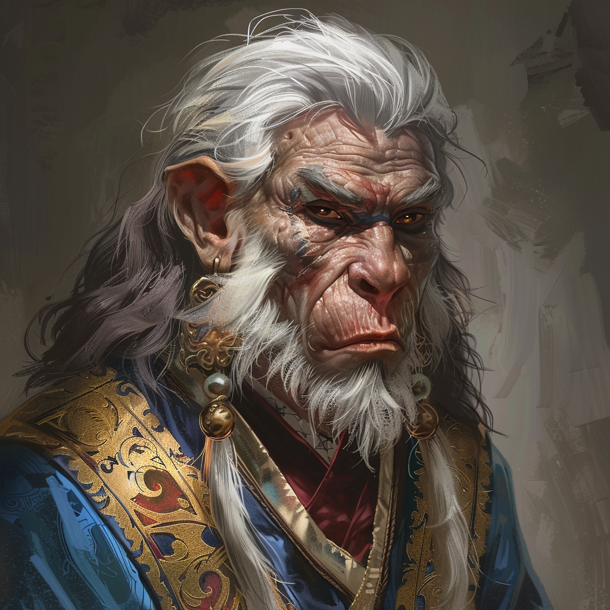

# Ingvor-Nemet Mandijit

**Name:** Ingvor-Nemet Mandijit  
**Titel/Klasse:** Elementar-Beschwörer  
**Alter:** Mittleren Alters  
**Geschlecht:** Männlich  
**Spezies/Rasse:** [Conius-Lateraler](/content/Volk_/Lateralen_/index.md)  
**Heimat:** Villa am See Kulios  
**Beruf:** Ehemaliger Lehrer an der Resrubor-Akademie, unabhängiger Forscher

## Allgemein

### Aussehen
Ingvor hat schulterlanges, silbergraues Haar und durchdringende, graublaue Augen, die von einem scharfen Verstand zeugen.
Sein Gesicht ist von den Jahren der intensiven Forschung und Lehre geprägt, mit tiefen Falten um die Augen und den Mund.
Er trägt meist prächtige Roben aus farbiger Seide, die seine wohlhabende Stellung und seine Vorliebe für Eleganz widerspiegeln.
Er ist immer mit Pergament, Federkiel und Zauberbüchern ausgestattet, bereit, seine Forschungen und Gedanken festzuhalten.

### Persönlichkeit

#### Charakterzüge
Ingvor ist ein rationaler und überlegter Lateral, der sich durch sachliches Auftreten und einen scharfen Verstand auszeichnet.
Seine Leidenschaft für die Magie und seine Neigung zur Beschwörung machen ihn zu einem motiviertem aber manchmal leicht aufbrausenden Lehrer und Forscher.
Trotz seines Temperaments war sein Unterricht an der Resrubor-Akademie sehr beliebt. 
In Akuelon ist er als temperamentvoller Lateraler bekannt, insbesondere aufgrund seines Streits mit dem Bürgermeister Stavros.
Hinter seiner diplomatischen Fassade verbirgt sich seither ein Hauch von Verbitterung.

### Ideale, Ziele und Bindungen
"Fortschritt dem Wissen" - Ingvor strebt danach, die Wissenschaft der Magie voranzutreiben.
Insbesondere möchte er die Forschung und Anwendung der Elementarbeschwörung weiterzuentwickeln.
Die Resrubor-Akademie war lange sein Zuhause, aber die träge Forschungspolitik trieb ihn dazu, seine Forschungen privat fortzuführen. 
Seine Erkenntnisse zur Elementarbeschwörung, sind sowohl innovativ als auch gefährlich.

## Fähigkeiten und Ausrüstung

### Physische Fähigkeiten
Ingvor hat keine herausragenden physischen Fähigkeiten, aber er ist geschickt im Umgang mit magischen Apparaturen und hat eine ausgezeichnete Feinmotorik für das Zeichnen komplexer Runen und Zauberzeichen.

### Magische Fähigkeiten
Ingvor ist ein erfahrener Zauberer mit besonderer Expertise in der Beschwörung und Kontrolle von Elementaren. 

### Talente
Ingvor ist ein geschickter Diplomat, auch wenn er diese Fähigkeiten inzwischen eher selten nutzt.
Er hat außerdem tiefes Wissen in der Runenwissenschaft und langjährige Erfahrung in der Forschung.

### Ausrüstung
Ingvor trägt meist prächtige Roben aus farbiger Seide und ist immer mit Pergament, Federkiel und Zauberbüchern ausgestattet. 
Sein Anwesen ist voller magischer Pflanzen und Gegenstände, die er für seine Forschungen und Beschwörungen nutzt.

## Hintergrundgeschichte

### Frühes Leben
Ingvor wurde in einer gemischten Lateralen-Kleinstadt nahe der Resrubor-Akademie geboren.
Er zeigte früh eine beeindruckende Begabung für Magie und besuchte die Akademie, wo seine beeindruckende magische Laufbahn begann.
Seine Eltern lebten in der Nähe der Akademie, aber aufgrund des Internatscharakters sah er sie selten.
In seiner Schulzeit hatte Ingvor nur wenige Freunde, da er sich vollends auf seine magischen Studien konzentrierte.

### Wichtige Ereignisse
Gegen Ende seiner Ausbildung verstarben Ingvors Eltern bei einer Epidemie, was ihn dazu brachte, auch nach seinem Abschluss an der Resrubor-Akademie zu verbleiben.
Ingvor wurde ein erfolgreicher Lehrer und Forscher an der Akademie, bekannt für seine Expertise in der Beschwörung von Elementaren.
Nach einigen Jahren verließ Ingvor die Akademie, da ihm die Forschungspolitik zu träge war, und zog sich an den See Kulios zurück, wo er seine Forschungen privat fortführte.
Ein Unfall bei seiner Forschung führte zur Persistenz eines Riesen-Elementars im See Kulios, der das nahegekegene Dorf Akuelon gefährdete.

### Aktuelle Situation
Ingvor wurde vom König der Sodili berufen der [Ikusations-Expedition](/content/Ereignis_/Ikusation.md) beizuwohnen.

## Beziehungen

### Familie
- **Eltern:** Verstarben bei einer Epidemie während Ingvors Ausbildung an der Resrubor-Akademie.

### Freunde
- **Ehemalige Schüler:** Viele seiner ehemaligen Schüler schätzen und respektieren ihn, auch wenn er keinen engen Kontakt zu ihnen pflegt.
- **Kollegen:** Einige seiner früheren Kollegen an der Resrubor-Akademie, die seine Arbeit respektieren, auch wenn sie seine Entscheidung, die Akademie zu verlassen, nicht nachvollziehen konnten.

### Feinde
- **Bürgermeister Stavros:** Ein langjähriger Rivale und Feind, mit dem Ingvor häufig Streitigkeiten hat.

### Romantische Beziehungen
Ingvor hat derzeit keine romantischen Beziehungen, da er seine Energie und Zeit vollständig seinen Forschungen und seiner Magie widmet.

## Zitate

> "Fortschritt ist das Streben nach Wissen."  

> "Elementare sind die reinste Form der Magie. Ihre Kontrolle erfordert Stärke und Verständnis."  

> "Die Wissenschaft der Magie ist ein unendliches Meer, und ich bin ein eifriger Schwimmer."  

## Trivia

- Ingvor hat einmal einen Riesen-Wasserelementar im See Kulios beschworen, ein Ereignis, das noch immer in der Region diskutiert wird.
- Sein Anwesen am See Kulios ist bekannt für die seltenen und exotischen magischen Pflanzen, die er dort kultiviert, aber auch für die komplexen Fallen, die Diebe und Gaffer abhalten sollen.
- Ingvor ist ein begeisterter Sammler alter und seltener Zauberbücher, die seine Bibliothek füllen.

<!-- ## Anmerkungen -->
