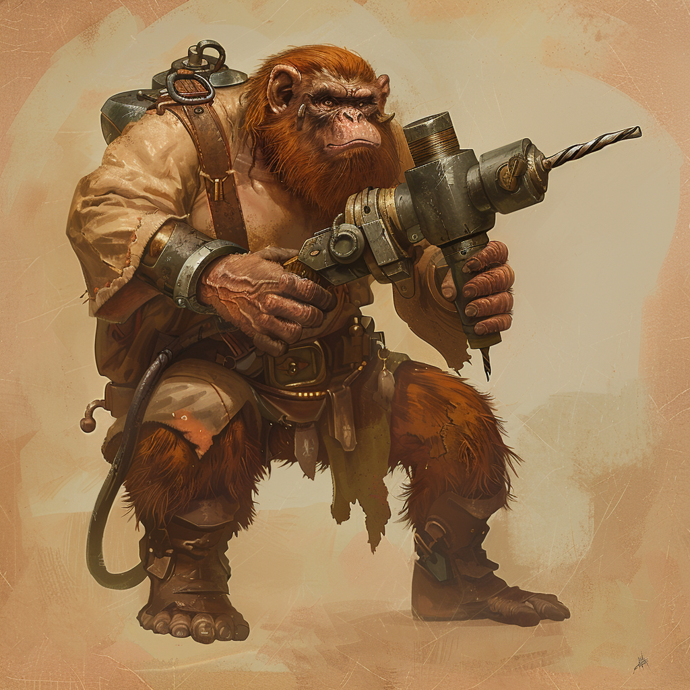

# Die Vapornane

:::figure{style="width: 400px;"}

::figcaption[Männlicher Vapornan des Phoriat-Zirkels]
:::

Die Vapornane sind das vorherrschende Volk auf [Aridess](/content/Himmelskoerper_/Aridess/index.md), bekannt für ihre robuste Natur und technische Raffinesse.
Diese kleinen, kräftigen Wesen haben sich perfekt an die extremen Umweltbedingungen ihrer Heimat angepasst, die von gnadenloser Hitze und endlosen Wüstenlandschaften dominiert werden.
Ihre Kultur ist geprägt von Anpassungsfähigkeit und pragmatischer Ingenieurskunst, die es ihnen ermöglicht, selbst unter den widrigsten Bedingungen zu florieren.
Da Aridess nicht [ovelärer](/content/Allgemein/Schoepfungsgeschichte.md#die-ovelären-planeten--die-elementdrachen) ist, haben die Vapornanes niemals magische Fähigkeiten durch eine [arcanogene Evolution](/content/Allgemein/Magie/index.md#arcanogene-evolution) entwickelt.
Sie fanden jedoch mit der Zeit trotzdem Möglichkeiten, die magische Energie des Serpinit-Systems zu nutzen (siehe [Gemtech](#gemtech)).

# Lebensraum
Vapornane leben in Ansammlungen von Höhlen und unterirdischen Tunnelsystemen, die Schutz vor den Elementen bieten, oder aber in Siedlungen in Oasen, wo fruchtbarer Boden und frisches Wasser zu finden sind.
Aufgrund der harschen Bedinungen auf Aridess sind die Vapornane jedoch letztlich immer auf gegenseitigen Ressourcenaustausch angewiesen, um zu überleben.

# Entwicklung & Geschichte

Zu den Anfängen der intelligenten Völker waren die Vapornane zu großen Teilen einfache Schmiede auf Aridess.
Sie nutzten Metall für Werkzeuge, ihre Unterkünfte und ähnliches.
Aufgrund der wiedrigen Umweltbedingungen gab es jedoch ausschließlich kleine, fast schon indigene Stämme und Siedlungen von Vapornanen.
Ein wichtiger Meilenstein in der Geschichte der Vapornanes war daher die Globalisierung ausgelöst durch die 12 Familien im [Zirkelgebirge](/content/Himmelskoerper_/Aridess/Kontinent/Unon/Gebirge_Zirkelgebirge/index.md).
Dort wurden die 12 Artefakte entwickelt, welche durch eine flächendeckende Nutzung infolgende einer engen Vernetzung der Vapornanen, die Lebensqualität nahezu aller Orte stark verbesserte und zur Verstädterung führte.
Diese 12 Erfindungen nutzten die einzigartigen Auswirkungen der magischen Potenz auf Edelsteine kombiniert mit der Kraft des Wasserdampfes.
Schließlich profitierten die Vapornane zudem stark von den Folgen der Ikusation, da sie mit Tjosand ihre gesamte Technologie zusätzlich stark verbessern konnten.

# Gesellschaft

Die Vapornane leben seit X in ewiger Zugehörigkeit zu sogenannten Zirkeln. 
Die Zirkel entstanden zwar ursprünglich aus den jeweils mächtigsten Vapornanenfamilien ihrer Zeit, sind jedoch schon seit Aridess' Globalisierung nicht mehr an die Grenzen einer Blutsverwandtschaft gebunden. 
Jeder der traditionellen Zirkel der Vapornane zeichnet sich ursprünglich durch eine besondere Erfindung aus, dessen Geheimnis viele Zyklen gehütet und weiterentwickelt wurde. 
Später hat jeder dieser Zirkel von der Entdeckung des Tjosandt-Quarzes und der Ikusation außerordentlich profitiert. 

# Zirkel

## Zirkel der kupfernen Flügel

Diese Vapornane haben es geschafft Flügel zu entwickeln, welche sich ähnlich eines Rucksacks umschnallen lassen. Der eingelassene Edelstein manipuliert dabei die umliegenden Winde. Zusammen mit der Kraft des Wasserdampfes ermöglichen so die Flügel selbst dem kleinen und schweren Volk der Vapornane den Flug durch die Luft. Dank der Weiterentwicklung ihrer Erfindung wurden später ganze Gebäude mit einer ähnlichen Technik flugfähig gemacht indem Wolken als dauerhafte Wasserdampfquellen genutzt wurden und die Nanos der kupfernen Flügel konnten sich in den Lüften Agranums ansiedeln ohne räumlich auf den Gravid-Ring beschränkt zu sein.

So ist eine ganze Stadt im Himmel entstanden, welche neben den Mitgliedern dieses Zirkels nur von fliegenden Sodili-Hybriden, Drachenkindern oder anderen fliegenden Lebewesen erreichbar sind.

## Zirkel des Eisenphoriats

Schon bevor die Entdeckung von Tjosandt den Zusammenhang zwischen Magie und ihrem Einfluss auf kristalline Stoffe offenbarte, spürten die Vapornane dieses Zirkels eine Vorliebe für Edelsteine.

Die Kraft des Wasserdampfes und die Notwendigkeit der Edelsteine für die Magie der Vapornane brachte einige ihrer Vertreter bereits früh dazu Geräte zu entwickeln die sich effektiv in den Boden graben können und sowohl Erde als auch Steine problemlos durchdringen. Während diese Bohrer zu Beginn noch vergleichsweise klein waren und von einem einzigen Vapornan bedient wurden, haben sie sich später zu riesigen Gerätschaften entwickelt, welche von innen gesteuert werden und breite Tunnel graben können.

Diese sogenannten Phoriat-Bohrer führten nicht nur dazu, dass dieser Zirkel seit je her sämtliche Vapornane mit Edelsteinen versorgt, sondern sie ließen auch riesige unterirdische Tunnelsysteme auf Aridess entstehen in welchen die Städte des Eisenphoriats errichtet wurden.

## Zirkel der Bleischützen

Einige Vapornane haben bereits sehr früh durch Zufall herausgefunden, dass sich Blei unter Einflüssen von Edelsteinmagie äußerst interessant verhält. So vermag die Magie z.B. spontane Veränderungen der Dichte des Metalls hervorzurufen ohne jedoch seine Masse oder Stabilität zu beeinflussen. Dieses Verhalten wurde trotz immer weiter fortschreitender Forschung bei keinem anderen Metall beobachtet.

Da die Wirkungsweise der Edelsteinmagie auf Blei jedoch mit nur leicht größer werdenden Stoffportionen bereits verschwindend gering wird, waren die Vapornane gefordert Geräte zu erfinden die selbst kleinsten Bleikugeln einen Nutzen zu geben.

Dafür wird innerhalb einer kleinen Maschine durch Wasserdampf ein enormer Druck aufgebaut, der dann schlagartig gegen die Bleikugel entladen wird, sodass diese gleich einem Geschoss durch die Luft fliegt. Ohne eine Veränderung der Dichte der Bleikugeln vor dem Schuss wären die Geschosse jedoch viel zu schwer und würden nur sehr geringe Strecken weit fliegen. Mit ihr jedoch, fliegen die Geschosse weit und kräftig und können so zur Jagd oder sogar zur Kriegsführung genutzt werden.

Durch Weiterentwicklung der dabei angewandten Magie wurden verschiedene Waffen erfunden, welche Bleikugeln mit unterschiedlichen Effekten verwenden. So sind die Projektile bei einigen Schusswaffen glühend heiß während des Schusses, bei anderen verflüssigt sich das Metall beim Aufschlag, bei wieder anderen dehnt sich die Kugel aus, usw..

## Zirkel der goldenen Temphora

Viele Vapornane befassten sich schon seit den ersten aufgezeichneten Zyklen mit der Zeit an und für sich. Seit der Entdeckung der Pulsene interessieren sich diese Nanos nicht mehr nur noch für die Definition der Zeit, sondern nunmehr auch für dessen Manipulation.

Nach langer gemeinsamer Zusammenarbeit schafften es einige der intelligentesten Vapornane die jemals lebten durch die Analyse der Zeitmesser der Sgrisigner, die Edelsteinmagie tatsächlich zur Manipulation der Zeit zu katalysieren.

Die entwickelten Gerätschaften sind klein, gleichen einer Taschenuhr und werden Temphora genannt. Sie sind in der Lage die Zeit in einem Umkreis von wenigen Schritten des Trägers leicht zu verlangsamen oder zu beschleunigen. Der Vapornan der die Temphora hält ist von der Zeitmanipulation dabei nicht betroffen. Dies eröffnete den Vapornanen ungeahnte Möglichkeiten und ließ ihren Zirkel zum mächtigsten und wohlhabendsten werden. Seither stellen die Vapornane als Zeichen ihres Reichtums die Temphoras ausschließlich aus Gold her.

Der Zirkel der goldenen Temphora ist einer der wenigen Zirkel der keinen Gebrauch von Wasserdampf in seiner Erfindung macht.

## Zirkel der Silberschiffe

Der Vapornanenzirkel der Silberschiffe hat sich auf dem großen Eistropfen Luqua angesiedelt. Die Schifffahrt auf Luqua ist zwar müßig, da die Wasseroberfläche regelmäßig gefriert, aber die Vapornane haben schon früh die gute Wärmeleitfähigkeit von Silber feststellen können, die sich mithilfe ihrer Edelsteinmagie sogar noch verstärken ließ. So brachten die Vapornane große beheizte Eisbrecher aus Silber an ihren Schiffen an und konnten die Wasseroberfläche von Luqua uneingeschränkt befahren. Das Wasser das als Nebeneffekt verdampft wird in großen Metallfalten an den Seiten der Schiffe aufgefangen und zur erneuten Wärmegeneration genutzt um so Energie zu sparen.

Dieser Zirkel bildet das Verbindungsglied zwischen den Vapornane und den Fluctro, zwischen denen ein reger Handel mit Tjosandt-Quarz herrscht.

## Zirkel der Stahlschmiede

Dieser Zirkel hat sich auf die traditionelle Schmiedekunst fokussiert, für die die Vapornane bereits vor der Gründung der Zirkel bekannt waren. Mit Klingen die von den Vapornanen dieses Zirkels hergestellt werden können sich nur sehr wenige andere Waffen im Serpinit-System messen, denn die Vapornane hatten viel Zeit ihre Methoden zu perfektionieren. In die Griffe von Waffen die für Vapornane hergestellt werden sind häufig Edelsteine eingelassen, welche die Waffe mit zusätzlicher Kraft des Trägers versehen. Der Kern solcher Klingen besteht außerdem aus Tjosandt-Quarz, um die Magie in die Schneide leiten zu können. Damit das Klingenblatt trotz des Quarzes stabil bleibt muss die Stahlummantelung in vielen besonderen Verfahren gehärtet werden.

Auch für andere Völker stellen die Vapornane gelegentlich Waffen her, doch diese sind den magischen Edelsteinklingen weit unterlegen.

## Zirkel der Aluminiumfliegen

Es handelt sich um ein kleines Gerät, welches einer Fliege aus klarem Kristall ähnelt. Die Kristallfliegen besteht zu großen Teilen aus Tjosandt-Quarz, mit einem Kern aus Edelstein. Außerdem sitzen unter den Flügeln kleine Metallplatten, die sich durch die Magie erhitzen. Gemeinsam mit der besonderen Struktur des Quarzes an der Unterseite des Flügels wird so der umgebenden Luft Feuchtigkeit entzogen, welche dann an den heißen Platten verdunstet und für den nötigen Auftrieb sorgt.

Im Korpus der Fliege ist eine kleine Aussparung, in der die Nachricht eingerollt befestigt werden kann. Genutzt werden die Fliegen zur Nachrichtenübermittlung über große Strecken hinweg. Dabei können die Fliegen auch die Sgrisignier-Portale nutzen um planetare Grenzen zu überwinden. Das Ziel kann der Fliege mündlich mitgeteilt werden. Die Vapornane haben über viele Zyklen hinweg unzählige Orte in die Magie der Kristallfliege „programmiert“, sodass diese Orte über die Aussprache erkannt werden können. Dafür wird ein weiterer Zettel mit den Koordinaten verschiedener Orte sowie den dazugehörigen Rufnamen in der Kristallfliege verstaut. Zu Beginn wurden die Kristallfliegen nur von den Vapornanen selbst genutzt, da auch nur diese in der Lage waren die kleinen Geräte aufzuladen. Die Möglichkeit Nachrichten schnell über große Strecken hinweg überbringen zu können hat jedoch auch bei den restlichen Völkern großen Anklang gefunden. Als die Vapornane es schafften die Magie der Fliegen so zu manipulieren, dass sie bei niedrigem Energieniveau automatisch zum Zirkel zurückkehrten um erneut aufgeladen werden zu können, haben sich die kleinen Geräte auch vollends bei den anderen Völkern durchgesetzt.

# Theologie & Magie

## Gemtech
Die Vapornans waren schon immer ein Volk der Schmiedekunst.
Viele ihrer unterirdischen Siedlungen sind aus Erz- oder Edelsteinminen entstanden.
Sie setzen Metall gezielt ein um das Überleben sowohl oberhalb also auch unterhalb der heißen Oberfläche von Aridess auf verschiedenste Weisen zu erleichtern.
Die Edelsteinverarbeitung hatte zuerst einen rein ästethischen Wert, doch so fanden die Vapornanes auch die energiespeichernden Eigenschaften von Edelsteinen heraus.
Der Erfindergeist der Vapornanos führte schließlich zur Kombination von energetisch aufgeladenen Edelsteinen und geschmiedetem Metall, woraus sie zügig bahnbrechende, mechanische Meisterwerke schufen, welche sich die Energie der Edelsteine durch Wasserdampf zunutze machten.
Mit diesen Erfindungen konnten die Vapornane schließlich zumindest teilweise ausgleichen, dass sie nicht wie die anderen Völker mit magischen Fähigkeiten geboren werden, was insbesondere ab dem Zeitpunkt der Ikusation ein wichtiger Faktor für die interplanetaren Beziehungen ist.

# Aussehen

* Bärtig (auch die Frauen), sonst kurzes Stoppelfell
* Haben einen Schwanz

Die Vapornane sind klein und rundlich, mit Händen die an Maulwurfsschaufeln erinnern. Ihre Arme/Beine und Hände/Füße sind stark behaart und Sie haben eine Fettschicht aufgrund ihrer guten Nahrungsaufnahme.
Sie entwickeln schon als Kinder (meist im Alter von ca. 8 Zyklen) starken Bartwuchs, dessen Ergebnis nicht selten in kunstvollen Zöpfen zusammengeflochten wird. Vapornane haben fast ausschließlich braune und rote Haare die mit dem Alter gräulich werden. Seltener werden auch Vapornane mit schwarzen Haaren geboren, während blonde Haare bei Vapornanen gar nicht vorkommen.

Bevor dieser Bartwuchs beginnt fällt es vielen Angehörigen anderer Völker schwer männliche und weibliche Vapornanenkinder zu unterscheiden, da auch die Frauen unter den Vapornanen kräftig gebaut sind und markante Gesichtszüge haben. Auch die Länge der Haupthaare sagt bei einem Vapornan nichts über das Geschlecht aus, denn sowohl lange als auch kurze Haare sind bei beiden Geschlechtern üblich.

Trifft man einen Vapornan an der neben einem glatten Kinn auch einen kahlen Kopf besitzt, so handelt es sich üblicherweise um einen Verbrecher der für die Zeit seiner Strafe keine Rechte mehr besitzt.

# Mode

## Alltäglich

Alle Vapornane besitzen von Kindesalter an breite Metallringe in die das Symbol ihres jeweiligen Zirkels sowie ihr Hauswappen eingraviert sind. Während die Männer diese Ringe über ihren Bartzöpfen tragen, hängen die der weiblichen Vapornane meist an Ketten um ihren Hals.

Die Kleidung der Vapornane kann je nach Lebensraum und Wohlhaben sehr unterschiedlich ausfallen, geht jedoch häufig in die rustikale Richtung mit vielen Fellen und Lederanteilen.

Aufgrund der Wirkungsweise der Vapornanenmagie ist Edelsteinschmuck zudem unverzichtbar unter Vapornanen. Ob in Ringen, Halsketten, Haarschmuck oder Armreifen, viele Vapornane tragen gleich mehrere reine Edelsteine am Körper damit ihnen stets magische Energie auf Abruf zur Verfügung steht.

## Kampf

Vapornanenrüstungen sind klassische Rüstungen aus breiten Metallplatten unter denen ein Kettenhemd getragen wird. Die Rüstungen sind darauf ausgelegt die Vapornane, die aufgrund ihres gedrungenen Körperbaus ohnehin nicht allzu viel Bewegungsfreiheit besitzen, nicht noch mehr einzuschränken. Dabei greifen die Platten bei jeder Drehbewegung ineinander und blockieren nicht.

In den Rüstungen ist immer das Symbol des jeweiligen Zirkels eingraviert. Außerdem werden in höherwertigen Rüstungen Tjosandt-Legierungen und Edelsteine eingelassen, die der Rüstung auf magische Art und Weise noch mehr Widerstandsfähigkeit im Kampf bieten.

Häufig sind Rüstungen für traditionelle Kämpfe und Feste zusätzlich mit dem bezeichnenden Metall des jeweiligen Zirkels und anderen Akzenten verziert.

## Festlich

Für besondere Anlässe tragen Vapornanen meist feine Leinenstücke mit passenden Umhängen. Die Farben fallen im Allgemeinen kräftig aus, werden dabei aber immer passend zum Edelsteinschmuck des Vapornane gewählt.

Des Weiteren wird für Festlichkeiten besonderes Augenmerk auf die Haare eines Vapornane gelegt. Häufig wird sehr viel Zeit investiert um sowohl das Haupthaar, als auch einen eventuellen Bart in aufwendigen Flecht- und Steckfrisuren herzurichten.

# Theologie

Die Vapornane glauben wie viele andere Völker auch an die allgemeine Fassung der serpinitären Lehren.

# Magische Fähigkeiten

Vapornane haben genetisch gesehen die niedrigste magische Intelligenz aller modernen Völker. Aus diesem Grund profitierten
sie ursprünglich auch am wenigsten von den Erkenntnissen der Conius-Lateralen über die Sgrisignier Runen. Erst als die
Sgrisignier-Portale größtenteils kartografiert waren entwickelten die Vapornane Fähigkeiten die mit denen der anderen
Völker vergleichbar waren. Diese basiert jedoch nicht auf der Repe, sondern

Diese Edelsteinmagie definiert sich dadurch, dass magische Kraft auf Edelsteine geladen wird, um diese dann ähnlich
einer Batterie nutzen zu können. Für diese Art der Magie ist immer Tjosandt-Quarz von Nöten, da nur mit der magischen
Leitfähigkeit von Tjosandt die Magie in die Edelsteine gelangen kann. Die Vapornane selbst besitzen keinerlei intuitive
magische Kräfte, da sie von keinem der Elementdrachen geformt wurden. Daher kann mit der Hilfe von Tjosandt theoretisch
jedes Lebewesen Edelsteine mit magischer Kraft aufladen. Die Vapornane haben ihr Verfahren jedoch über die Zeit
perfektioniert um mit der Magie der anderen Völkern mithalten zu können

Vapornanen sind zwar von Magie durchdrungen, haben aber trotzdem nicht im direkten Sinne magische Kräfte. Stattdessen haben Vapornane nur das unglaublich starke Verlangen Edelsteine zu erlangen. Berührt ein Vapornan einen reinen Edelstein kann er intuitiv eine Verbindung zu diesem Stein aufbauen und ist nun in der Lage seine magische Energie auf den Stein zu übertragen. Aufgeladene Edelsteine können genutzt werden um Magie in die Technologien der Vapornane zu integrieren. Besonders in Verbindung mit Metall und durch die leitenden Fähigkeiten des Tjosandt-Quarzes konnten die Vapornane Erfindungen entwickeln die so bahnbrechend waren, dass sie auch ohne intuitive magische Fähigkeiten schnell zu einem der mächtigsten Völker im Serpinit-System werden konnten.

