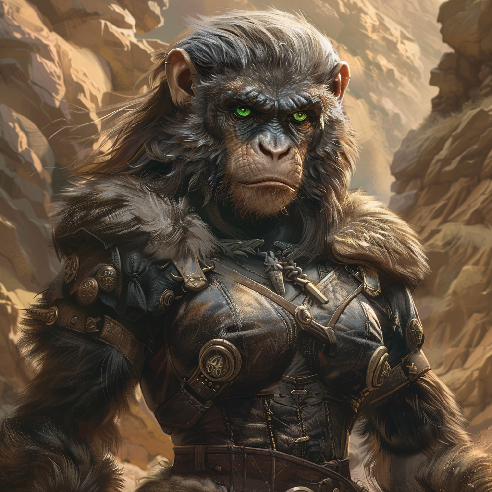

# Hiante Krolpin, Zirkelgründerin

:::overview

 
|                      |                                                                                                         |
| -------------------- | ------------------------------------------------------------------------------------------------------- |
| **Name:**            | Hiante Krolpin (geb. Kriolen)                                                                        |
| **Titel / Klasse:**  | Zirkelgründerin                                                                                         |
| **Alter:**           | Erwachsene                                                                                              |
| **Geschlecht:**      | Weiblich                                                                                                |
| **Spezies / Rasse:** | [Varnops](/content/Volk_/Varnops/index.md)                                                          |
| **Heimat:**          | [Nördliche Wüste Frilach](/content/Himmelskoerper_/Aridess/Kontinent_/Unol/Wüste_Frilach/index.md)      |
| **Beruf:**           | Handelsstrategin, Metallurgin                                                                           |

:::

# Allgemein

## Aussehen
Hiante Krolpin ist eine Frau von beeindruckender Natur.
Sie ist groß und durchtrainiert und ihr Gesicht ist markant, mit hohen Wangenknochen und durchdringenden grünen Augen.
Ihre silbergrauen Haare trägt sie meist recht kurz geschnitten und sie kleidet sich typischerweise in praktische Lederschürzen.
Hiantes Kleidung sticht mit ihrem steigenden Alter immer stärker durch kunstvolle, metallene Verzierungen hervor – Symbole die sie durch ihre Verbindung zu den Minenleitern und ihre Rolle als Anführerin erhält.

## Persönlichkeit

### Charakterzüge
Hiante ist bekannt für ihre strategische Weitsicht und ihren unerschütterlichen Willen.
Sie ist zielorientiert und pragmatisch, aber gleichzeitig mitfühlend gegenüber ihren Angehörigen.
Ihre größte Stärke ist ihre Fähigkeit, komplexe Beziehungen und Netzwerke zu pflegen, was ihr, in Kombination mit den polyamorösen und traditionell leicht matriarchalischen Strukturen der Varnop-Gesellschaft, mit der Zeit zu viel Macht verhilft.

### Vorlieben
Hiante liebt die Arbeit mit Metall und die segende Hitze einer Erzschmiede seitdem sie das erste Mal eine Mine betreten hat.
Sie hat darüber hinaus auch schon immer eine tiefe Leidenschaft für Handelsstrategien und Machtspiele.
In der Freizeit ihres späteren Lebens genießt sie es vor allem, sich mit ihren Kindern zu beschäftigen.

### Abneigungen
Hiante hat eine starke Abneigung gegen Inkompetenz und Verschwendung von Ressourcen.
Sie verabscheut Unehrlichkeit und Intrigen innerhalb ihrer Familie und Geschäftskreise.
Obwohl sie wenig offene Feinde hat, steht sie Personen skeptisch gegenüber, die ihre Autorität in Frage stellen oder die Harmonie in ihrer Familie stören.

# Hintergrundgeschichte

## Frühes Leben
Hiante wird im 253. Zyklus vor der Ikusation in den nördlichen Ebenen der [Wüste Frilach](/content/Himmelskoerper_/Aridess/Kontinent_/Unol/Wüste_Frilach/index.md) von [Aridess](/content/Himmelskoerper_/Aridess/index.md) geboren.
Ihre Geburts-Familie [Kriolen](../../../Kriolen_Wüstenstamm/index.md) siedelt dort als eigenständiger Stamm im Schatten der nördlichen Berge.
Die Gemeinschaft ist klein und lebt hauptsächlich vom Jagen und Sammeln, hat jedoch mit der Zeit auch einige rudimentäre Handelsbeziehungen zu den nördlichen liegenden Bergketten aufgebaut.
Meist ertauschen sich die Kriolen dabei verarbeitetes Metall in Form von Waffen und Werkzeugen mit dem Leder und Fleisch ihrer letzten Jagdzüge.
Der Kontakt zu dem ertauschtem Rohstoff fasziniert Hiante schon als Kind und sie verliert sich nur zu gern in den spiegelnden Reflexen der Wüstensonne in glänzenden Metallen.
In ihrer späten Adoleszenz entscheidet sie sich schließlich, die Familie Kriolen zu verlassen und in die nördlichen Berge zu reisen um dort die Metallverarbeitung genauer kennenzulernen.
Außerdem verfolgt sie das Ziel dort eine eigene Familie mit dem neuen Namen "Krolpin" zu gründen.
 
## Erwachsenenalter
Erst als Hiante in die nächstgelegenen Ausläufer der nördlichen Gebirge zieht, versteht sie wie begrenzt ihr Verständnis von der Welt bisher war.
Der Kriolen-Stamm ist traditionell und wertschätzt altbekannte Werte und Normen.
Sowohl der fernen Bergkette am Horizont als auch den fremden Händlern die den Stamm manchmal besuchen, stand Hiantes Familie somit stets distanziert gegenüber.
Sie hegen zwar keinen Groll gegenüber fremden Dingen, doch versuchen sie stets die Kontaktpunkte gering zu halten.
Hiante kennt lange Zeit also nur ein kleines, wohlvertrautes Umfeld, bis ihre Neugierde sie schließlich hinaus in die Welt treibt.

### Familiengründung
Im Zirkelgebirge findet Hiante zuerst die [Kharrak-Mine](/content/Himmelskoerper_/Aridess/Kontinent_/Unol/Gebirge_Zirkelgebirge/Kharrak-Mine/index.md), in welcher Eisenerz abgebaut und verarbeitet wird.
Dort beginnt sie 96 Zyklen vor der Ikusation eine Beziehung mit [Lerold](../Lerold-Krolpin/index.md), dem Leiter der Mine, und zeugt zweieinhalb Zyklen später ihren ersten Sohn, [Grisham Krolpin](../Grisham-Krolpin/index.md) welcher somit schließlich im 87. Zyklus vor der Ikusation auf die Welt kommt.
Daraufhin verbringt sie mit Lerold einige glückliche Zyklen, in welchen sie zum einen die Grundlagen der Metallurgie näher kennenlernt und zum anderen liebevoll ihren ersten Sohn großzieht.

In Grishams Jugend erkundet sie schließlich die weiteren Minen des Zirkelgebirges und etabliert polyamore Beziehungen mit noch weiteren führenden Männern der Region.
Sie reist fortan viel zwischen den Minen umher und wird dabei immer mal wieder von Grisham und später auch von ihren anderen Nachkommen begleitet.

Hiantes zweiter Mann ist [Torval](../Torval-Krolpin), der Leiter der [Drakar-Mine](/content/Himmelskoerper_/Aridess/Kontinent_/Unol/Gebirge_Zirkelgebirge/Drakar-Mine/index.md), mit welchem sie ihre Zwillings-Töchter [Jell](../Jell-Krolpin) und [Liss](../Liss-Krolpin) zeugt.
In der Drakar-Mine wird hauptsächlich Kupfer abgebaut und zu Bronze (später auch Messing) verarbeitet.

Auf Torval folgt [Fynrik](../Fynrik-Krolpin), der Leiter der Murgath-Stollen.
Diese Stollen haben sich aus den ersten Edelstein- und Goldfunden in den Flussbetten der Gebirge gebildet, welche bei indigeneren Stämmen für die Herstellung von Schmuck sehr beliebt waren.
Hier wird Hiantes Tochter [Legartha](../Legartha-Krolpin) geboren.

Im Zyklus -24 entsteht nahe Arides' Nordpol der Hauptsitz der Krolpin-Familie: [Dronak](/content/Himmelskoerper_/Aridess/Kontinent_/Unol/Gebirge_Zirkelgebirge/Dronak/index.md).
Diese Residenz ensteht aus der Zusammenarbeit aller Männer von Hiante und soll fortan als Koordinierungszentrum für die immer komplexer werdenden Handelsbeziehungen dienen.
In den nachfolgenden Zyklen zeugt Hiante mit ihren Männern noch drei weitere Söhne: [Jopun](../Jopun-Krolpin), [Flort](../Flort-Krolpin) und [Brill](../Brill-Krolpin), welche zu großen Teilen in Dronak aufwachsen und neben Hinate auch viel von Jell und Liss erzogen werden.

## Aridess' Globalisierung
Im Zyklus -15 initiiert Hiante die Planung einer Globalisierung von Aridess.
Sie ist unzufrieden mit den ineffizienten Handelswegen der nördlichen Minen und versucht Veränderung auf den Weg zu bringen.
Während ihre Männer der Überzeugung sind, dass alle ihnen zur Verfügung stehenden Mittel bereits voll ausschöpft werden, hat Hiante aufgrund ihres persönlichen Hintergrunds und ihres Ursprungs im Kriolen-Stamm den festen Glauben, dass ein engerer Außtausch mit Populationen außerhalb des Zirkel-Gebirges viele ihrer Probleme lösen könnte.
Aus diesem Grund plant sie den [Zirkel-Wettstreit](/content/Ereignis_/Zirkel-Wettstreit/index.md) um ihrem Ziel einer Globalisierung näherzukommen.
Eine der teilnehmenden Gruppen lässt Hiante von ihrem Sohn Grisham aufstellen, sie selbst nimmt jedoch den gesamten Wettstreit über eine neutrale Position als Ausrichterin ein.

Nach dem Wettstreit veranlasst Hiante die Konstruktion von 11 weiteren Residenzen am Nordpol, eine für jeden Zirkel.
Natürlich wird Dronrak als der Krolpin-Familiensitz die Residenz des [Erzphoriat-Zirkels](/content/Volk_/Varnops/Politik/Zirkel_/Erz-Phoriat.md), die siegende Teilnehmergruppe von Grisham.

## Spätes Leben
Zum Zeitpunkt ihres Todes im Zyklus 72 hat Hiante ihre Familie zu einer der einflussreichsten auf Aridess gemacht.
Ihre Nachkommen verwalten weiterhin die Minen und Handelsposten, die Hiante aufgebaut hat, und führen das von ihr begonnene Erbe fort.

# Fähigkeiten und Kräfte

## Physische Fähigkeiten
Hiante ist körperlich sehr robust, stark und besitzt eine große Ausdauer, was von ihrer Erziehung im Kriolen-Stamm herrührt.
In ihrer Jugend hat sie gelernt [Sterosse](/content/Himmelskoerper_/Aridess/Fauna_/Sterros/index.md) zu reiten, eine Aktivität welcher sie noch bis ins hohe Alter gerne nachgeht.
Hiante ist jedoch weder ein gute Kämpferin noch eine Jägerin. 
Während ihrer Jugend im Kriolen-Stamm sträubt sie sich gegen alle Lehreinheiten die mit dem Erlegen eines Tiers oder dem Führen einer Waffe zu tun haben.
All das vermisst sie auch nicht im entferntesten, als sie ihren Stamm schließlich verlässt.

## Magische Fähigkeiten
Als Varnops besitzt Hiante keine magischen Fähigkeiten.

## Talente
Hiante ist im allgemeinen bekannt für ihre Empathie und Diplomatie.
Ihr Geschick im Umgang mit Handelspartnern und ihre innovative Natur sind entscheidend für ihr ambitioniertes Vorhaben der Globalisierung von Aridess.
Auch ihre Fähigkeiten und ihr Wissen im Bereich der Metallurgie sind heruasragend. 
Diese hat Hiante sich jedoch mit viel Mühe aneignen müssen, um auf die Führung der nördlichen Minen auf Aridess Einfluss nehmen zu können.

# Ausrüstung

## Waffen
Hiante trägt häufig einen verzierten, kurzen Minendolch, der sowohl als Werkzeug als auch als Waffe dient.

## Rüstung
Ihre bevorzugte Kleidung besteht aus dickem Minenleder, das mit Tjosand-Legierungen verstärkt ist, um sie sowohl vor Unfällen in den Minen als auch vor Angriffen zu schützen.

## Sonstiges
Hiante trägt stets einen kunstvollen Gürtel, an dem verschiedene Werkzeuge und kleine Erze hängen, die sie als Glücksbringer betrachtet.
Zudem besitzt sie eine Kartensammlung der Minen, die sie selbst angefertigt hat, um die Handelsrouten zu optimieren.

# Beziehungen

## Familie
- **Grisham Krolpin:** Ihr ältester Sohn und designierter Nachfolger in der Familienführung.
Hiante hat eine enge und lehrreiche Beziehung zu ihm.
- **Lerold (Kharrak-Mine):** Grishams Vater und einer der ersten Minenleiter, mit dem Hiante eine Beziehung eingeht.
Ihre Beziehung basiert auf gegenseitigem Respekt und gemeinsamer Zielstrebigkeit.
- **Torval (Drakar-Mine) und Fynrik (Murgath-Mine):** Weitere Minenleiter und Väter ihrer Kinder.
Die Beziehungen zu ihnen sind geprägt von Vertrauen und strategischer Zusammenarbeit.

## Freunde
Hiante ist eng mit den Anführern der anderen Minen verbunden, insbesondere mit denjenigen, die durch ihre Allianzen Teil der Krolpin-Familie werden.
Sie pflegt außerdem gute Beziehungen zu verschiedenen Handelsführern, die ihre Vision teilen.

## Feinde
Direkte Feinde hat Hiante kaum, doch es gibt rivalisierende Minenleiter und Händler, die ihre Macht und Einflussnahme kritisch sehen.
Diese Rivalen bleiben jedoch meist im Schatten, da Hiante sie durch ihre geschickten Allianzen und strategischen Züge in Schach hält.

## Romantische Beziehungen
Hiante führt mehrere parallele Beziehungen mit Minenleitern, die auf gegenseitiger Zuneigung und strategischer Notwendigkeit basieren.
Diese Beziehungen sind integraler Bestandteil ihres Plans, die Krolpin-Familie zu gründen und die Kontrolle über die nördlichen Minen zu erlangen.

# Zitate

> "Die Tiefe der Erde birgt mehr als nur Erz – sie birgt unsere Zukunft."  
> "Jede Ader, die wir entdecken, ist ein Schritt näher zu unserer wahren Macht."  
> "Familie ist das Netz, das uns trägt – und ich bin der Knoten, der es zusammenhält."  

# Trivia

- Hiante ist bekannt für ihre Fähigkeit, die Qualität von Erz allein durch Berührung zu beurteilen.
- Sie führt ein Tagebuch, in dem sie ihre Gedanken und Strategien festhält.
Dieses wird nach ihrem Tod zu einem wertvollen Familienerbstück.
- Der Zirkel-Wettstreit, den sie initiiert, wird bis heute in ihrer Ehre abgehalten.

# Anmerkungen

Hiante Krolpins Lebenswerk legt die Grundlage für das moderne Aridess.
Ihre Nachkommen und ihre strategischen Entscheidungen beeinflussen die Minenwirtschaft und die politische Struktur des Planeten bis heute.