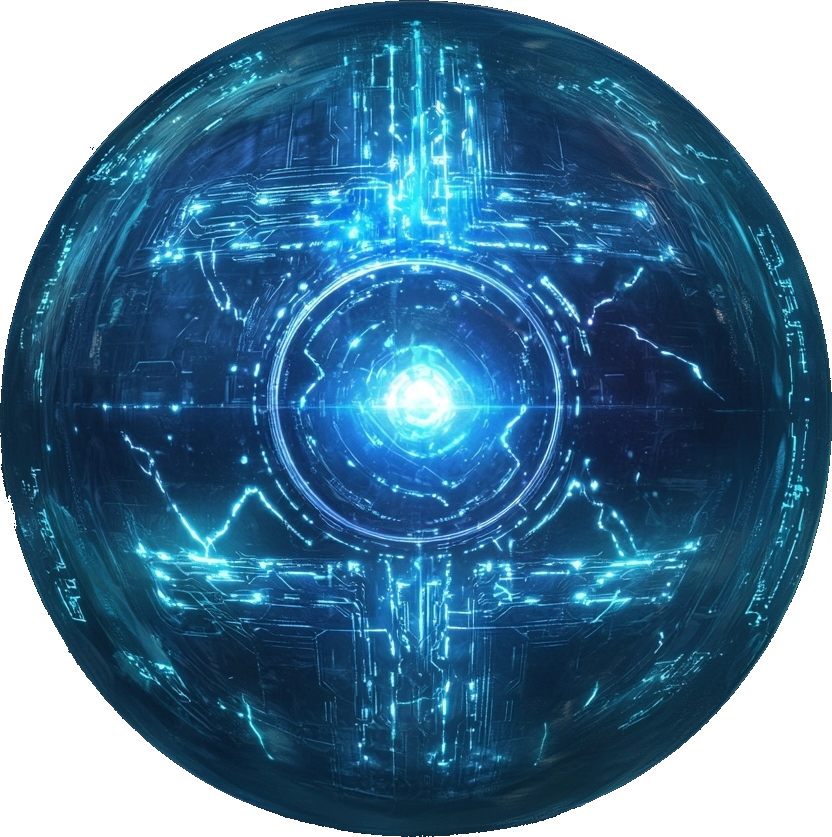

# Das Planetensystem Serpinit

Serpinit ist ein Planetensystem, welches vom großen Drachengott [Creapatos](/content/Allgemein/Schoepfungsgeschichte.md#creapatos) geschaffen wurde.
Das System besteht aus 9 Himmelskörpern mit vielfältiger Flora und Fauna und variierender Intelligenz.

::::a{.no-fancy style="width: 200px;" href=/content/Allgemein/Magie/index.md}

::::

- [Die Magie](/content/Allgemein/Magie/index.md)
- [Die Schöpfungsgeschichte](/content/Allgemein/Schoepfungsgeschichte.md)
- [Die 9 Himmelskörper](/content/Himmelskoerper_/index.md)
- [Die 9 Völker](/content/Volk_/index.md)