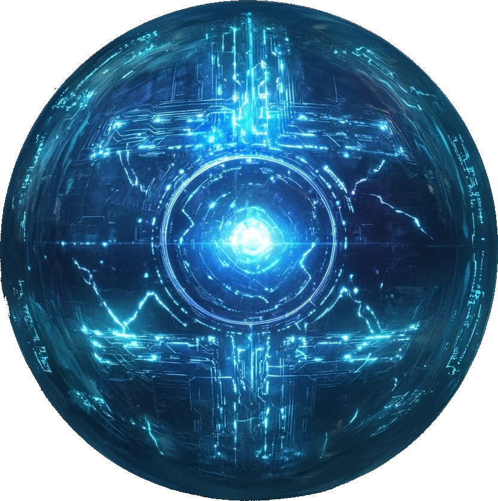
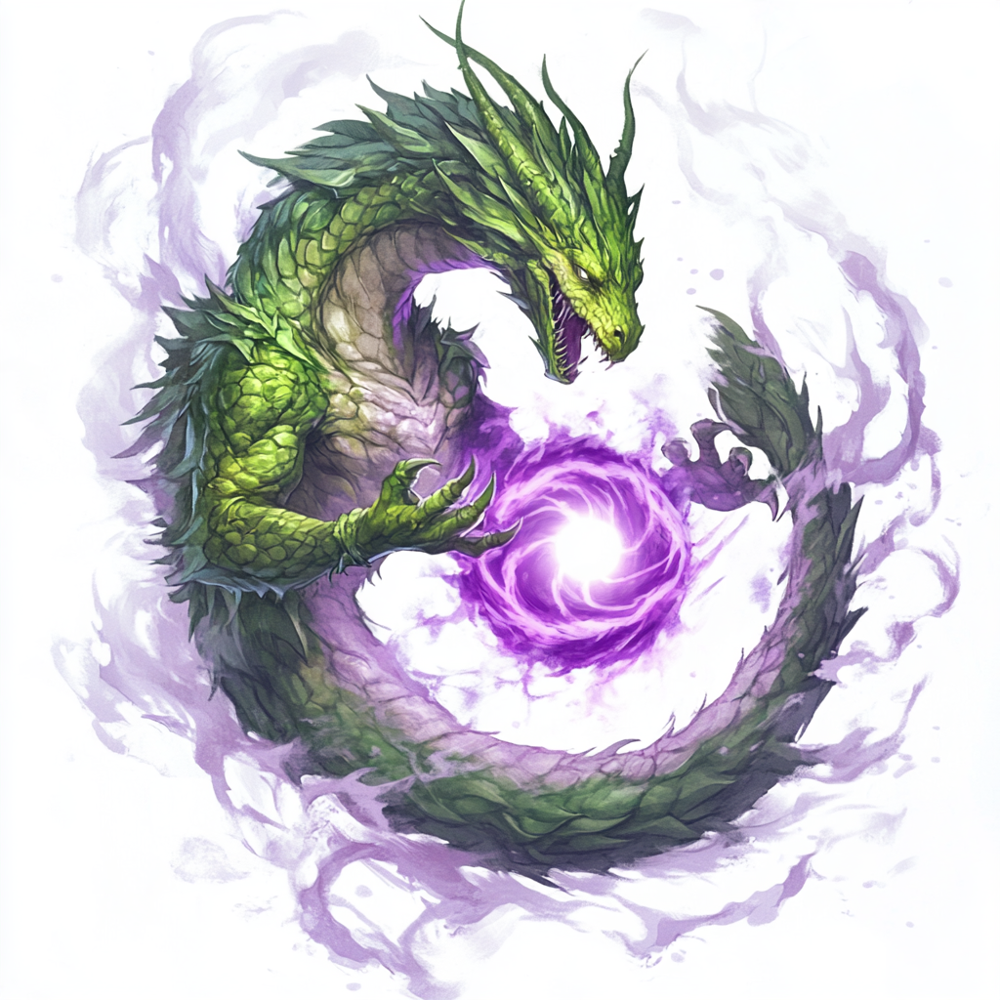

# Das Planetensystem Serpinit

Serpinit ist ein Planetensystem, welches vom großen Drachengott [Creapatos](/content/Allgemein/Schöpfungsgeschichte.md#creapatos) geschaffen wurde.
Das System besteht aus neun Himmelskörpern mit vielfältiger Flora, Fauna, Geschichte und unterschiedlichsten Formen von Intelligenz.
Dieses Wiki dient als Nachschlagewerk für Orte, Völker, Magie, Schöpfung und zentrale Figuren des Settings.
## Grundlagen

Wenn du das Setting neu erkunden willst, sind diese Themen die besten Startpunkte:

<!-- display: card-link style="width: 220px;" -->

Die Magie

<!-- display: card-link style="width: 220px;" -->

Die Schöpfungsgeschichte

## Große Einstiege

- [Die 9 Himmelskörper](/content/Himmelskörper/index.md)
- [Die 9 Völker](/content/Volk/index.md)
- [Die Timeline](/content/timeline)
- [Die Suche](/content/search)

## Orientierung

Die Himmelskörper-Seiten helfen beim räumlichen Überblick über Planeten, Kontinente und Orte.
Die Völker-Seiten bündeln Spezies, Kulturen und viele Charaktere.
Die Magie- und Schöpfungsartikel geben den theoretischen und historischen Rahmen des gesamten Systems.
