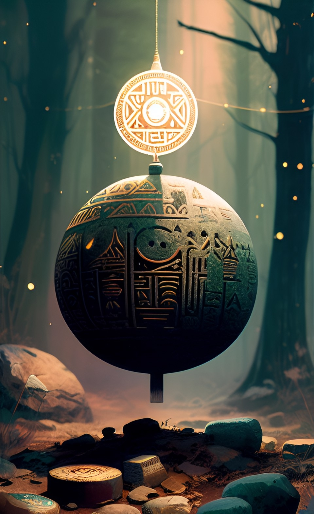

# Die Sgrisignier

Die Sgrisignier sind eine uralte Hochkultur des Serpinit-Systems. So lange es sie gab waren sie die ersten und einzigen intelligenten Bewohner der 7 Planeten. Sie wurden von Creapatos direkt erschaffen und entstanden nicht durch natürliche Evolution. Sgrisignier sind geschlechtslos und daher nicht selbstständig in der Lage zu reproduzieren. Creapatos erschuf so also eine einzigartige Population fester Größe und gab den Sgrisigniern dabei ausreichend magische Macht um jeden natürlichen Alterungsprozess zu verhindern. 

Sgrisignier sind komplett haarlose, 3 - 4,5 m große Kreaturen mit langen, dürren Gliedmaßen. Ihre Haut ist gräulich und leicht rauh und ihre Augen sind zumeist rot oder lila gefärbt. 

# Runen
Die Sgrisignier-Runen stellen eine Schnittstelle zur Magie dar, welche Creapatos den Sgrisigniern bot. Creapatos nutzte in seiner Allmächtigkeit die von ihm erschaffenen Magiefaktoren Wymen & Vendos in einer sehr intuitiven Form. Um seinem ersten Volk ebenfalls einen Zugang zur Magie zu geben, gab er ihnen magische Intelligenz und insbesondere das Wissen um ein magisches, dreidimensionales Schriftsystem, mit welchem Wymen & Vendos ebenfalls manipuliert werden konnten. Man kann sich die Sgrisignier-Runen wie eine Programmiersprache der Realität vorstellen, geschrieben in einem Schriftsystem das mit topologischer Knotenlehre korreliert. 

Runen werden von vielen Völkern weiterhin genutzt, da sie das Wymen beeinflussen können.

# Portale

Auf nahezu jedem Planeten des Serpinit-Systems befinden sich rundliche Steintore die von uralter Runenmagie
durchdrungen sind. Diese Steinbögen sind Portale, wobei in der Theorie immer genau zwei Portale miteinander verbunden
sind. Sie wurden von den Sgrisigniern gebaut und genutzt um schnell und unkompliziert zwischen den Planeten reisen zu
können. Die Portale überlebten den Fall der Sgrisignier und werden auch von den modernen Völkern weiter genutzt. Doch
bevor die Conius-Lateralen die Chaos-Portale gezähmt haben, war die Benutzung aufgrund von Chaos-Portalen äußerst
gefährlich.

## Chaos-Portale

Chaos-Portale sind Sgrisignier-Portale welche kein festes Ziel mehr besitzen. Dies passiert meist, weil das
ursprüngliche Gegenstück zerstört wurde. Die Teleporationsmagie eines solchen Protals "zappt" förmlich durch das
System auf der Suche nach seinem Gegenstück. Dabei stellt des Chaos-Portal zwar immer wieder eine durchaus
stabile, aber auch sehr kurze Verbindung zu einem beliebigen anderen Portal her. Die Verbindung dauert im Schnitt kaum
eine halbe Pulsene (0.235 ± 0.19). Aus diesem Grund wurden die meisten Lebewesen die jemals versuchten ein Chaos-Portal
zu durchqueren schlichtweg von der Ungezähmtheit der Magie zerrissen. Darüber hinaus macht die Existenz der
Chaos-Portale auch das Reisen mit vollkommen intakten Portalen äußerst gefährlich. Ein Chaos-Portal bildet beim
Verbindungsaufbau mit einem anderen Portal für kurze Zeit ein gerichtetes Teleportations-Dreieck mit dem Ziel-Portal und
seinem eigentlichen Gegenstück. Sollte also ein Lebewesen gerade auf dem regulären Weg zum Ziel-Portal sein, so kann es
ebenfalls vom Chaos-Portal zerrissen werden. Erst die Conius-Lateralen schafften es durch die geschickte Anpassung von
Sgrisignier-Runen die Chaos-Portale zu zähmen. Das von ihnen entwickelte Verfahren wandten sie in ihrem groß angelegtem
Ikusations-Projekt an um das Serpinit-System zu vernetzen. Dabei wurde zum einen die Dauer einer Chaos-Verbindung
signifikant erhöht (ca. um den Faktor 10) und zum anderen wurden alle Portale stückweise gegen den Verbindungsaufbau mit
Chaos-Portalen abgesichert.

Die Nutzung von Chaos-Portalen und auch die Erschließung von bisher unbekannten Portalen war jedoch auch nach der
Ikusation keine ungefährliche Angelegenheit. Die Sgrisignier waren mächtige Lebewesen die auch auf den Planeten
überleben konnten die für späteren Lebewesen nicht habitabel sind. Somit gibt es durchaus Portale zu diesen mitunter
stark toxischen oder brennend heißen Planeten.

# Notes

